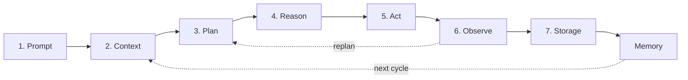
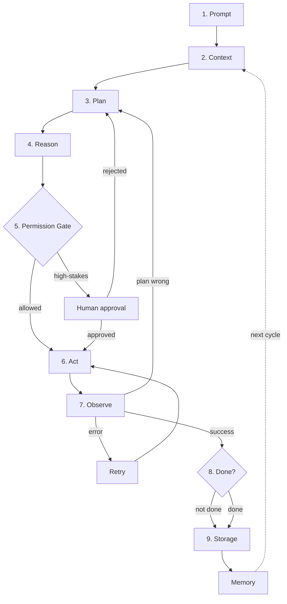
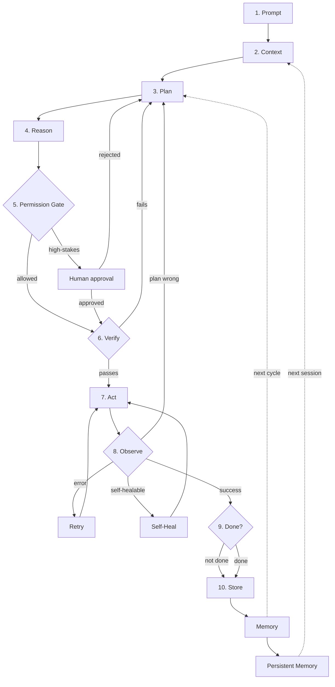

# Prometheus Loop — Agentic AI Loop Guide & Diagrams

## What is this?

Prometheus Loop is a comprehensive reference for building, teaching, and reasoning about **agentic AI systems** — AI agents that can plan, act, observe, learn, and iterate autonomously.

It provides:
- **Three maturity levels** — from concept to production to autonomous operation
- **Complete diagrams** — mermaid flowcharts that render on GitHub
- **Deep dive guides** — memory systems, planning, safety, multi-agent, evaluation, production
- **Code examples** — Python implementations of every major component
- **Case studies** — how the loop applies to coding, research, and support agents

## Who is this for?

| Audience | What you'll get |
|---|---|
| **AI engineers** | Implementation patterns, code snippets, architecture decisions |
| **ML researchers** | Theoretical foundations, evaluation frameworks, state-of-the-art techniques |
| **Engineering managers** | Deployment patterns, cost optimization, team coordination |
| **Students & learners** | Clear explanations, progressive complexity, real-world examples |
| **Security engineers** | Threat modeling, guardrails, adversarial testing, compliance |
| **Product managers** | When to use which level, tradeoffs, ROI considerations |

## How to use this repo

1. **New to agentic AI?** Start with [core/README.md](core/README.md) — the 7-step loop explained simply
2. **Building for production?** Go to [production/README.md](production/README.md) — safety, testing, deployment
3. **Want autonomous operation?** See [autonomous/README.md](autonomous/README.md) — self-healing, cost optimization, compliance
4. **Need deep dives?** Check [shared/README.md](shared/README.md) — memory, reasoning, safety, multi-agent patterns

---

## Repository Structure

```
Prometheus-Loop/
├── core/                          # Concept level (v1)
│   ├── README.md
│   ├── agentic-ai-loop-guide.md
│   ├── agentic-ai-loop.mermaid
│   └── agentic-ai-loop-core.mermaid
├── production/                    # Production level (v2)
│   ├── README.md
│   ├── agentic-ai-loop-v2-guide.md
│   ├── agentic-ai-loop-v2.mermaid
│   └── agentic-ai-loop-v2-core.mermaid
├── autonomous/                    # Autonomous level (v3)
│   ├── README.md
│   ├── agentic-ai-loop-v3-guide.md
│   ├── agentic-ai-loop-v3.mermaid
│   └── agentic-ai-loop-v3-core.mermaid
├── shared/                        # Common resources
│   ├── README.md
│   ├── evaluation-metrics.md
│   ├── observability.md
│   ├── cost-optimization.md
│   ├── ethics-compliance.md
│   └── multi-agent-patterns.md
├── examples/                      # Code snippets & case studies
│   ├── README.md
│   ├── code-snippets.md
│   ├── coding-agent-case-study.md
│   ├── research-agent-case-study.md
│   └── support-agent-case-study.md
├── LICENSE                        # MIT License
└── README.md                      # This file
```

## Quick Start

| Level | Best for | Start here |
|---|---|---|
| **Concept** (v1) | Teaching, prototyping | [core/README.md](core/README.md) |
| **Production** (v2) | Real deployments, human oversight | [production/README.md](production/README.md) |
| **Autonomous** (v3) | Minimal oversight, cost-sensitive | [autonomous/README.md](autonomous/README.md) |

## How to view the diagrams

The diagrams are embedded below and render automatically on GitHub, Notion, Obsidian, and any Mermaid-compatible renderer. Each version has two diagrams:
- **Core** — simplified loop only (10 nodes, readable in 10 seconds)
- **Full** — loop + all cross-cutting concerns (comprehensive)

The `.mermaid` source files are also included for standalone use or editing at [mermaid.live](https://mermaid.live).

---

## v1 — Core Loop

The 7-step agentic loop: Prompt, Context, Plan, Reason, Act, Observe, Store/Memory, with foundational security awareness, evaluation metrics, and ethical considerations.



**Guide:** [v1 guide](core/agentic-ai-loop-guide.md) | **Core diagram:** [simplified](core-only/agentic-ai-loop-core.mermaid)

---

## v2 — Safety Layers

Adds Permission Gate, HITL, Retry vs. Replan, Goal Check, Coordinator, plus operational layers: security, testing, explainability, resources, lifecycle, UX, streaming, composition, and ethics.



**Guide:** [v2 guide](production/agentic-ai-loop-v2-guide.md) | **Core diagram:** [simplified](core-only/agentic-ai-loop-v2-core.mermaid)

---

## v3 — Autonomous Operation

Designed to minimize human touchpoints. Full autonomous system with Self-Healing, Adaptive Planning, Cost Optimization, Cross-Session Memory, Verification, Feedback Loops, Graceful Degradation, plus 11 cross-cutting concerns.



**Guide:** [v3 guide](autonomous/agentic-ai-loop-v3-guide.md) | **Core diagram:** [simplified](core-only/agentic-ai-loop-v3-core.mermaid)

**Guide:** [v3 guide](agentic-ai-loop-v3-guide.md) — full explanations, implementation patterns, checklists.

---

## Suggested read order

1. **`agentic-ai-loop-guide.md`** — get the shape of the loop. Each step explains *what* it does, *why* it matters, *what goes wrong*, and *real examples* of it in action.
2. **`agentic-ai-loop-v2-guide.md`** — see what's needed to run it safely. Covers guardrails, error handling, multi-agent coordination, security at the gate level, testing, explainability, resource management, lifecycle, and UX.
3. **`agentic-ai-loop-v3-guide.md`** — see how to make it autonomous and robust. Covers self-healing, adaptive planning, cost optimization, cross-session memory, full adversarial defense, evaluation framework, testing framework, streaming, composition, ethics, and agent-as-a-service.
4. **README** (you are here) — overview and quick reference.

## TL;DR

> **v1:** Prompt → Context → Plan → Reason → Act → Observe → Store/Remember → loop
> **v2:** same loop, plus permission gate, HITL, retry vs. replan, goal check, coordinator, security at the gate level, testing, explainability, resource management, lifecycle, UX.
> **v3:** same loop, designed to minimize human touchpoints — self-healing, adaptive planning, cost optimization, cross-session memory, verification, multi-tenant isolation, feedback loops, graceful degradation, full adversarial robustness, evaluation framework, testing framework, streaming, agent composition, ethics & compliance, agent-as-a-service.

## Quick reference: step-by-step

| Step | What it does | v1 | v2 | v3 |
|---|---|---|---|---|
| **1. Prompt** | Task definition + system rules + tool schemas | Core | Core | Core |
| **2. Context** | RAG + history + tool outputs + memory | Core | Core | Core + cross-session memory |
| **3. Plan** | Decompose goal → ordered sub-tasks | Core | Core | Adaptive (learns from history) |
| **4. Reason** | Chain-of-thought, tool selection, decision | Core | Core | + cost-optimized model selection |
| **5. Permission Gate** | Scope/policy/blast-radius check before action | — | New | New + adversarial defense |
| **6. HITL** | Approval for high-stakes actions | — | New | New |
| **Verify** | Pre-execution correctness check | — | — | New |
| **7. Act** | Execute: API call, code run, file write | Core | Core | Core + sandboxed |
| **8. Observe** | Capture result, detect success/failure | Core | Core | Core + self-healing |
| **Self-Heal** | Diagnose and fix known failure patterns | — | — | New |
| **9. Retry vs. Replan** | Differentiate execution error from plan error | — | New | New |
| **10. Goal Check** | Termination condition: done? budget? stuck? | — | New | New + budget awareness |
| **11. Storage** | Raw persistence: logs, artifacts, DB | Core | Core | Core |
| **12. Memory** | Curated state for future cycles | Core | Core | Core + relevance scoring + integrity checks |
| **13. Coordinator** | Multi-agent dispatch, merge, conflict resolution | — | New | New |
| **Feedback Loop** | Learn from outcomes, improve policies | — | — | New |
| **Graceful Degradation** | Continue when components fail | — | — | New |

## Cross-cutting concerns (covered across all versions)

| Concern | v1 | v2 | v3 |
|---|---|---|---|
| **Security** | Basic awareness (3 vectors, minimum posture) | Gate-level (injection detection, tool validation, memory integrity, exfil prevention) | Full adversarial robustness (4-layer defense, sandboxing, red team) |
| **Evaluation** | Basic metrics (5 signals, evaluation loop, health check) | Observability + dashboard metrics | Full framework (task suites, 8 metrics, A/B comparison, regression gates) |
| **Testing** | Smoke tests (3 patterns, basic health signals) | Unit, integration, chaos, regression tests | Full pyramid + chaos engineering (8 scenarios) + load testing + property-based |
| **Explainability** | "Why did it do this?" (manual log reading) | Decision traces, audit logs, compliance requirements | Full traces + memory attribution + counterfactuals |
| **Resources** | Not needed (single task) | Concurrency, priority scheduling, backpressure, dead letter queues | Same, production-hardened |
| **Lifecycle** | Not addressed | Deployment strategies (4 types), monitoring, incident response | Same, with rollback |
| **UX** | Not addressed | Progress, transparency, correction mechanisms, trust calibration | Same, with streaming |
| **Streaming** | Not needed | Progress reporting basics | Event-driven architecture, streaming, interrupts, long-running tasks |
| **Composition** | Not needed | Tool integration, Coordinator basics | 5 communication patterns, DAG orchestration, shared state |
| **Ethics** | 3 questions, minimum ethical posture | Ethical controls (gate, HITL, observability), compliance basics | 5 principles, bias testing, 7 regulations, impact assessment |
| **Agent-as-a-Service** | Not addressed | Not addressed | API design, auth, rate limiting, SLA tiers |

## When to use which version

| Scenario | Use |
|---|---|
| Teaching the concept of agentic AI | **v1** — simple, clear, memorable |
| Building a prototype or PoC | **v1** — get the loop working first |
| Deploying against real systems | **v2** — you need the guardrails |
| Multi-agent orchestration | **v2** — Coordinator is essential |
| High-stakes or irreversible actions | **v2** — Permission Gate + HITL are non-negotiable |
| Long-running autonomous agents | **v2** — Goal Check prevents infinite loops |
| Production with minimal oversight | **v3** — designed to minimize human touchpoints |
| Cost-sensitive deployments | **v3** — dynamic model selection saves money |
| Recurring / cross-session tasks | **v3** — cross-session memory accumulates knowledge |
| Multi-user platforms | **v3** — multi-tenant isolation is required |
| Regulated industries (finance, health) | **v3** — explainability + compliance framework required |
| Security-critical deployments | **v3** — full adversarial robustness required |
| Agent exposed as API | **v3** — agent-as-a-service patterns required |
| Real-time / interactive agents | **v3** — streaming + interrupt handling required |

## Glossary

| Term | Definition |
|---|---|
| **Adaptive Planning** | Learning from history which planning strategies work best for which task types |
| **Adversarial robustness** | Defending against attacks that try to make the agent do something harmful |
| **Agentic AI** | An AI system that can plan, act, observe, and iterate — not just respond to prompts |
| **Blast radius** | How many systems, users, or data records an action could affect |
| **Chaos engineering** | Injecting failures to test agent resilience |
| **Circuit breaker** | A retry strategy that stops attempting after N failures, preventing resource waste |
| **Coordinator** | The orchestration layer that dispatches sub-tasks to multiple agents and merges results |
| **Cross-session memory** | Persistent memory that survives across separate agent sessions |
| **Dead letter queue** | Storage for tasks that can't be completed after max retries |
| **Decision trace** | A record of why the agent made a specific decision |
| **Fan-out / fan-in** | Splitting a task into parallel sub-tasks (fan-out) and merging results (fan-in) |
| **Graceful degradation** | Continuing to operate (at reduced capability) when components fail |
| **HITL** | Human-in-the-Loop — a checkpoint where a human approves or rejects an action before execution |
| **Memory poisoning** | Adversarial content injected into the agent's memory to corrupt future decisions |
| **Permission Gate** | A pre-execution check that evaluates whether an action is authorized, in-scope, and within policy |
| **Prompt injection** | Adversarial input that hijacks the agent's behavior by overriding instructions |
| **RAG** | Retrieval-Augmented Generation — pulling external documents into context to ground the model's reasoning |
| **Red team testing** | Regularly testing agent defenses against adversarial attacks |
| **Replan** | Restarting the Plan step because the strategy was wrong (vs. Retry, which re-executes the same action) |
| **Retry** | Re-executing the same action after a transient failure (timeout, rate limit, network error) |
| **Self-healing** | Automatic diagnosis and recovery from known failure patterns without human intervention |
| **Sandboxing** | Executing agent actions in isolated environments to limit blast radius |
| **Verification** | Pre-execution checks that prove an action will produce the expected result |

---

## Shared Resources

Common resources that apply across all maturity levels:

| Resource | Description |
|---|---|
| [Evaluation & Metrics](shared/evaluation-metrics.md) | Benchmarks, metric definitions, evaluation suites, A/B comparison templates |
| [Observability & Monitoring](shared/observability.md) | LangSmith, Phoenix, structured logs, dashboards, alert rules |
| [Cost Optimization](shared/cost-optimization.md) | Model routing, caching, context compression, budget enforcement |
| [Ethics & Compliance](shared/ethics-compliance.md) | GDPR, SOC 2, HIPAA, PCI DSS, EU AI Act checklists, bias testing |
| [Multi-Agent Patterns](shared/multi-agent-patterns.md) | Communication protocols, consensus, conflict resolution, workflow orchestration |

## Examples

Concrete implementations and case studies:

| Example | Description |
|---|---|
| [Code Snippets](examples/code-snippets.md) | Python pseudocode for Permission Gate, Goal Check, Self-Healing, Adaptive Planning, Cost Optimizer, Memory Manager |
| [Coding Agent Case Study](examples/coding-agent-case-study.md) | How the loop applies to bug fixing, feature implementation, refactoring |
| [Research Agent Case Study](examples/research-agent-case-study.md) | How the loop applies to paper research, synthesis, report writing |
| [Customer Support Case Study](examples/support-agent-case-study.md) | How the loop applies to inquiry handling, troubleshooting, escalation |

## License

MIT License — see [LICENSE](LICENSE) for details.
