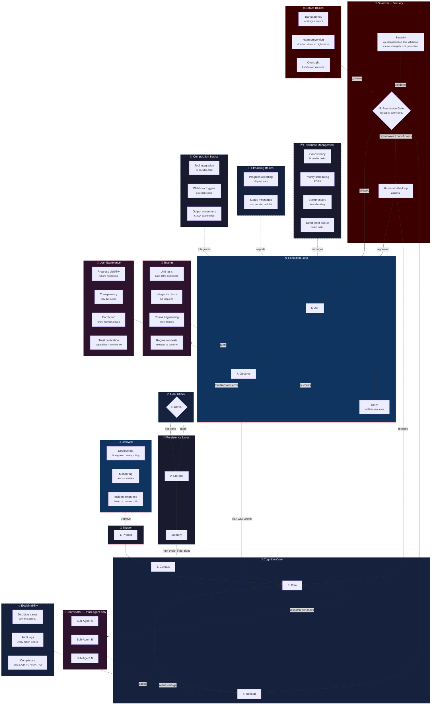

# Agentic AI Loop — Guide & Diagrams

A comprehensive breakdown of what actually happens inside an agentic AI system — from the initial prompt to persisted memory — across three evolutionary stages: concept (v1), safety (v2), and autonomy (v3). Now includes security, evaluation, testing, explainability, resource management, lifecycle, UX, streaming, ethics, and agent-as-a-service patterns.

This is the reference for building, teaching, or reasoning about agentic AI systems. It covers both the conceptual model (what the loop *is*) and the operational model (what you need to run it safely, autonomously, and securely).

## Files

| File | What it is |
|---|---|
| `agentic-ai-loop-guide.md` | **v1** — the core 7-step loop plus security awareness, basic evaluation, smoke tests, explainability basics, and ethics basics. Start here if you're new to agentic AI. |
| `agentic-ai-loop.mermaid` | Diagram for v1 — 7-step loop with 3 cross-cutting subgraphs: Security Awareness, Evaluation, Testing + Ethics. |
| `agentic-ai-loop-v2-guide.md` | **v2** — adds safety layers (Permission Gate, HITL, Retry/Replan, Goal Check, Coordinator) plus operational gaps: security at the gate level, testing methodology, explainability, resource management, lifecycle, UX, streaming basics, composition basics, and ethics basics. |
| `agentic-ai-loop-v2.mermaid` | Diagram for v2 — full safety system with 9 cross-cutting subgraphs: Security, Testing, Explainability, Resources, Lifecycle, UX, Streaming, Composition, Ethics. |
| `agentic-ai-loop-v3-guide.md` | **v3** — 70% autonomous operation. Adds Self-Healing, Adaptive Planning, Cost Optimization, Cross-Session Memory, Verification, Multi-Tenant Orchestration, Feedback Loops, Graceful Degradation, plus full adversarial robustness, evaluation framework, testing framework, streaming, agent composition, ethics & compliance, and agent-as-a-service. |
| `agentic-ai-loop-v3.mermaid` | Diagram for v3 — full autonomous system with 11 cross-cutting subgraphs: Security, Evaluation, Testing, Explainability, Resources, Lifecycle, UX, Streaming, Composition, Ethics, API. |

## How to view the diagrams

The diagrams are embedded below and render automatically on GitHub, Notion, Obsidian, and any Mermaid-compatible renderer. The `.mermaid` source files are also included for standalone use or editing at [mermaid.live](https://mermaid.live).

---

## v1 — Core Loop

The 7-step agentic loop: Prompt → Context → Plan → Reason → Act → Observe → Store/Memory, with foundational security awareness, evaluation metrics, and ethical considerations.

```mermaid
flowchart LR
    subgraph INPUT["🎯 Trigger"]
        A["1. Prompt<br/><small>goal + system rules + tool defs</small>"]
    end

    subgraph COGNITION["🧠 Cognitive Core"]
        B["2. Context<br/><small>retrieved data, history, live inputs</small>"]
        C["3. Plan<br/><small>decompose goal → sub-tasks</small>"]
        D["4. Reason<br/><small>chain-of-thought, decide next move</small>"]
    end

    subgraph EXECUTION["⚙️ Execution Loop"]
        E["5. Act<br/><small>call tool / API / run code</small>"]
        F["6. Observe<br/><small>capture result, success or failure</small>"]
    end

    subgraph PERSIST["💾 Persistence Layer"]
        G["7. Storage<br/><small>raw logs, artifacts, DB</small>"]
        H["Memory<br/><small>curated, retrievable state</small>"]
    end

    subgraph SECURITY["🔒 Security Awareness"]
        S1["Prompt injection<br/><small>user input hijack</small>"]
        S2["Indirect injection<br/><small>adversarial RAG content</small>"]
        S3["Tool abuse<br/><small>unintended tool calls</small>"]
    end

    subgraph EVAL["📊 Evaluation"]
        E1["Completion rate<br/><small>% tasks finished</small>"]
        E2["Accuracy<br/><small>% correct results</small>"]
        E3["Cycle count<br/><small>avg loops per task</small>"]
    end

    subgraph QUALITY["🧪 Testing + Ethics"]
        T1["Smoke tests<br/><small>3 patterns</small>"]
        T2["Health signals<br/><small>cycle, token, output</small>"]
        ETH["Ethics<br/><small>transparency, harm, oversight</small>"]
    end

    A --> B --> C --> D --> E --> F
    F --> G
    G --> H
    H -.next cycle.-> B
    F -.replan if failed.-> C

    SECURITY -.defends.-> E
    EVAL -.measures.-> F
    QUALITY -.validates.-> D

    style INPUT fill:#1a1a2e,color:#fff,stroke:#e94560
    style COGNITION fill:#16213e,color:#fff,stroke:#0f3460
    style EXECUTION fill:#0f3460,color:#fff,stroke:#e94560
    style PERSIST fill:#1a1a2e,color:#fff,stroke:#0f3460
    style SECURITY fill:#3d0000,color:#fff,stroke:#e94560,stroke-dasharray: 5 5
    style EVAL fill:#16213e,color:#fff,stroke:#0f3460,stroke-dasharray: 5 5
    style QUALITY fill:#2d132c,color:#fff,stroke:#e94560,stroke-dasharray: 5 5
```



**Guide:** [v1 guide](agentic-ai-loop-guide.md) — full explanations, failure modes, examples for each step.

---

## v2 — Safety Layers

Adds Permission Gate, HITL, Retry vs. Replan, Goal Check, Coordinator, plus operational layers: security, testing, explainability, resources, lifecycle, UX, streaming, composition, and ethics.



**Guide:** [v2 guide](agentic-ai-loop-v2-guide.md) — full explanations, implementation patterns, checklists.

---

## v3 — 70% Autonomous Operation

Full autonomous system with Self-Healing, Adaptive Planning, Cost Optimization, Cross-Session Memory, Verification, Feedback Loops, Graceful Degradation, plus 11 cross-cutting concerns.

```mermaid
flowchart TD
    subgraph TRIGGER["🎯 Trigger"]
        A["1. Prompt"]
    end

    subgraph COGNITION["🧠 Cognitive Core"]
        B["2. Context<br/><small>+ cross-session memory</small>"]
        C{"3. Adaptive Plan<br/><small>+ learned strategies</small>"}
        D["4. Reason<br/><small>+ cost-optimized model</small>"}
    end

    subgraph GATE["🛂 Guardrail + Verification + Security"]
        E{"5. Permission Gate<br/><small>scope? authorized?</small>"}
        HITL["6. Human-in-the-loop<br/><small>approval</small>"]
        V{"Verify<br/><small>will this work?</small>"}
        SEC["4-Layer Defense<br/><small>injection, hierarchy,<br/>output validation, monitoring</small>"]
    end

    subgraph EXEC["⚙️ Execution Loop"]
        F["7. Act<br/><small>sandboxed</small>"]
        G{"8. Observe"}
        SH["Self-Heal<br/><small>diagnose + fix</small>"]
        RETRY["Retry<br/><small>transient error</small>"]
    end

    subgraph CHECK["✅ Goal Check + Budget"]
        H{"9. Done?<br/><small>+ budget check</small>"}
    end

    subgraph PERSIST["💾 Persistence Layer"]
        I["10. Store"]
        J["Memory<br/><small>+ relevance scoring + integrity</small>"]
        PM["Persistent Memory Store<br/><small>cross-session</small>"]
    end

    subgraph LEARN["🔄 Feedback + Learning"]
        FL["Feedback Loop<br/><small>learns from outcomes</small>"]
        CO["Cost Optimizer<br/><small>model selection + caching</small>"]
    end

    subgraph DEGRAD["🛡️ Graceful Degradation"]
        GD["Fallback paths<br/><small>L1-L7 when components fail</small>"]
    end

    subgraph SECURITY["🔒 Full Adversarial Robustness"]
        S1["Threat model<br/><small>5 attacker types</small>"]
        S2["Memory integrity<br/><small>signed, audited</small>"]
        S3["Sandboxing<br/><small>process, container, VM, network</small>"]
        S4["Red team testing<br/><small>injection, tool abuse, exfil, boundary</small>"]
    end

    subgraph EVAL["📊 Evaluation Framework"]
        EV1["Task suites<br/><small>50-100 tasks</small>"]
        EV2["8 metrics<br/><small>completion, accuracy, cost...</small>"]
        EV3["A/B comparison<br/><small>baseline vs candidate</small>"]
        EV4["Regression gate<br/><small>block if >5% regress</small>"]
    end

    subgraph TESTING["🧪 Testing Framework"]
        TP["Test pyramid<br/><small>unit → integration → E2E</small>"]
        CH["Chaos engineering<br/><small>8 failure scenarios</small>"]
        LD["Load testing<br/><small>concurrency + breaking point</small>"]
        PB["Property-based<br/><small>safety invariants</small>"]
    end

    subgraph EXPLAIN["🔍 Explainability + Compliance"]
        X1["Decision traces<br/><small>reasoning + context + memories</small>"]
        X2["Audit logs<br/><small>complete action history</small>"]
        X3["7 regulations<br/><small>GDPR, SOC2, HIPAA, PCI, AI Act...</small>"]
        X4["Impact assessment<br/><small>pre-deployment review</small>"]
    end

    subgraph RESOURCES["📦 Resource Management"]
        R1["Concurrency<br/><small>N parallel tasks</small>"]
        R2["Priority scheduling<br/><small>P0-P3 + SLAs</small>"]
        R3["Backpressure<br/><small>load shedding</small>"]
        R4["Dead letter queue<br/><small>failed task handling</small>"]
    end

    subgraph LIFECYCLE["🚀 Lifecycle"]
        L1["4 deployment strategies<br/><small>blue-green, canary, rolling, shadow</small>"]
        L2["Monitoring + alerting<br/><small>5 metric thresholds</small>"]
        L3["Incident response<br/><small>detect → contain → fix → review</small>"]
    end

    subgraph UX_DESIGN["👤 User Experience"]
        U1["Progress visibility<br/><small>real-time updates</small>"]
        U2["Transparency<br/><small>action log + reasoning</small>"]
        U3["Correction<br/><small>undo, redirect, pause, cancel</small>"]
        U4["Trust calibration<br/><small>capabilities + confidence + risk</small>"]
    end

    subgraph STREAM["📡 Streaming + Real-Time"]
        ST1["Event-driven architecture<br/><small>event bus + workers</small>"]
        ST2["Streaming responses<br/><small>SSE/WebSocket</small>"]
        ST3["Interrupt handling<br/><small>graceful cancel + state save</small>"]
        ST4["Long-running tasks<br/><small>heartbeat, checkpoint, timeout</small>"]
    end

    subgraph COMPOSE["🔗 Agent Composition"]
        CP1["5 communication patterns<br/><small>req-res, pub-sub, queue, shared, blackboard</small>"]
        CP2["DAG orchestration<br/><small>workflow graphs</small>"]
        CP3["Shared state<br/><small>optimistic locking + conflict resolution</small>"]
    end

    subgraph ETHICS["⚖️ Ethics + Compliance"]
        ETH1["5 principles<br/><small>transparency, accountability, fairness, privacy, safety</small>"]
        ETH2["Bias testing<br/><small>demographics, phrasings, edge cases</small>"]
        ETH3["Compliance checklist<br/><small>7 regulations documented</small>"]
    end

    subgraph API["🌐 Agent-as-a-Service"]
        AP1["REST API<br/><small>CRUD tasks</small>"]
        AP2["Auth + rate limiting<br/><small>API keys, tiers</small>"]
        AP3["SLA guarantees<br/><small>uptime + latency</small>"]
    end

    A --> B --> C --> D --> E
    E -- allowed --> V
    E -- high-stakes / out of policy --> HITL
    HITL -- approved --> V
    HITL -- rejected --> C
    V -- passes --> F
    V -- fails --> C
    F --> G
    G -- transient error --> RETRY
    RETRY --> F
    G -- plan wrong --> C
    G -- self-healable --> SH
    SH --> F
    G -- success --> H
    H -- not done --> I
    H -- done --> I
    I --> J
    J --> PM
    PM -.next session.-> B
    J -.next cycle.-> C

    FL -.learns from.-> G
    FL -.updates.-> C
    CO -.selects model.-> D
    CO -.monitors budget.-> H
    GD -.fallback for.-> E
    GD -.fallback for.-> G
    GD -.fallback for.-> PM

    SEC -.defends.-> E
    EVAL -.measures.-> G
    TESTING -.validates.-> F
    EXPLAIN -.traces.-> D
    RESOURCES -.manages.-> F
    LIFECYCLE -.deploys.-> A
    UX_DESIGN -.presents.-> G
    STREAM -.streams.-> F
    COMPOSE -.orchestrates.-> C
    ETHICS -.governs.-> E
    API -.exposes.-> F

    style TRIGGER fill:#1a1a2e,color:#fff,stroke:#e94560
    style COGNITION fill:#16213e,color:#fff,stroke:#0f3460
    style GATE fill:#3d0000,color:#fff,stroke:#e94560
    style EXEC fill:#0f3460,color:#fff,stroke:#e94560
    style CHECK fill:#16213e,color:#fff,stroke:#0f3460
    style PERSIST fill:#1a1a2e,color:#fff,stroke:#0f3460
    style LEARN fill:#2d132c,color:#fff,stroke:#e94560,stroke-dasharray: 5 5
    style DEGRAD fill:#1a1a2e,color:#fff,stroke:#0f3460,stroke-dasharray: 5 5
    style SECURITY fill:#3d0000,color:#fff,stroke:#e94560,stroke-dasharray: 5 5
    style EVAL fill:#16213e,color:#fff,stroke:#0f3460,stroke-dasharray: 5 5
    style TESTING fill:#2d132c,color:#fff,stroke:#e94560,stroke-dasharray: 5 5
    style EXPLAIN fill:#1a1a2e,color:#fff,stroke:#0f3460,stroke-dasharray: 5 5
    style RESOURCES fill:#0f3460,color:#fff,stroke:#e94560,stroke-dasharray: 5 5
    style LIFECYCLE fill:#16213e,color:#fff,stroke:#0f3460,stroke-dasharray: 5 5
    style UX_DESIGN fill:#2d132c,color:#fff,stroke:#e94560,stroke-dasharray: 5 5
    style STREAM fill:#1a1a2e,color:#fff,stroke:#0f3460,stroke-dasharray: 5 5
    style COMPOSE fill:#3d0000,color:#fff,stroke:#e94560,stroke-dasharray: 5 5
    style ETHICS fill:#0f3460,color:#fff,stroke:#e94560,stroke-dasharray: 5 5
    style API fill:#16213e,color:#fff,stroke:#0f3460,stroke-dasharray: 5 5
```

**Guide:** [v3 guide](agentic-ai-loop-v3-guide.md) — full explanations, implementation patterns, checklists.

---

## Suggested read order

1. **`agentic-ai-loop-guide.md`** — get the shape of the loop. Each step explains *what* it does, *why* it matters, *what goes wrong*, and *real examples* of it in action.
2. **`agentic-ai-loop-v2-guide.md`** — see what's needed to run it safely. Covers guardrails, error handling, multi-agent coordination, security at the gate level, testing, explainability, resource management, lifecycle, and UX.
3. **`agentic-ai-loop-v3-guide.md`** — see how to make it autonomous and robust. Covers self-healing, adaptive planning, cost optimization, cross-session memory, full adversarial defense, evaluation framework, testing framework, streaming, composition, ethics, and agent-as-a-service.
4. **README** (you are here) — overview and quick reference.

## TL;DR

> **v1:** Prompt → Context → Plan → Reason → Act → Observe → Store/Remember → loop
> **v2:** same loop, plus permission gate, HITL, retry vs. replan, goal check, coordinator, security at the gate level, testing, explainability, resource management, lifecycle, UX.
> **v3:** same loop, plus self-healing, adaptive planning, cost optimization, cross-session memory, verification, multi-tenant isolation, feedback loops, graceful degradation, full adversarial robustness, evaluation framework, testing framework, streaming, agent composition, ethics & compliance, agent-as-a-service.

## Quick reference: step-by-step

| Step | What it does | v1 | v2 | v3 |
|---|---|---|---|---|
| **1. Prompt** | Task definition + system rules + tool schemas | Core | Core | Core |
| **2. Context** | RAG + history + tool outputs + memory | Core | Core | Core + cross-session memory |
| **3. Plan** | Decompose goal → ordered sub-tasks | Core | Core | Adaptive (learns from history) |
| **4. Reason** | Chain-of-thought, tool selection, decision | Core | Core | + cost-optimized model selection |
| **5. Permission Gate** | Scope/policy/blast-radius check before action | — | New | New + adversarial defense |
| **6. HITL** | Approval for high-stakes actions | — | New | New |
| **Verify** | Pre-execution correctness check | — | — | New |
| **7. Act** | Execute: API call, code run, file write | Core | Core | Core + sandboxed |
| **8. Observe** | Capture result, detect success/failure | Core | Core | Core + self-healing |
| **Self-Heal** | Diagnose and fix known failure patterns | — | — | New |
| **9. Retry vs. Replan** | Differentiate execution error from plan error | — | New | New |
| **10. Goal Check** | Termination condition: done? budget? stuck? | — | New | New + budget awareness |
| **11. Storage** | Raw persistence: logs, artifacts, DB | Core | Core | Core |
| **12. Memory** | Curated state for future cycles | Core | Core | Core + relevance scoring + integrity checks |
| **13. Coordinator** | Multi-agent dispatch, merge, conflict resolution | — | New | New |
| **Feedback Loop** | Learn from outcomes, improve policies | — | — | New |
| **Graceful Degradation** | Continue when components fail | — | — | New |

## Cross-cutting concerns (covered across all versions)

| Concern | v1 | v2 | v3 |
|---|---|---|---|
| **Security** | Basic awareness (3 vectors, minimum posture) | Gate-level (injection detection, tool validation, memory integrity, exfil prevention) | Full adversarial robustness (4-layer defense, sandboxing, red team) |
| **Evaluation** | Basic metrics (5 signals, evaluation loop, health check) | Observability + dashboard metrics | Full framework (task suites, 8 metrics, A/B comparison, regression gates) |
| **Testing** | Smoke tests (3 patterns, basic health signals) | Unit, integration, chaos, regression tests | Full pyramid + chaos engineering (8 scenarios) + load testing + property-based |
| **Explainability** | "Why did it do this?" (manual log reading) | Decision traces, audit logs, compliance requirements | Full traces + memory attribution + counterfactuals |
| **Resources** | Not needed (single task) | Concurrency, priority scheduling, backpressure, dead letter queues | Same, production-hardened |
| **Lifecycle** | Not addressed | Deployment strategies (4 types), monitoring, incident response | Same, with rollback |
| **UX** | Not addressed | Progress, transparency, correction mechanisms, trust calibration | Same, with streaming |
| **Streaming** | Not needed | Progress reporting basics | Event-driven architecture, streaming, interrupts, long-running tasks |
| **Composition** | Not needed | Tool integration, Coordinator basics | 5 communication patterns, DAG orchestration, shared state |
| **Ethics** | 3 questions, minimum ethical posture | Ethical controls (gate, HITL, observability), compliance basics | 5 principles, bias testing, 7 regulations, impact assessment |
| **Agent-as-a-Service** | Not addressed | Not addressed | API design, auth, rate limiting, SLA tiers |

## When to use which version

| Scenario | Use |
|---|---|
| Teaching the concept of agentic AI | **v1** — simple, clear, memorable |
| Building a prototype or PoC | **v1** — get the loop working first |
| Deploying against real systems | **v2** — you need the guardrails |
| Multi-agent orchestration | **v2** — Coordinator is essential |
| High-stakes or irreversible actions | **v2** — Permission Gate + HITL are non-negotiable |
| Long-running autonomous agents | **v2** — Goal Check prevents infinite loops |
| Production with minimal oversight | **v3** — 70% autonomous operation |
| Cost-sensitive deployments | **v3** — dynamic model selection saves money |
| Recurring / cross-session tasks | **v3** — cross-session memory accumulates knowledge |
| Multi-user platforms | **v3** — multi-tenant isolation is required |
| Regulated industries (finance, health) | **v3** — explainability + compliance framework required |
| Security-critical deployments | **v3** — full adversarial robustness required |
| Agent exposed as API | **v3** — agent-as-a-service patterns required |
| Real-time / interactive agents | **v3** — streaming + interrupt handling required |

## Glossary

| Term | Definition |
|---|---|
| **Adaptive Planning** | Learning from history which planning strategies work best for which task types |
| **Adversarial robustness** | Defending against attacks that try to make the agent do something harmful |
| **Agentic AI** | An AI system that can plan, act, observe, and iterate — not just respond to prompts |
| **Blast radius** | How many systems, users, or data records an action could affect |
| **Chaos engineering** | Injecting failures to test agent resilience |
| **Circuit breaker** | A retry strategy that stops attempting after N failures, preventing resource waste |
| **Coordinator** | The orchestration layer that dispatches sub-tasks to multiple agents and merges results |
| **Cross-session memory** | Persistent memory that survives across separate agent sessions |
| **Dead letter queue** | Storage for tasks that can't be completed after max retries |
| **Decision trace** | A record of why the agent made a specific decision |
| **Fan-out / fan-in** | Splitting a task into parallel sub-tasks (fan-out) and merging results (fan-in) |
| **Graceful degradation** | Continuing to operate (at reduced capability) when components fail |
| **HITL** | Human-in-the-Loop — a checkpoint where a human approves or rejects an action before execution |
| **Memory poisoning** | Adversarial content injected into the agent's memory to corrupt future decisions |
| **Permission Gate** | A pre-execution check that evaluates whether an action is authorized, in-scope, and within policy |
| **Prompt injection** | Adversarial input that hijacks the agent's behavior by overriding instructions |
| **RAG** | Retrieval-Augmented Generation — pulling external documents into context to ground the model's reasoning |
| **Red team testing** | Regularly testing agent defenses against adversarial attacks |
| **Replan** | Restarting the Plan step because the strategy was wrong (vs. Retry, which re-executes the same action) |
| **Retry** | Re-executing the same action after a transient failure (timeout, rate limit, network error) |
| **Self-healing** | Automatic diagnosis and recovery from known failure patterns without human intervention |
| **Sandboxing** | Executing agent actions in isolated environments to limit blast radius |
| **Verification** | Pre-execution checks that prove an action will produce the expected result |
