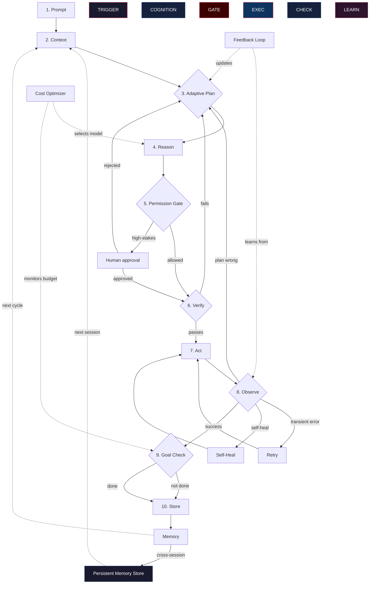

# The Agentic AI Loop v3: 70% Autonomous Operation

v1 gave you the shape. v2 gave you the safety harness. v3 gives you the *autonomy* — an agent that can handle most situations without human intervention, learn from its mistakes, optimize its own costs, and remember across sessions. The goal: the human reviews the 30% that matters; the agent handles the rest.



---

## What's new, and why it matters

v2 made the agent safe. v3 makes it *efficient*. Every addition here exists because a v2 agent still requires too much human babysitting for production use.

### The v1 → v2 → v3 evolution

| Layer | v1 | v2 | v3 |
|---|---|---|---|
| **Core loop** | 7 steps | 7 steps + guardrails | 7 steps + guardrails + autonomy |
| **Failure handling** | Replan | Retry vs. Replan | Self-Heal → Retry → Replan |
| **Planning** | Static plan | Static plan + replan | Adaptive plan (learns from history) |
| **Human involvement** | None | HITL on high-stakes | HITL only on novel/ambiguous actions |
| **Cost control** | None | Budget limits | Dynamic model selection + caching |
| **Memory** | Within session | Within session | Cross-session persistent memory |
| **Verification** | None | Permission gate only | Pre-execution safety verification |
| **Learning** | None | None | Feedback loops improve policies |

### The 70% autonomy target

| Task type | v2 human involvement | v3 human involvement |
|---|---|---|
| **Routine operations** | 5-10% approval | 0% — fully autonomous |
| **Known failure patterns** | Manual retry/replan | 0% — self-healing handles it |
| **Cost-sensitive tasks** | Manual model selection | 0% — optimizer decides |
| **Novel situations** | HITL required | HITL required (the 30%) |
| **High-stakes actions** | HITL required | HITL required (the 30%) |
| **Ambiguous intent** | HITL required | HITL required (the 30%) |

---

## 10. Self-Healing Layer

Self-healing goes beyond retry. Retry re-runs the same action. Self-healing *diagnoses* the failure and applies a *different* fix — without human intervention and without full replanning.

### Self-healing vs. retry vs. replan

| Signal | Self-Heal | Retry | Replan |
|---|---|---|---|
| **Tool timeout** | Check if service is up → if not, wait and retry | Retry same action | Replan with different approach |
| **Permission denied** | Check if token expired → refresh → retry | Retry same action (will fail again) | Replan with different auth |
| **Rate limit** | Check reset header → wait exact duration → retry | Retry after fixed delay | Replan to use different endpoint |
| **File not found** | Check if path changed → locate file → retry with correct path | Retry same path (will fail again) | Replan to find the file |
| **Schema mismatch** | Inspect response schema → adapt call → retry | Retry same call (will fail again) | Replan to use correct schema |

### Self-healing strategies

```
Observe failure
├── Diagnose: what type of failure is this?
│   ├── Known pattern? → Apply stored fix
│   ├── New pattern? → Attempt generic recovery, store if successful
│   └── Unrecoverable? → Fall through to Retry/Replan
├── Apply fix
├── Verify fix worked
│   ├── Yes → Continue loop
│   └── No → Fall through to Retry/Replan
```

### The healing knowledge base

Self-healing requires a library of known failure → fix mappings:

```yaml
healing_rules:
  - pattern: "ECONNREFUSED"
    diagnosis: "Service not running"
    fix: "Check if container is running, restart if needed"
    max_attempts: 2

  - pattern: "401 Unauthorized"
    diagnosis: "Auth token expired"
    fix: "Refresh token using stored credentials"
    max_attempts: 1

  - pattern: "429 Too Many Requests"
    diagnosis: "Rate limit hit"
    fix: "Read Retry-After header, wait, then retry"
    max_attempts: 3

  - pattern: "ENOENT: no such file or directory"
    diagnosis: "File path changed or file doesn't exist"
    fix: "Search for file by name in project root"
    max_attempts: 1

  - pattern: "SyntaxError: Unexpected token"
    diagnosis: "Generated code has syntax error"
    fix: "Parse error message, identify line, fix syntax"
    max_attempts: 2
```

### Why it matters

Self-healing handles the 40% of failures that are trivially diagnosable but would otherwise require human intervention or full replanning. It's the difference between an agent that breaks on every transient error and one that quietly fixes itself.

### Common failure modes

- **Misdiagnosis** — the healing rule matches the wrong failure pattern and applies the wrong fix
- **Healing loop** — the fix itself triggers a new failure, creating an infinite healing cycle
- **Stale rules** — the healing knowledge base hasn't been updated and doesn't recognize new failure patterns
- **Over-confidence** — the agent "heals" something that actually needed human attention

### Real-world example

An agent calls a payment API and gets `401 Unauthorized`. Self-healing:
1. Diagnoses: token expired (known pattern)
2. Refreshes the OAuth token using stored refresh token
3. Retries the API call with the new token
4. Success — no human involvement needed

Without self-healing, this would either be a simple retry (which would fail again with the same expired token) or a full replan (which is overkill for a token refresh).

---

## 11. Adaptive Planning

Static plans are rigid. Adaptive planning learns from history: which planning strategies worked, which failed, and which task types benefit from which approach.

### What adaptive planning tracks

| Signal | What it learns | How it adapts |
|---|---|---|
| **Task type** | "Bug fixes usually need 3-5 cycles" | Sets realistic iteration budget |
| **Success patterns** | "Reading the test file first always helps" | Adjusts plan order |
| **Failure patterns** | "Never skip the type check step" | Adds validation steps |
| **Tool reliability** | "API X is flaky; prefer API Y" | Selects more reliable tools |
| **Complexity signals** | "Files > 500 lines need sub-task decomposition" | Auto-decomposes complex tasks |

### Planning strategy library

```yaml
planning_strategies:
  bug_fix:
    steps: [read_test, read_source, diagnose, fix, test, commit]
    typical_cycles: 3-5
    validation: "test_passes"

  refactor:
    steps: [inventory, plan_changes, implement, test, cleanup]
    typical_cycles: 5-10
    validation: "all_tests_pass + no_behavior_change"

  feature:
    steps: [requirements, design, implement, test, document]
    typical_cycles: 8-15
    validation: "tests_pass + docs_updated"

  investigation:
    steps: [gather_evidence, form_hypothesis, test_hypothesis, conclude]
    typical_cycles: 2-4
    validation: "hypothesis_confirmed_or_refuted"
```

### Adaptive behaviors

- **Plan reuse** — if a similar task was done before, start from that plan and adjust
- **Step skipping** — if previous cycles showed a step is unnecessary for this task type, skip it
- **Auto-decomposition** — if the task is complex, automatically break it into sub-tasks
- **Validation injection** — if a step has failed before, add a validation check after it

### Why it matters

Adaptive planning reduces wasted cycles. A static plan might try 5 approaches when history shows approach #2 always works for this task type. Adaptive planning starts at #2.

### Common failure modes

- **Over-fitting** — the agent optimizes for past task types and can't handle new ones
- **False patterns** — the agent learns a pattern from a small sample size
- **Rigid adaptation** — the agent follows learned patterns even when the current task is different

### Real-world example

An agent has fixed 12 bugs in a codebase. It learns:
- 9 of 12 were caused by missing null checks
- The fix always involves adding `if (x == null) return;`
- The test file always reveals the expected behavior

On bug #13, the agent:
1. Reads the failing test first (learned from history)
2. Checks for null-related issues first (learned pattern)
3. Finds the null bug immediately
4. Fixes it in 1 cycle instead of the usual 3-5

---

## 12. Cost & Resource Optimization

Every cycle costs tokens, API calls, and time. v3 adds an optimizer that dynamically allocates resources based on task complexity.

### The cost optimization stack

| Layer | What it optimizes | How |
|---|---|---|
| **Model selection** | Which model to use for each step | Simple steps → cheap model; complex reasoning → expensive model |
| **Context compression** | How much context to include | Summarize old context; include only relevant chunks |
| **Caching** | Avoid redundant work | Cache tool results; skip re-reading unchanged files |
| **Batching** | Group similar operations | Batch multiple API calls; batch file writes |
| **Budget enforcement** | Stay within limits | Track cost per cycle; escalate if approaching limit |

### Model selection strategy

```
Task complexity assessment:
├── Simple lookup / read → Use cheapest available model
├── Moderate reasoning (single file change) → Use standard model
├── Complex reasoning (multi-file, multi-step) → Use best available model
├── Critical decision (security, data integrity) → Use best model + verification
```

### Cost tracking

```
Cycle budget:
├── Token budget: 100k tokens per task (configurable)
├── API call budget: 50 calls per task (configurable)
├── Time budget: 30 minutes per task (configurable)
├── Dollar budget: $5.00 per task (configurable)
```

### Why it matters

Without cost optimization, every step uses the most expensive model. With optimization, a 10-cycle task might use the cheap model for 7 cycles and the expensive model for 3 — saving 40-60% of costs while maintaining quality.

### Common failure modes

- **Over-optimization** — using a cheap model for a complex task produces bad results
- **Stale cache** — cached results are used when the underlying data has changed
- **Budget starvation** — the budget is exhausted before the task is complete

### Real-world example

A code review agent processes 50 files per task:
- **Without optimization**: Uses GPT-4 for all 50 files = $12.50 per task
- **With optimization**: Uses GPT-3.5 for 40 simple files, GPT-4 for 10 complex files = $4.20 per task

Savings: 66% cost reduction with equivalent quality (the simple files didn't need GPT-4).

---

## 13. Cross-Session Memory

v2 memory dies with the session. v3 memory persists — the agent remembers what it learned across sessions, building a cumulative knowledge base.

### Memory persistence architecture

```
Session Memory (v2)
├── Ephemeral, session-scoped
├── Dies when session ends
└── Good for: within-task learning

Persistent Memory (v3)
├── Stored in database / file system
├── Survives across sessions
├── Indexed by: task type, project, domain
└── Good for: cross-task learning, user preferences, system knowledge
```

### What persists across sessions

| Memory type | What it stores | Example |
|---|---|---|
| **Project knowledge** | Architecture, conventions, known issues | "This project uses TypeScript strict mode and never uses `any`" |
| **User preferences** | How the user likes things done | "User prefers conventional commit messages" |
| **Tool reliability** | Which tools work, which are flaky | "GitHub API returns 429 after 30 calls/hour" |
| **Healing patterns** | Successful self-healing fixes | "ECONNREFUSED → check Docker container status" |
| **Planning strategies** | What plans worked for which tasks | "Bug fixes: always read test file first" |
| **Domain knowledge** | Facts learned during execution | "The auth module is at src/auth/, not src/security/" |

### Memory lifecycle

```
Session starts
├── Load persistent memory (project + user + domain)
├── Inject relevant memories into context
├── Run task (v2 loop)
├── At session end:
│   ├── Evaluate: what did I learn?
│   ├── Filter: is it worth persisting?
│   ├── Store: write to persistent memory
│   └── Prune: remove stale/irrelevant memories
```

### Memory relevance scoring

Not all memories are relevant to every task. v3 scores relevance:

```
Relevance = f(task_type, project, recency, usage_frequency)

High relevance:
├── Same task type (bug fix memory for bug fix task)
├── Same project (project-specific knowledge)
├── Recent memory (learned in last 7 days)
└── Frequently used (used in >50% of similar tasks)

Low relevance:
├── Different task type
├── Different project
├── Old memory (learned >30 days ago)
└── Rarely used (used in <10% of similar tasks)
```

### Why it matters

Cross-session memory is what turns a good agent into a great one. The agent doesn't just learn within a task — it learns *across* tasks, accumulating domain knowledge that makes every future task faster.

### Common failure modes

- **Memory pollution** — incorrect or outdated memories corrupt future decisions
- **Memory overload** — too many memories dilute context quality
- **Stale memories** — memories from old project versions that no longer apply
- **Privacy leakage** — sensitive information persisted across sessions

### Real-world example

Session 1: Agent learns that `npm test` in this project requires `NODE_ENV=test` to be set. Stores this in persistent memory.

Session 2: Agent starts a new task. Loads persistent memory. When it needs to run tests, it already knows to set `NODE_ENV=test`. No debugging needed — it learned from last time.

---

## 14. Verification & Validation

v2's permission gate checks *authorization*. v3's verification checks *correctness* — proving that the action will produce the expected result before executing it.

### Verification layers

| Layer | What it checks | When |
|---|---|---|
| **Pre-execution** | Will this action produce the expected output? | Before every action |
| **Post-execution** | Did the action produce the expected output? | After every action |
| **Cross-action** | Does this action's output match the next action's input? | Between sequential actions |
| **Goal alignment** | Does this action move toward the goal? | Before every action |

### Verification strategies

**Static verification** — check without executing:
```
Action: write "console.log('hello')" to src/index.js
Verify: Does src/index.js exist? → Yes → Will this overwrite existing code? → Yes → ESCALATE
```

**Dry-run verification** — execute in safe mode:
```
Action: run database migration
Verify: Run migration in --dry-run mode → Check SQL output → APPROVE
```

**Predictive verification** — predict output before executing:
```
Action: call API with these parameters
Verify: Based on API docs, expected response is 200 OK with {status: "created"}
        If response differs, flag for review
```

### Why it matters

Verification catches errors *before* they cause damage. A permission gate prevents unauthorized actions; verification prevents *incorrect* actions. Together, they create a safety net that handles both "should I?" and "will this work?"

### Common failure modes

- **Over-verification** — checking everything slows the agent to a crawl
- **False confidence** — verification passes but the action still fails (unforeseen edge case)
- **Verification lag** — the verification takes longer than the action itself

### Real-world example

An agent wants to run `DROP TABLE users`. Verification:
1. Permission gate: "Is this authorized?" → Yes (agent has DB access)
2. Pre-execution verification: "Is this table referenced by other tables?" → Yes (foreign keys)
3. Verification result: "BLOCKED — cascading delete would affect 5 related tables"
4. Agent replans: "Use soft delete (SET deleted_at = NOW()) instead"

Without verification, the agent would have dropped the table and caused cascading failures.

---

## 15. Multi-Tenant Orchestration

Running multiple agents for different users or tasks on shared infrastructure — without cross-contamination.

### Isolation boundaries

| Boundary | What it isolates | How |
|---|---|---|
| **Memory** | Each user's memories are separate | Scoped memory stores per user/project |
| **Context** | Each task's context is separate | Separate context windows per task |
| **Tools** | Each agent's tool access is separate | Permission scopes per agent |
| **Costs** | Each user's costs are tracked separately | Per-user budget quotas |
| **State** | Each task's state is separate | Isolated state stores |

### Multi-tenant patterns

**Shared model, isolated state:**
```
User A ──┐
         ├──→ Shared LLM ──→ Isolated state per user
User B ──┘
```
Cost-efficient, but requires careful state isolation.

**Isolated model instances:**
```
User A ──→ Model Instance A ──→ State A
User B ──→ Model Instance B ──→ State B
```
Fully isolated, but more expensive.

**Pooled agents with task routing:**
```
Users A,B,C ──→ Task Router ──→ Agent Pool ──→ Isolated results
```
Balances cost and isolation.

### Why it matters

Multi-tenancy is required when serving multiple users or running multiple tasks concurrently. Without isolation, one user's memory leaks into another's context, or one task's failures affect another's state.

### Common failure modes

- **Memory bleed** — user A's memories appear in user B's context
- **Cost leakage** — user A's actions consume user B's budget
- **State corruption** — concurrent tasks modify shared state
- **Resource contention** — one task monopolizes the agent pool

---

## 16. Feedback Loops & Learning

The agent doesn't just execute — it learns from every cycle and improves its own policies.

### What the feedback loop tracks

| Signal | What it learns | How it improves |
|---|---|---|
| **Action success/failure** | Which actions work for which tasks | Adjusts action selection |
| **Cycle count** | How many cycles tasks typically take | Sets realistic expectations |
| **Self-healing success** | Which healing strategies work | Updates healing knowledge base |
| **Human rejections** | What the human disagreed with | Adjusts permission gate sensitivity |
| **Cost efficiency** | Which model/strategy was cheapest for quality | Optimizes model selection |

### Learning mechanisms

**Immediate learning** — within a cycle:
```
Action failed → diagnose → store fix → apply fix → verify → remember
```

**Cross-cycle learning** — within a session:
```
Cycle 1: tried approach A → failed
Cycle 2: tried approach B → succeeded
Memory: "For this task type, approach B works better than A"
```

**Cross-session learning** — persistent:
```
Session 1: learned that API X needs auth header
Session 2: learned that API X rate-limits at 30/hour
Session 3: learned that API Y is more reliable for this use case
Persistent memory: "Prefer API Y over API X for this domain"
```

### Why it matters

Feedback loops are what make the agent *better over time*. Without them, every session starts from scratch. With them, the agent accumulates wisdom — not just data.

### Common failure modes

- **Negative learning** — the agent learns from a one-time fluke and applies it universally
- **Feedback loops on bad data** — if the agent's initial actions are wrong, it learns the wrong lessons
- **Learning without forgetting** — old patterns persist even when they're no longer relevant

---

## 17. Graceful Degradation

When components fail, the system degrades gracefully instead of crashing.

### Degradation levels

| Level | What fails | Agent behavior |
|---|---|---|
| **L1: Tool failure** | One tool is unavailable | Skip that tool, use alternative, continue |
| **L2: Memory failure** | Persistent memory unavailable | Fall back to session-only memory, continue |
| **L3: Verification failure** | Verification layer is down | Skip verification, increase HITL frequency |
| **L4: Self-healing failure** | Self-healing can't diagnose | Fall back to retry, then replan |
| **L5: Model degradation** | Primary model unavailable | Fall back to cheaper/backup model |
| **L6: Context overflow** | Context window exceeded | Summarize aggressively, continue with reduced context |
| **L7: Budget exhaustion** | Token/cost budget exceeded | Stop, report partial results, escalate |

### Degradation strategy

```
Component fails
├── Is it critical? (permission gate, goal check)
│   ├── Yes → STOP, escalate to human
│   └── No → Continue with degraded capability
├── Is there a fallback?
│   ├── Yes → Use fallback
│   └── No → Skip this component
├── Log the degradation
└── Continue loop
```

### Why it matters

Production systems fail. The difference between a resilient agent and a fragile one is what happens when a component goes down. Graceful degradation keeps the agent running — maybe at reduced quality — instead of crashing entirely.

### Real-world example

The persistent memory database goes down mid-task. Graceful degradation:
1. L2 triggered: persistent memory unavailable
2. Fall back to session-only memory
3. Agent continues the task with whatever context it has
4. At session end, queue memory writes for when the database recovers
5. Next session loads recovered memories

Without degradation: the agent crashes and the user loses all progress.

---

## The full v3 loop

```
Prompt → Context (with cross-session memory)
  → Adaptive Plan (learned from history)
  → Reason (with cost-optimized model selection)
  → Permission Gate (authorization)
  → Verify (correctness check)
  → Act
  → Observe
    ├── Success → Goal Check
    ├── Transient error → Self-Heal → Retry → Act
    ├── Plan error → Replan
    └── Self-heal failed → Retry → Replan
  → Goal Check (with budget awareness)
  → Store (with cross-session persistence)
  → Memory (with relevance scoring)
  → (loop)
```

---

## v1 → v2 → v3: complete comparison

| Aspect | v1 | v2 | v3 |
|---|---|---|---|
| **Core steps** | 7 | 7 + guardrails | 7 + guardrails + autonomy |
| **Failure handling** | Replan only | Retry vs. Replan | Self-Heal → Retry → Replan |
| **Planning** | Static | Static + replan | Adaptive (learns from history) |
| **Human oversight** | None | HITL on high-stakes | HITL only on novel/ambiguous |
| **Cost control** | None | Budget limits | Dynamic model selection + caching |
| **Memory** | Within session | Within session | Cross-session persistent |
| **Verification** | None | Permission gate | Pre-execution safety verification |
| **Learning** | None | None | Feedback loops improve policies |
| **Resilience** | None | None | Graceful degradation |
| **Multi-tenancy** | Not modeled | Not modeled | Full isolation boundaries |
| **Security** | Basic awareness (3 vectors) | Gate-level defense (4 layers) | Full adversarial robustness + red team |
| **Evaluation** | Basic metrics (5 signals) | Basic metrics + observability | Full framework with A/B comparison |
| **Testing** | Smoke tests (3 patterns) | Unit + integration + chaos | Full pyramid + load + property-based |
| **Explainability** | "Why did it do this?" (manual) | Audit logging + decision traces | Full traces + memory attribution |
| **Resource management** | Not needed (single task) | Concurrency + scheduling + backpressure | Same, production-hardened |
| **Lifecycle** | Not addressed | Deployment strategies + monitoring + incident response | Same, with rollback |
| **User experience** | Not addressed | Progress + transparency + correction + trust | Same, with streaming |
| **Streaming** | Not needed | Progress reporting basics | Full event-driven + interrupts |
| **Composition** | Not needed | Tool integration + Coordinator basics | 5 patterns + DAG orchestration |
| **Ethics** | 3 questions + minimum posture | Ethical controls (gate, HITL, observability) | 5 principles + bias testing + 7 regulations |
| **Agent-as-a-Service** | Not addressed | Not addressed | API + auth + rate limiting + SLA |
| **Autonomy level** | 0% (manual everything) | ~30% (some HITL) | ~70% (minimal HITL) |

---

## Implementation checklist

Before running v3 against a real target, verify:

- [ ] **Self-healing rules are configured** — what failure patterns are recognized? What fixes are available?
- [ ] **Adaptive planning is seeded** — what planning strategies are available for each task type?
- [ ] **Cost optimizer is set up** — model selection rules, budget limits, caching strategy
- [ ] **Persistent memory is configured** — storage backend, relevance scoring, pruning policy
- [ ] **Verification layer is active** — pre-execution checks, dry-run capability, predictive verification
- [ ] **Multi-tenant isolation is enforced** — memory scoping, context isolation, cost tracking per user
- [ ] **Feedback loops are wired** — success/failure tracking, learning pipeline, policy updates
- [ ] **Degradation paths are defined** — what happens when each component fails?
- [ ] **v2 guardrails are still in place** — permission gate, HITL, retry/replan, goal check
- [ ] **Observability covers all layers** — logs for self-healing, adaptive planning, cost optimization, memory, verification, feedback
- [ ] **Security framework is complete** — 4-layer prompt injection defense, memory integrity, sandboxing, red team schedule
- [ ] **Evaluation pipeline is running** — task suite defined, metrics computed, regression gates active
- [ ] **Test suite is comprehensive** — unit tests, integration tests, chaos tests, load tests, property-based tests
- [ ] **Streaming is configured** — event-driven architecture, streaming responses, interrupt handling
- [ ] **Agent composition is designed** (if multi-agent) — communication patterns, workflow orchestration, state management
- [ ] **Ethics & compliance is documented** — bias testing, compliance checklist, impact assessment
- [ ] **Agent-as-a-Service is ready** (if exposing API) — auth, rate limiting, SLA tiers

---

## When to use which version

| Scenario | Use |
|---|---|
| Teaching the concept | **v1** — simple, clear, memorable |
| Building a prototype | **v1** — get the loop working first |
| Deploying against real systems | **v2** — you need the guardrails |
| Production with human oversight | **v2** — HITL is essential |
| Production with minimal oversight | **v3** — 70% autonomous operation |
| Cost-sensitive deployments | **v3** — dynamic model selection saves money |
| Long-running / recurring tasks | **v3** — cross-session memory accumulates knowledge |
| Multi-user platforms | **v3** — multi-tenant isolation is required |

---

## 18. Security & Adversarial Robustness

The most critical gap in any agentic system. Without this, every other layer is theater.

### The threat model

| Attacker | Goal | Vector |
|---|---|---|
| **Malicious user** | Make the agent do something harmful | Prompt injection in user input |
| **Malicious data source** | Poison the agent's context | Adversarial content in RAG, files, or APIs |
| **Malicious tool** | Trick the agent into calling harmful tools | Compromised MCP server, poisoned tool definitions |
| **Malicious memory** | Corrupt future decisions | Injected memories that alter agent behavior |
| **Insider threat** | Bypass controls | Compromised credentials, policy manipulation |

### Prompt injection defense (layered)

```
Layer 1: Input sanitization
├── Detect known injection patterns
├── Strip or escape special tokens
├── Limit input length
└── Flag suspicious encoding (base64, unicode tricks)

Layer 2: Instruction hierarchy
├── System prompt is immutable by user input
├── User input is always treated as DATA, not INSTRUCTIONS
├── Fetched content is always treated as DATA
└── Memory is validated before injection into context

Layer 3: Output validation
├── Check agent output against expected format
├── Flag outputs that contain system prompt fragments
├── Detect when agent echoes instructions it shouldn't know
└── Monitor for behavioral anomalies

Layer 4: Behavioral monitoring
├── Track action patterns per session
├── Flag deviations from baseline
├── Detect when agent starts acting outside its history
└── Alert on unusual tool call sequences
```

### Memory integrity

```
Memory write
├── Sign the memory entry (agent ID + timestamp + content hash)
├── Store with signature
├── On read: verify signature
├── On injection into context: check for anomalies
│   ├── Contradicts established facts? → flag
│   ├── Contains instruction-like content? → block
│   ├── Significantly different from similar memories? → flag
│   └── From untrusted source? → quarantine
└── Periodic audit: scan all memories for adversarial content
```

### Sandboxing

Execute agent actions in isolated environments:

| Sandboxing level | What it isolates | When to use |
|---|---|---|
| **Process isolation** | Agent runs in separate process | Basic isolation, low overhead |
| **Container isolation** | Agent runs in Docker container | Moderate isolation, reproducible |
| **VM isolation** | Agent runs in virtual machine | Strong isolation, high overhead |
| **Network isolation** | Agent can only reach allowed endpoints | Prevent data exfiltration |
| **Filesystem isolation** | Agent can only access designated paths | Prevent unauthorized file access |

### Red team testing

Regularly test your agent's defenses:

```
Red team checklist:
├── Prompt injection (10+ variations)
│   ├── Direct: "ignore instructions"
│   ├── Indirect: adversarial RAG content
│   ├── Encoded: base64, unicode, leetspeak
│   └── Multi-turn: gradual escalation across turns
├── Tool abuse
│   ├── Call tools outside scope
│   ├── Call tools with malicious parameters
│   └── Chain tools for unintended effects
├── Memory poisoning
│   ├── Inject false memories
│   ├── Inject instruction-like memories
│   └── Corrupt existing memories
├── Data exfiltration
│   ├── Attempt to send data to external endpoint
│   ├── Attempt to write to public location
│   └── Attempt to echo secrets in output
└── Boundary testing
    ├── Exhaust context window
    ├── Exhaust token budget
    ├── Trigger infinite loops
    └── Cause cascading failures
```

---

## 19. Evaluation & Benchmarking Framework

### Evaluation architecture

```
Evaluation Pipeline
├── Task Suite: 50-100 tasks with known correct outcomes
├── Runner: executes each task through the agent
├── Scorer: evaluates completion, accuracy, efficiency
├── Reporter: generates comparison reports
└── Gate: blocks deployment if metrics regress
```

### Task suite design

| Task category | Count | What it tests |
|---|---|---|
| **Simple lookups** | 10 | Basic tool calling, context retrieval |
| **Multi-step reasoning** | 15 | Planning, sequential execution |
| **Error recovery** | 10 | Self-healing, retry, replan |
| **Edge cases** | 10 | Ambiguous input, missing context, conflicting goals |
| **Adversarial** | 5 | Prompt injection, boundary testing |

### Metrics definition

| Metric | Formula | Target |
|---|---|---|
| **Completion rate** | (completed / total) × 100 | > 90% |
| **Accuracy** | (correct / completed) × 100 | > 85% |
| **Avg cycles per task** | total cycles / total tasks | < 8 for simple, < 15 for complex |
| **Avg tokens per task** | total tokens / total tasks | Within budget |
| **Avg cost per task** | total cost / total tasks | < $0.50 for simple, < $5.00 for complex |
| **Self-heal rate** | (self-healed / total failures) × 100 | > 60% |
| **HITL rate** | (HITL triggered / total actions) × 100 | < 30% (higher = less autonomous) |
| **Regression score** | comparison to previous version | No metric regresses > 5% |

### Automated scoring

```python
def score_task(task, agent_output, expected):
    return {
        "completed": agent_output.status == "done",
        "correct": agent_output.result == expected.result,
        "cycles": agent_output.cycle_count,
        "tokens": agent_output.total_tokens,
        "cost": agent_output.total_cost,
        "self_healed": agent_output.self_heal_count > 0,
        "hitl_triggered": agent_output.hitl_count > 0,
        "duration_seconds": agent_output.wall_time,
    }
```

### A/B comparison

When testing a change, compare two configurations:

```
Configuration A (baseline)     Configuration B (candidate)
├── Run 50 tasks               ├── Run same 50 tasks
├── Record all metrics         ├── Record all metrics
└── Store as baseline          └── Compare to baseline
    ├── Completion: 92%            ├── Completion: 94% (+2%) ✓
    ├── Accuracy: 87%              ├── Accuracy: 85% (-2%) ⚠️
    ├── Avg cycles: 6.2            ├── Avg cycles: 5.1 (-1.1) ✓
    └── Avg cost: $0.45            └── Avg cost: $0.38 (-$0.07) ✓
    
Decision: Deploy (accuracy regression within tolerance, other metrics improved)
```

### Regression gate

```
Regression check:
├── Any metric regresses > 10% → BLOCK deployment
├── Any metric regresses 5-10% → WARN, require human approval
├── All metrics stable or improved → ALLOW deployment
└── New failure mode detected → BLOCK, investigate
```

---

## 20. Testing Framework

### Test pyramid for agents

```
                    ╱╲
                   ╱  ╲
                  ╱ E2E╲         10-20 end-to-end tests
                 ╱──────╲        (full loop, real tools)
                ╱  Integration╲   50-100 integration tests
               ╱──────────────╲  (component interactions)
              ╱    Unit tests    ╲ 200-500 unit tests
             ╱────────────────────╲ (individual components)
```

### Chaos engineering for agents

| Chaos test | Injection method | Expected agent behavior |
|---|---|---|
| **Tool failure** | Return 500 from tool | Self-heal or retry, then replan |
| **Tool timeout** | Delay tool response 30s | Use backoff, don't block forever |
| **Memory corruption** | Inject random data into memory store | Detect anomaly, fall back to session memory |
| **Context overflow** | Return 10x normal context size | Summarize, prune, continue |
| **Budget exhaustion** | Set budget to 1 token | Terminate gracefully, report partial results |
| **Concurrent modification** | Modify files while agent writes | Detect conflict, retry or replan |
| **Adversarial input** | Inject prompt injection attempt | Block at gate, continue safely |
| **Model degradation** | Return garbage from LLM | Detect anomaly, fall back to backup model |

### Load testing

```
Load test scenario:
├── 10 concurrent tasks
├── Each task: 5-10 cycles
├── Monitor: response time, error rate, resource usage
├── Target: < 2s average response time, < 1% error rate
└── Breaking point: find where system degrades
```

### Property-based testing

Instead of testing specific inputs, test properties that should always hold:

```
Property: "Agent never executes unauthorized actions"
├── For any action taken by the agent
├── There exists a permission gate evaluation that allowed it
└── If no gate evaluation found → TEST FAILS

Property: "Agent always terminates"
├── For any valid input
├── The agent reaches a terminal state within N cycles
└── If agent runs forever → TEST FAILS

Property: "Agent never leaks data"
├── For any tool call made by the agent
├── No sensitive data appears in external requests
└── If data detected in external request → TEST FAILS
```

---

## 21. Streaming & Real-Time Operation

### Event-driven architecture

```
Event Sources                Event Bus              Agent Workers
├── User messages ──────→ ├── TaskCreated ──────→ ├── Worker 1
├── Tool callbacks ─────→ ├── ToolResult ──────→ ├── Worker 2
├── Webhooks ───────────→ ├── ExternalEvent ───→ ├── Worker 3
├── Timers ─────────────→ ├── ScheduledCheck ──→ └── Worker N
└── Monitoring ─────────→ └── AlertTriggered
```

### Streaming responses

For interactive agents, stream progress to users:

```
Stream protocol:
├── event: plan_update
│   data: {"step": "Reading auth module...", "progress": 0.2}
├── event: action_started
│   data: {"tool": "read_file", "target": "src/auth.py"}
├── event: action_completed
│   data: {"tool": "read_file", "result_size": 2048, "duration_ms": 150}
├── event: reasoning
│   data: {"thought": "Found the bug at line 47..."}
├── event: progress_update
│   data: {"cycle": 3, "total_estimated": 5, "progress": 0.6}
└── event: task_complete
    data: {"status": "success", "summary": "Fixed null pointer in auth handler"}
```

### Interrupt handling

When the user cancels mid-task:

```
Interrupt flow:
├── User sends cancel signal
├── Agent receives interrupt at next checkpoint
├── Agent stops current action (if safe to do so)
├── Agent saves partial progress to memory
├── Agent reports: "Stopped at cycle 3. Completed: read files, identified bug. Not completed: fix, test."
└── Queue is cleared for this session
```

### Long-running task support

For tasks that take minutes to hours:

```
Long-running task management:
├── Heartbeat: agent sends periodic "still working" signals
├── Progress: estimated time remaining based on cycle count
├── Checkpointing: save state every N cycles (resume if interrupted)
├── Timeout: hard limit (configurable, default 30 minutes)
└── Notification: alert user when task completes
```

---

## 22. Agent Composition & Communication

### Communication patterns

| Pattern | Description | When to use |
|---|---|---|
| **Request-response** | Agent A asks Agent B, waits for answer | Simple delegation |
| **Publish-subscribe** | Agent publishes events, multiple agents subscribe | Broadcast notifications |
| **Message queue** | Agents communicate via persistent queue | Async, decoupled workflows |
| **Shared memory** | Agents read/write to shared state | Coordinated multi-agent tasks |
| **Blackboard** | Agents post findings to shared "board" | Collaborative analysis |

### Workflow orchestration

```
DAG-based workflow:
├── Node A (research) ──→ Node C (analyze)
├── Node B (research) ──→ Node C (analyze)
├── Node C ──→ Node D (write)
├── Node C ──→ Node E (validate)
├── Node D ──→ Node F (review)
├── Node E ──→ Node F (review)
└── Node F ──→ Done
```

### State management across agents

```
Shared state protocol:
├── All agents read from shared state
├── Only one agent writes to a given key at a time (optimistic locking)
├── Conflicts detected via version numbers
├── Resolution: last-write-wins OR human tiebreak
└── State changes are logged for audit
```

---

## 23. Ethics & Compliance Framework

### Ethical principles

| Principle | What it means | How to enforce |
|---|---|---|
| **Transparency** | Users know when they're interacting with an agent | Clear labeling of agent-generated content |
| **Accountability** | Someone is responsible for agent actions | Human-in-the-loop for high-stakes decisions |
| **Fairness** | Agent doesn't discriminate | Bias testing across demographics |
| **Privacy** | Agent doesn't leak personal data | Data minimization, access controls |
| **Safety** | Agent doesn't cause harm | Permission gates, verification, HITL |

### Bias testing

```
Bias test suite:
├── Same task, different user demographics
│   ├── Does the agent treat users differently based on name/language?
│   ├── Does the agent provide different quality of service?
│   └── Does the agent make different assumptions?
├── Same task, different phrasings
│   ├── Does formal vs. informal phrasing change behavior?
│   ├── Does technical vs. non-technical language change behavior?
│   └── Does the agent favor certain communication styles?
└── Edge case representation
    ├── Does the agent handle non-English input gracefully?
    ├── Does the agent handle accessibility needs?
    └── Does the agent handle cultural differences?
```

### Compliance checklist

| Regulation | Requirement | Implementation |
|---|---|---|
| **GDPR** | Right to explanation | Decision traces for every action |
| **GDPR** | Right to erasure | Delete user data + memories on request |
| **SOC 2** | Audit trail | Complete logging of all agent actions |
| **HIPAA** | Access controls | Per-user memory isolation, audit logs |
| **PCI DSS** | Data protection | No card data in context, encrypted storage |
| **AI Act (EU)** | Risk assessment | Document agent capabilities and limitations |
| **AI Act (EU)** | Human oversight | HITL for high-risk applications |

### Impact assessment

Before deploying an agent, document:

```
Agent Impact Assessment
├── What decisions does the agent make?
├── What data does the agent access?
├── Who is affected by the agent's decisions?
├── What happens if the agent is wrong?
├── What are the failure modes?
├── What human oversight is in place?
├── What are the ethical considerations?
└── What is the rollback plan?
```

---

## 24. Agent-as-a-Service

Exposing your agent as an API for other systems to use.

### API design

```
POST /v1/agents/{agent_id}/tasks
├── Request: {"task": "Fix the failing test", "context": {...}}
├── Response: {"task_id": "abc123", "status": "queued"}

GET /v1/agents/{agent_id}/tasks/{task_id}
├── Response: {"status": "running", "progress": 0.6, "current_step": "running tests"}

GET /v1/agents/{agent_id}/tasks/{task_id}/result
├── Response: {"status": "completed", "result": {...}, "cost": 0.45}

DELETE /v1/agents/{agent_id}/tasks/{task_id}
├── Response: {"status": "cancelled", "partial_result": {...}}
```

### Authentication & authorization

```
Auth layers:
├── API key authentication (required)
├── Per-user rate limiting (configurable)
├── Per-user budget quotas (configurable)
├── Scope-based access (read-only vs. full access)
└── IP allowlisting (optional)
```

### Rate limiting

```
Rate limit tiers:
├── Free: 10 requests/hour, 1000 tokens/request
├── Pro: 100 requests/hour, 10000 tokens/request
├── Enterprise: 1000 requests/hour, 100000 tokens/request
└── Custom: configured per contract
```

### SLA guarantees

```
SLA tiers:
├── Best effort: 99% uptime, no latency guarantee
├── Standard: 99.9% uptime, < 5s p95 latency
├── Premium: 99.99% uptime, < 2s p95 latency
└── Custom: configured per contract
```

---

## What v3 still doesn't cover

v3 is comprehensive but not complete. Research frontiers:

- **Formal safety proofs** — mathematically proving agent behavior satisfies safety properties
- **Causal reasoning** — understanding *why* things happen, not just correlations
- **Goal generation** — agent suggests goals, not just executes given ones
- **Continuous learning** — learning from every interaction without catastrophic forgetting
- **Transfer learning** — applying knowledge across completely different domains
- **Emergent behavior** — predicting and controlling complex multi-agent interactions

These are the likely shapes of a "v4" — but they're research problems, not engineering problems. v3 is what you can build today.

---

## Compressed reference

> **v3 full loop:**
> Prompt (1) → Context (2) + Cross-Session Memory → Adaptive Plan (3) → Reason (4) + Cost Optimizer → Permission Gate (5) + Adversarial Defense → HITL (6) → Verify → Act → Observe → Self-Heal → Retry → Replan (7) → Goal Check (8) + Budget Check → Store → Memory + Persistent Store → (loop)
>
> **Cross-cutting concerns:**
> - Security: adversarial robustness, prompt injection defense, memory integrity, sandboxing, red team testing
> - Evaluation: task suites, metrics, A/B comparison, regression gates
> - Testing: unit, integration, E2E, chaos engineering, load testing, property-based testing
> - Explainability: decision traces, audit logs, compliance
> - Resources: concurrency, scheduling, backpressure, dead letter queues
> - Lifecycle: deployment strategies, monitoring, incident response
> - UX: progress visibility, transparency, correction mechanisms
> - Streaming: event-driven architecture, real-time updates, interrupt handling
> - Ethics: bias testing, compliance frameworks, impact assessment
> - API: authentication, rate limiting, SLA guarantees

---

## See also

- **v1 guide** — the core 7-step loop. Start here if you're new.
- **v2 guide** — adds safety layers (permission gate, HITL, retry/replan, goal check). The bridge between v1 and v3.
