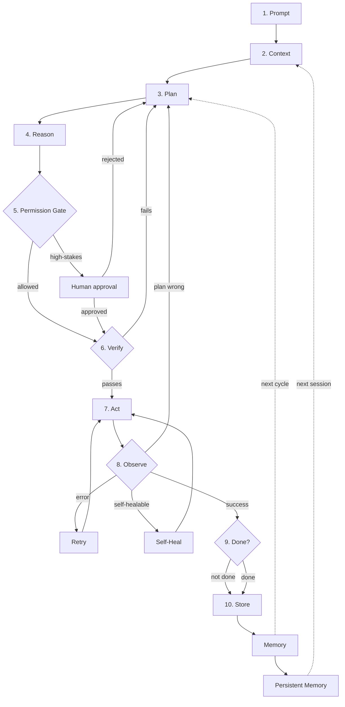
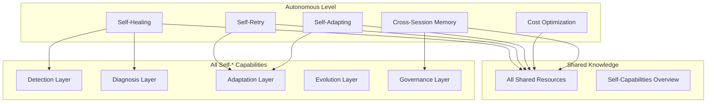

# Autonomous

The fully autonomous agentic loop. Designed to minimize human touchpoints.

> **Self-* Capabilities:** Autonomous level includes all 13 self-* capabilities. See [self/](../shared/self/) folder for deep dives.

## What this covers

Everything in Production, plus:
- Self-Healing (automatic recovery)
- Adaptive Planning (learned strategies)
- Cost Optimization (model routing, caching)
- Cross-Session Memory (persistent knowledge)
- Verification (pre-execution checks)
- Multi-Tenant Orchestration (isolation)
- Feedback Loops (continuous learning)
- Graceful Degradation (resilience)
- Full adversarial robustness
- Full evaluation framework
- Full testing framework (chaos, load, property-based)
- Full streaming (event-driven, interrupts)
- Full agent composition (5 patterns, DAG orchestration)
- Full ethics & compliance (7 regulations)
- Agent-as-a-Service (API, auth, SLA)

## Architecture

## Autonomous Files

| File | Description | Lines |
|---|---|---|
| `agentic-ai-loop-v3-guide.md` | Full guide with implementation patterns | 1144 |
| `agentic-ai-loop-v3.mermaid` | Full diagram with 11 cross-cutting subgraphs | - |
| `agentic-ai-loop-v3-core.mermaid` | Simplified diagram (loop + autonomy only) | - |

## Enhancements (10 files)

| Enhancement | Description | Lines |
|---|---|---|
| `self-healing-playbook.md` | Healing strategies and patterns | 120+ |
| `adaptive-planning-guide.md` | Dynamic planning techniques | 150+ |
| `multi-agent-patterns.md` | Fan-out, pipeline, competitive, consensus | 180+ |
| `memory-management.md` | Short/long-term, vector, graph memory | 200+ |
| `cost-optimization.md` | Model routing, caching, compression | 150+ |
| `evaluation-framework.md` | Benchmarks, red-team testing | 180+ |
| `red-team-testing.md` | Adversarial testing methodology | 150+ |
| `migration-strategies.md` | Migrating from other frameworks | 120+ |
| `advanced-troubleshooting.md` | Complex issue resolution | 150+ |
| `future-roadmap.md` | What's coming next | 100+ |

## When to use

- Production with minimal oversight
- Cost-sensitive deployments
- Recurring / cross-session tasks
- Multi-user platforms
- Regulated industries
- Security-critical deployments
- Agent exposed as API
- Real-time / interactive agents

## Shared resources for Autonomous level

### Core Knowledge

| Resource | What you learn | Diagram |
|---|---|---|
| [Memory Systems](../shared/memory-systems.md) | Short/long-term memory, vector stores, forgetting | [mermaid](../shared/memory-systems.mermaid) |
| [Planning & Reasoning](../shared/planning-reasoning.md) | CoT, ToT, ReAct, meta-reasoning | [mermaid](../shared/planning-reasoning.mermaid) |

### Safety & Compliance

| Resource | What you learn | Diagram |
|---|---|---|
| [Safety & Guardrails](../shared/safety-guardrails.md) | Threat modeling, sandboxing, adversarial testing | [mermaid](../shared/safety-guardrails.mermaid) |
| [Ethics & Compliance](../shared/ethics-compliance.md) | 7 regulations, bias testing, accountability | [mermaid](../shared/ethics-compliance.mermaid) |

### Operations & Scale

| Resource | What you learn | Diagram |
|---|---|---|
| [Observability](../shared/observability.md) | Tracing, logging, metrics, alerting | [mermaid](../shared/observability.mermaid) |
| [Production Concerns](../shared/production-concerns.md) | Streaming, deployment, Agent-as-a-Service | [mermaid](../shared/production-concerns.mermaid) |
| [Multi-Agent Patterns](../shared/multi-agent-patterns.md) | 5 communication patterns, consensus | [mermaid](../shared/multi-agent-patterns.mermaid) |
| [Multi-Agent Orchestration](../shared/multi-agent-orchestration.md) | Task routing, agent coordination | [mermaid](../shared/multi-agent-orchestration.mermaid) |

### Quality & Cost

| Resource | What you learn | Diagram |
|---|---|---|
| [Evaluation Framework](../shared/evaluation-framework.md) | Benchmarking, A/B testing, regression gates | [mermaid](../shared/evaluation-framework.mermaid) |
| [Evaluation Metrics](../shared/evaluation-metrics.md) | Core metrics, evaluation suites | [mermaid](../shared/evaluation-metrics.mermaid) |
| [Cost Optimization](../shared/cost-optimization.md) | Model routing, caching, budget enforcement | [mermaid](../shared/cost-optimization.mermaid) |

## Self-* capabilities for Autonomous level

### Detection Layer

| Capability | What you learn | Deep dive | Diagram |
|---|---|---|---|
| **Self-Monitoring** | Metrics, health checks, alerts, anomaly detection | [self-monitoring.md](../shared/self/self-monitoring.md) | [mermaid](../shared/self/self-monitoring.mermaid) |
| **Self-Observing** | Decision tracing, meta-cognition, reflection | [self-observing.md](../shared/self/self-observing.md) | [mermaid](../shared/self/self-observing.mermaid) |

### Diagnosis Layer

| Capability | What you learn | Deep dive | Diagram |
|---|---|---|---|
| **Self-Debugging** | Error capture, code context, fix generation | [self-debugging.md](../shared/self/self-debugging.md) | [mermaid](../shared/self/self-debugging.mermaid) |
| **Self-Healing** | Error classification, pattern database, fix execution | [self-healing.md](../shared/self/self-healing.md) | [mermaid](../shared/self/self-healing.mermaid) |

### Adaptation Layer

| Capability | What you learn | Deep dive | Diagram |
|---|---|---|---|
| **Self-Adapting** | Context detection, strategy selection, configuration | [self-adapting.md](../shared/self/self-adapting.md) | [mermaid](../shared/self/self-adapting.mermaid) |
| **Self-Retry** | Smart backoff, circuit breakers, adaptive strategies | [self-retry.md](../shared/self/self-retry.md) | [mermaid](../shared/self/self-retry.mermaid) |
| **Self-Planning** | Goal analysis, plan generation, dynamic replanning | [self-planning.md](../shared/self/self-planning.md) | [mermaid](../shared/self/self-planning.mermaid) |

### Evolution Layer

| Capability | What you learn | Deep dive | Diagram |
|---|---|---|---|
| **Self-Improving** | Pattern extraction, strategy optimization, benchmarking | [self-improving.md](../shared/self/self-improving.md) | [mermaid](../shared/self/self-improving.mermaid) |
| **Self-Evolution** | Skill discovery, architecture adaptation, fitness | [self-evolution.md](../shared/self/self-evolution.md) | [mermaid](../shared/self/self-evolution.mermaid) |
| **Self-Refactoring** | Code analysis, smell detection, refactoring | [self-refactoring.md](../shared/self/self-refactoring.md) | [mermaid](../shared/self/self-refactoring.mermaid) |

### Governance Layer

| Capability | What you learn | Deep dive | Diagram |
|---|---|---|---|
| **Self-Governing** | Policy engine, ethical framework, compliance | [self-governing.md](../shared/self/self-governing.md) | [mermaid](../shared/self/self-governing.mermaid) |
| **Multi-Agent Orchestration** | Agent registry, task routing, conflict resolution | [multi-agent-orchestration.md](../shared/self/multi-agent-orchestration.md) | [mermaid](../shared/self/multi-agent-orchestration.mermaid) |
| **Self-Remembering** | Input filtering, relevance scoring, consolidation | [self-remembering.md](../shared/self/self-remembering.md) | [mermaid](../shared/self/self-remembering.mermaid) |

## How it all connects

## Next level

This is the highest level of autonomy. To extend further, explore:
- [Self-Capabilities Deep Dives](../shared/self/) — detailed implementations
- [Examples](../examples/) — code snippets and case studies
