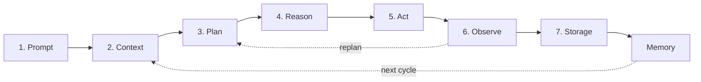
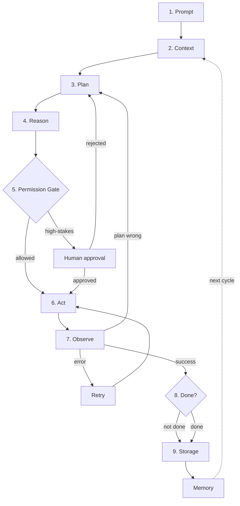
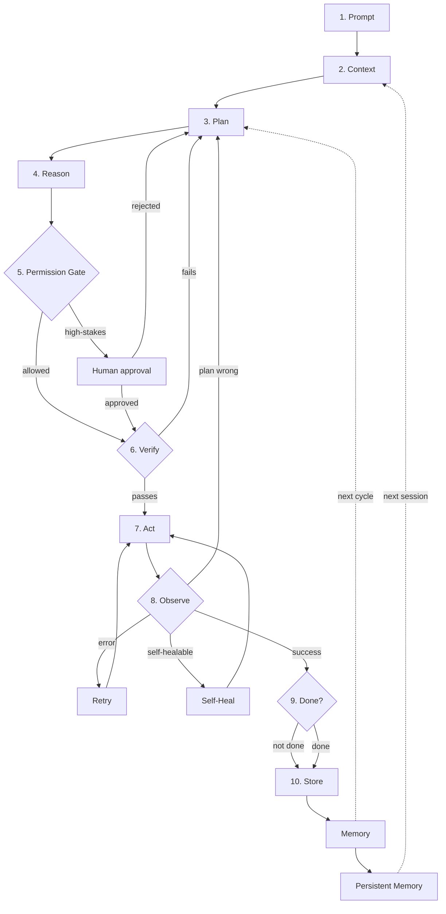

# Core-Only Diagrams

Simplified diagrams showing just the essential loop — no cross-cutting concerns. Use these when you need to explain the basic shape quickly.

## Files

| File | Description | Nodes |
|---|---|---|
| `agentic-ai-loop-core.mermaid` | v1 core loop (Concept level) | 8 |
| `agentic-ai-loop-v2-core.mermaid` | v2 core loop with safety (Production level) | 11 |
| `agentic-ai-loop-v3-core.mermaid` | v3 core loop with autonomy (Autonomous level) | 14 |

## How these differ from the full diagrams

| Diagram | What it shows | When to use |
|---|---|---|
| **Core-only** | Essential loop only, 10-15 nodes | Quick explanations, teaching, presentations |
| **Full diagrams** | Loop + all cross-cutting concerns | Implementation, deep dives, reference |

## v1 Core Loop

**The 7-step loop:** Prompt → Context → Plan → Reason → Act → Observe → Storage → Memory (loop back to Context)

## v2 Core Loop (with Safety)

**v2 additions:** Permission Gate, HITL, Retry, Goal Check

## v3 Core Loop (with Autonomy)

**v3 additions:** Verify step, Self-Heal, Persistent Memory

## Related resources

| Resource | Description |
|---|---|
| [Core guide](../core/agentic-ai-loop-guide.md) | Full explanations for v1 loop |
| [Production guide](../production/agentic-ai-loop-v2-guide.md) | Full explanations for v2 loop |
| [Autonomous guide](../autonomous/agentic-ai-loop-v3-guide.md) | Full explanations for v3 loop |
| [Self-* capabilities](../shared/self/README.md) | 13 autonomous capabilities deep dives |
| [Shared resources](../shared/README.md) | Memory, planning, safety, evaluation deep dives |
