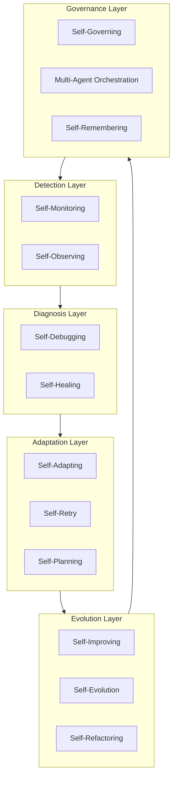

# Self-* Capabilities Summary

Quick reference for the 13 self-* capabilities. For full implementations, see [shared/self/](../shared/self/).

## The 5 layers

## Capabilities by maturity level

| Level | Capabilities | Why |
|---|---|---|
| **Core** | Self-Monitoring, Self-Remembering, Self-Planning | Foundation: track, remember, plan |
| **Production** | + Self-Healing, Self-Retry, Self-Debugging, Self-Governing | Resilience: fix, retry, debug, govern |
| **Autonomous** | + Self-Improving, Self-Evolution, Self-Refactoring, Self-Adapting, Self-Observing, Multi-Agent | Intelligence: learn, evolve, adapt, observe |

## Quick reference

| Capability | One-liner | Deep dive |
|---|---|---|
| **Self-Monitoring** | Track metrics, health, alerts | [link](../shared/self/self-monitoring.md) |
| **Self-Remembering** | Store, retrieve, forget intelligently | [link](../shared/self/self-remembering.md) |
| **Self-Planning** | Decompose goals, create and adapt plans | [link](../shared/self/self-planning.md) |
| **Self-Healing** | Diagnose and fix failures automatically | [link](../shared/self/self-healing.md) |
| **Self-Retry** | Smart backoff, circuit breakers | [link](../shared/self/self-retry.md) |
| **Self-Debugging** | Root cause analysis, fix generation | [link](../shared/self/self-debugging.md) |
| **Self-Governing** | Policy enforcement, compliance | [link](../shared/self/self-governing.md) |
| **Self-Adapting** | Context-aware configuration | [link](../shared/self/self-adapting.md) |
| **Self-Improving** | Learn from successes and failures | [link](../shared/self/self-improving.md) |
| **Self-Evolution** | Acquire new capabilities | [link](../shared/self/self-evolution.md) |
| **Self-Refactoring** | Improve code structure | [link](../shared/self/self-refactoring.md) |
| **Self-Observing** | Meta-cognition, decision tracing | [link](../shared/self/self-observing.md) |
| **Multi-Agent** | Coordinate multiple agents | [link](../shared/self/multi-agent-orchestration.md) |
