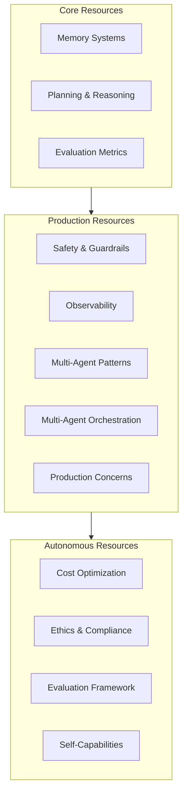

# Shared Resources Summary

Quick reference for all shared deep dives. For full implementations, see [shared/](../shared/).

## Resource map

## Quick reference by topic

### Memory & Knowledge

| Resource | What it covers | Lines |
|---|---|---|
| [Memory Systems](../shared/memory-systems.md) | Short/long-term memory, vector stores, graph memory, forgetting | 437 |

### Reasoning & Planning

| Resource | What it covers | Lines |
|---|---|---|
| [Planning & Reasoning](../shared/planning-reasoning.md) | CoT, ToT, GoT, ReAct, reflexion, meta-reasoning | 493 |

### Safety & Security

| Resource | What it covers | Lines |
|---|---|---|
| [Safety & Guardrails](../shared/safety-guardrails.md) | Threat modeling, sandboxing, output validation | 682 |
| [Ethics & Compliance](../shared/ethics-compliance.md) | Regulations, bias testing, accountability | 407 |

### Evaluation & Quality

| Resource | What it covers | Lines |
|---|---|---|
| [Evaluation Metrics](../shared/evaluation-metrics.md) | Core metrics, evaluation suites, A/B testing | 619 |
| [Evaluation Framework](../shared/evaluation-framework.md) | Benchmarking, regression gates | 420 |

### Operations & Scale

| Resource | What it covers | Lines |
|---|---|---|
| [Observability](../shared/observability.md) | Tracing, logging, metrics, alerting | 617 |
| [Production Concerns](../shared/production-concerns.md) | Streaming, deployment, Agent-as-a-Service | 599 |
| [Cost Optimization](../shared/cost-optimization.md) | Model routing, caching, budget enforcement | 605 |

### Multi-Agent

| Resource | What it covers | Lines |
|---|---|---|
| [Multi-Agent Patterns](../shared/multi-agent-patterns.md) | Communication protocols, consensus | 686 |
| [Multi-Agent Orchestration](../shared/multi-agent-orchestration.md) | Task routing, agent coordination | 511 |

### Self-* Capabilities

| Resource | What it covers | Lines |
|---|---|---|
| [Self-Capabilities Overview](../shared/self-capabilities.md) | All 13 capabilities overview | 1546 |
| [Self-* Deep Dives](../shared/self/) | Individual capability implementations | 10,000+ |

## Reading order by goal

| Goal | Start here | Then read |
|---|---|---|
| **Build first agent** | Memory Systems | Planning & Reasoning |
| **Make it safe** | Safety & Guardrails | Ethics & Compliance |
| **Make it cheap** | Cost Optimization | Evaluation Metrics |
| **Make it observable** | Observability | Production Concerns |
| **Make it autonomous** | Self-Capabilities Overview | shared/self/ folder |
| **Scale to multiple agents** | Multi-Agent Patterns | Multi-Agent Orchestration |
| **Evaluate quality** | Evaluation Metrics | Evaluation Framework |
