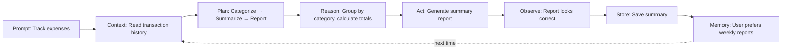

# v1 Loop Example: Personal Budget Tracker

A simple agent that helps users track their spending — demonstrating the core 7-step loop without any safety or autonomy layers.

## Scenario

User asks: "Help me track my expenses for this week"

## Loop walkthrough



## Implementation

```python
class BudgetTracker:
    """Simple budget tracker using v1 core loop."""
    
    def __init__(self):
        self.transactions = []
        self.reports = []
        self.user_preferences = {}
    
    def track_expenses(self, transactions: list) -> dict:
        """Track expenses using the 7-step loop."""
        
        # Step 1: Prompt (already received)
        # Step 2: Context (gather transaction data)
        context = self.gather_context(transactions)
        
        # Step 3: Plan (categorize, summarize, report)
        plan = {
            "steps": ["categorize", "summarize", "report"],
            "categories": ["food", "transport", "entertainment", "utilities", "other"]
        }
        
        # Step 4: Reason (group by category, calculate totals)
        categorized = self.categorize_transactions(context["transactions"])
        totals = self.calculate_totals(categorized)
        
        # Step 5: Act (generate report)
        report = self.generate_report(categorized, totals)
        
        # Step 6: Observe (check if report is correct)
        if self.validate_report(report):
            # Step 7: Store (save report and learn preferences)
            self.store_report(report)
            self.learn_preferences(report)
            
            return {"success": True, "report": report}
        else:
            return {"success": False, "reason": "Report validation failed"}
    
    def gather_context(self, transactions: list) -> dict:
        """Gather context from transactions."""
        
        return {
            "transactions": transactions,
            "total_count": len(transactions),
            "date_range": self.get_date_range(transactions),
            "total_amount": sum(t.get("amount", 0) for t in transactions)
        }
    
    def get_date_range(self, transactions: list) -> dict:
        """Get date range of transactions."""
        
        if not transactions:
            return {"start": None, "end": None}
        
        dates = [t.get("date") for t in transactions if t.get("date")]
        
        return {
            "start": min(dates) if dates else None,
            "end": max(dates) if dates else None
        }
    
    def categorize_transactions(self, transactions: list) -> dict:
        """Categorize transactions by type."""
        
        categories = {}
        
        for transaction in transactions:
            category = transaction.get("category", "other")
            
            if category not in categories:
                categories[category] = []
            
            categories[category].append(transaction)
        
        return categories
    
    def calculate_totals(self, categorized: dict) -> dict:
        """Calculate totals for each category."""
        
        totals = {}
        
        for category, transactions in categorized.items():
            totals[category] = {
                "count": len(transactions),
                "total": sum(t.get("amount", 0) for t in transactions),
                "average": sum(t.get("amount", 0) for t in transactions) / len(transactions) if transactions else 0
            }
        
        return totals
    
    def generate_report(self, categorized: dict, totals: dict) -> dict:
        """Generate expense report."""
        
        report = {
            "summary": {
                "total_transactions": sum(t["count"] for t in totals.values()),
                "total_amount": sum(t["total"] for t in totals.values()),
                "categories": len(totals)
            },
            "breakdown": totals,
            "top_category": max(totals.items(), key=lambda x: x[1]["total"])[0] if totals else None,
            "generated_at": datetime.now().isoformat()
        }
        
        return report
    
    def validate_report(self, report: dict) -> bool:
        """Validate report looks correct."""
        
        # Basic validation
        if report["summary"]["total_transactions"] == 0:
            return False
        
        if report["summary"]["total_amount"] < 0:
            return False
        
        return True
    
    def store_report(self, report: dict):
        """Store report."""
        
        self.reports.append(report)
    
    def learn_preferences(self, report: dict):
        """Learn user preferences from report."""
        
        # Learn preferred categories
        self.user_preferences["preferred_categories"] = list(report["breakdown"].keys())
        
        # Learn report format preference
        self.user_preferences["report_format"] = "detailed"
```

## Example usage

```python
tracker = BudgetTracker()

# User provides transactions
transactions = [
    {"date": "2025-01-15", "description": "Coffee", "amount": 5.50, "category": "food"},
    {"date": "2025-01-15", "description": "Uber", "amount": 15.00, "category": "transport"},
    {"date": "2025-01-16", "description": "Netflix", "amount": 15.99, "category": "entertainment"},
    {"date": "2025-01-17", "description": "Groceries", "amount": 45.20, "category": "food"},
    {"date": "2025-01-18", "description": "Electric bill", "amount": 85.00, "category": "utilities"}
]

# Agent tracks expenses
result = tracker.track_expenses(transactions)

print(f"Total spent: ${result['report']['summary']['total_amount']:.2f}")
print(f"Top category: {result['report']['top_category']}")
```

## What this demonstrates

| v1 Step | What happens |
|---|---|
| **Prompt** | User asks to track expenses |
| **Context** | Agent reads transaction history |
| **Plan** | Agent decides to categorize → summarize → report |
| **Reason** | Agent groups transactions and calculates totals |
| **Act** | Agent generates the summary report |
| **Observe** | Agent validates the report looks correct |
| **Store** | Agent saves report and learns user preferences |
| **Memory** | Agent remembers user prefers weekly reports |

## Key takeaway

This is the simplest possible agent loop. No safety gates, no retry logic, no self-healing. Just: receive task → gather context → plan → execute → observe → store → remember. This is where every agent starts.
