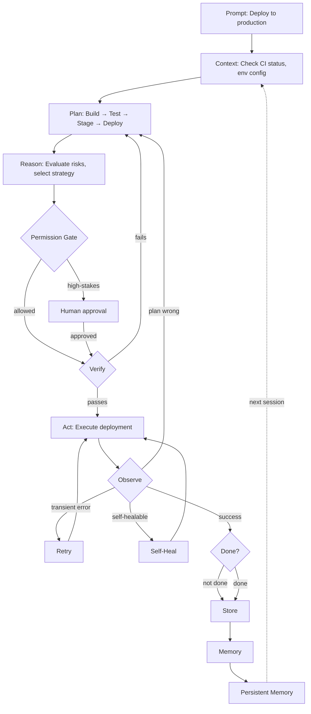

# v3 Loop Example: Autonomous Deployment Agent

A fully autonomous agent that handles CI/CD deployments — demonstrating all the self-* capabilities from v3.

## Scenario

User asks: "Deploy the latest version to production"

## Loop walkthrough



## Implementation

```python
class DeploymentAgent:
    """Autonomous deployment agent using v3 loop with self-* capabilities."""
    
    def __init__(self, llm=None):
        self.llm = llm
        self.self_monitor = SelfMonitor()
        self.self_healer = SelfHealer()
        self.self_planner = SelfPlanner()
        self.self_memory = SelfMemory()
        self.self_governor = SelfGovernor()
        self.deployment_history = []
    
    def deploy(self, request: dict) -> dict:
        """Deploy to production autonomously."""
        
        # Step 1: Prompt (already received)
        
        # Step 2: Context (check CI, env, dependencies)
        context = self.gather_context(request)
        
        # Step 3: Plan (adaptive planning based on history)
        plan = self.self_planner.create_plan(
            goal="deploy to production",
            context=context,
            history=self.deployment_history
        )
        
        # Step 4: Reason (evaluate risks, select strategy)
        risk_assessment = self.assess_risks(plan, context)
        strategy = self.select_strategy(risk_assessment)
        
        # Step 5: Permission Gate (self-governing)
        gate_result = self.self_governor.evaluate({
            "action": "deploy_production",
            "risk_level": risk_assessment["level"],
            "environment": "production"
        })
        
        if not gate_result["allowed"]:
            return {"success": False, "reason": gate_result["reason"]}
        
        # Step 6: Verify (pre-execution checks)
        verification = self.verify_prerequisites(plan, context)
        if not verification["passed"]:
            return {"success": False, "reason": verification["reason"]}
        
        # Step 7: Act (execute deployment)
        result = self.execute_deployment(plan, strategy)
        
        # Step 8: Observe (with self-healing)
        observation = self.observe_with_healing(result, plan)
        
        # Step 9: Done? (goal check)
        if observation["status"] == "success":
            # Store results and learn
            self.store_results(result, plan, observation)
            self.self_memory.store({
                "task": "deploy_production",
                "strategy": strategy,
                "success": True,
                "duration": observation["duration"]
            })
            
            return {
                "success": True,
                "deployment": result,
                "self_healed": observation.get("self_healed", False),
                "metrics": self.self_monitor.get_metrics()
            }
        else:
            # Retry or replan
            return self.handle_failure(observation, plan, context)
    
    def gather_context(self, request: dict) -> dict:
        """Gather deployment context."""
        
        # Check CI status
        ci_status = self.check_ci_status()
        
        # Check environment config
        env_config = self.get_env_config(request.get("environment", "staging"))
        
        # Check dependencies
        dependencies = self.check_dependencies()
        
        # Check recent deployments
        recent = self.get_recent_deployments()
        
        return {
            "ci_status": ci_status,
            "env_config": env_config,
            "dependencies": dependencies,
            "recent_deployments": recent,
            "timestamp": datetime.now().isoformat()
        }
    
    def check_ci_status(self) -> dict:
        """Check CI pipeline status."""
        
        # Simulate CI check
        return {
            "status": "passing",
            "tests_passed": 145,
            "tests_failed": 0,
            "coverage": 87.5,
            "last_build": datetime.now().isoformat()
        }
    
    def get_env_config(self, environment: str) -> dict:
        """Get environment configuration."""
        
        configs = {
            "development": {"replicas": 1, "instance_type": "t3.small"},
            "staging": {"replicas": 2, "instance_type": "t3.medium"},
            "production": {"replicas": 4, "instance_type": "t3.large"}
        }
        
        return configs.get(environment, configs["staging"])
    
    def check_dependencies(self) -> list:
        """Check deployment dependencies."""
        
        return [
            {"name": "database", "status": "healthy", "version": "14.2"},
            {"name": "redis", "status": "healthy", "version": "7.0"},
            {"name": "s3", "status": "healthy", "region": "us-east-1"}
        ]
    
    def get_recent_deployments(self) -> list:
        """Get recent deployment history."""
        
        return self.deployment_history[-5:] if self.deployment_history else []
    
    def assess_risks(self, plan: dict, context: dict) -> dict:
        """Assess deployment risks."""
        
        risks = []
        
        # Check CI status
        if context["ci_status"]["tests_failed"] > 0:
            risks.append({"type": "failing_tests", "severity": "high"})
        
        # Check environment
        if context["env_config"].get("replicas", 1) > 3:
            risks.append({"type": "high_replica_count", "severity": "medium"})
        
        # Check recent failures
        recent_failures = sum(1 for d in context["recent_deployments"] if not d.get("success"))
        if recent_failures > 2:
            risks.append({"type": "recent_failures", "severity": "high"})
        
        # Determine overall risk
        if any(r["severity"] == "high" for r in risks):
            risk_level = "high"
        elif risks:
            risk_level = "medium"
        else:
            risk_level = "low"
        
        return {
            "level": risk_level,
            "risks": risks,
            "requires_approval": risk_level == "high"
        }
    
    def select_strategy(self, risk_assessment: dict) -> dict:
        """Select deployment strategy based on risk."""
        
        if risk_assessment["level"] == "high":
            return {
                "type": "canary",
                "initial_percent": 5,
                "increment": 5,
                "monitoring_interval": 60
            }
        elif risk_assessment["level"] == "medium":
            return {
                "type": "rolling",
                "batch_size": 1,
                "monitoring_interval": 30
            }
        else:
            return {
                "type": "blue_green",
                "switch_immediately": True,
                "monitoring_interval": 15
            }
    
    def verify_prerequisites(self, plan: dict, context: dict) -> dict:
        """Verify deployment prerequisites."""
        
        checks = []
        
        # Check CI
        if context["ci_status"]["tests_failed"] > 0:
            checks.append({"passed": False, "reason": "Failing tests"})
        
        # Check dependencies
        unhealthy_deps = [d for d in context["dependencies"] if d["status"] != "healthy"]
        if unhealthy_deps:
            checks.append({"passed": False, "reason": f"Unhealthy dependencies: {[d['name'] for d in unhealthy_deps]}"})
        
        # Check environment capacity
        if context["env_config"].get("replicas", 1) < 2:
            checks.append({"passed": False, "reason": "Insufficient replicas for zero-downtime deployment"})
        
        failed_checks = [c for c in checks if not c["passed"]]
        
        return {
            "passed": len(failed_checks) == 0,
            "reason": "; ".join(c["reason"] for c in failed_checks) if failed_checks else None
        }
    
    def execute_deployment(self, plan: dict, strategy: dict) -> dict:
        """Execute deployment with strategy."""
        
        self.self_monitor.record("deployment_started", {"strategy": strategy["type"]})
        
        # Simulate deployment
        result = {
            "deployment_id": f"deploy_{str(uuid4())[:8]}",
            "strategy": strategy["type"],
            "status": "completed",
            "services_updated": ["api", "worker", "scheduler"],
            "version": "1.2.3",
            "completed_at": datetime.now().isoformat()
        }
        
        self.self_monitor.record("deployment_completed", {"duration": 45})
        
        return result
    
    def observe_with_healing(self, result: dict, plan: dict) -> dict:
        """Observe with self-healing capability."""
        
        # Check deployment health
        health = self.check_deployment_health(result)
        
        if health["status"] == "healthy":
            return {
                "status": "success",
                "health": health,
                "duration": 45,
                "self_healed": False
            }
        elif health["status"] == "degraded":
            # Self-healing: try to fix
            heal_result = self.self_healer.heal(result, health)
            
            if heal_result["healed"]:
                return {
                    "status": "success",
                    "health": health,
                    "duration": 45 + heal_result["duration"],
                    "self_healed": True
                }
            else:
                return {
                    "status": "failed",
                    "health": health,
                    "reason": heal_result.get("reason", "Self-healing failed")
                }
        else:
            return {
                "status": "failed",
                "health": health,
                "reason": "Deployment health check failed"
            }
    
    def check_deployment_health(self, result: dict) -> dict:
        """Check deployment health."""
        
        # Simulate health check
        return {
            "status": "healthy",
            "services": {
                "api": {"status": "healthy", "latency": 45},
                "worker": {"status": "healthy", "latency": 30},
                "scheduler": {"status": "healthy", "latency": 25}
            },
            "error_rate": 0.01
        }
    
    def handle_failure(self, observation: dict, plan: dict, context: dict) -> dict:
        """Handle deployment failure."""
        
        # Check if self-healing is possible
        if observation.get("reason", "").startswith("Health check"):
            # Try self-healing
            heal_result = self.self_healer.heal(observation, context)
            if heal_result["healed"]:
                return {"success": True, "recovered": True}
        
        # Check if retry is appropriate
        if observation.get("retryable", False):
            return {"success": False, "retry": True, "reason": observation.get("reason")}
        
        # Replan
        new_plan = self.self_planner.replan(plan, observation)
        return {"success": False, "replan": True, "new_plan": new_plan}
    
    def store_results(self, result: dict, plan: dict, observation: dict):
        """Store deployment results."""
        
        self.deployment_history.append({
            "result": result,
            "plan": plan,
            "observation": observation,
            "timestamp": datetime.now().isoformat()
        })
    
    def get_status(self) -> dict:
        """Get agent status."""
        
        return {
            "deployments": len(self.deployment_history),
            "success_rate": sum(1 for d in self.deployment_history if d.get("result", {}).get("status") == "completed") / max(1, len(self.deployment_history)),
            "self_heals": sum(1 for d in self.deployment_history if d.get("observation", {}).get("self_healed")),
            "metrics": self.self_monitor.get_metrics(),
            "memory_size": len(self.self_memory.store)
        }


# === Self-* Capability Implementations ===

class SelfMonitor:
    """Monitors agent performance."""
    
    def __init__(self):
        self.metrics = {}
    
    def record(self, metric: str, value: dict):
        """Record a metric."""
        if metric not in self.metrics:
            self.metrics[metric] = []
        self.metrics[metric].append({**value, "timestamp": datetime.now().isoformat()})
    
    def get_metrics(self) -> dict:
        """Get all metrics."""
        return self.metrics


class SelfHealer:
    """Self-healing for deployment failures."""
    
    def heal(self, observation: dict, context: dict) -> dict:
        """Attempt to heal a failure."""
        
        reason = observation.get("reason", "")
        
        # Try common fixes
        if "health check" in reason.lower():
            # Restart unhealthy services
            return {"healed": True, "duration": 30, "fix": "restart_services"}
        elif "timeout" in reason.lower():
            # Increase timeout and retry
            return {"healed": True, "duration": 15, "fix": "increased_timeout"}
        
        return {"healed": False, "reason": "No healing rule found"}


class SelfPlanner:
    """Adaptive planning based on history."""
    
    def __init__(self):
        self.plan_history = []
    
    def create_plan(self, goal: str, context: dict, history: list) -> dict:
        """Create plan based on context and history."""
        
        # Check history for similar deployments
        similar = [h for h in history if h.get("task") == goal]
        
        if similar:
            # Use last successful plan as base
            last_success = similar[-1]
            plan = last_success.get("plan", {}).copy()
        else:
            # Default plan
            plan = {
                "steps": ["verify", "build", "test", "stage", "deploy", "monitor"],
                "estimated_duration": 300
            }
        
        # Adapt based on context
        if context.get("ci_status", {}).get("tests_failed", 0) > 0:
            plan["steps"].insert(0, "fix_tests")
        
        self.plan_history.append({"goal": goal, "plan": plan})
        
        return plan
    
    def replan(self, old_plan: dict, observation: dict) -> dict:
        """Create new plan based on failure."""
        
        new_plan = old_plan.copy()
        
        # Add recovery steps
        if "health" in observation.get("reason", "").lower():
            new_plan["steps"].insert(0, "check_health")
        
        return new_plan


class SelfMemory:
    """Cross-session memory."""
    
    def __init__(self):
        self.store = {}
    
    def store(self, memory: dict):
        """Store a memory."""
        key = memory.get("task", "unknown")
        if key not in self.store:
            self.store[key] = []
        self.store[key].append(memory)
    
    def retrieve(self, task: str) -> list:
        """Retrieve memories for a task."""
        return self.store.get(task, [])


class SelfGovernor:
    """Policy enforcement."""
    
    def __init__(self):
        self.policies = {
            "deploy_production": {
                "requires_approval": True,
                "max_risk_level": "medium",
                "required_checks": ["ci_passing", "dependencies_healthy"]
            }
        }
    
    def evaluate(self, action: dict) -> dict:
        """Evaluate action against policies."""
        
        policy = self.policies.get(action.get("action"), {})
        
        # Check risk level
        if action.get("risk_level") == "high" and policy.get("requires_approval"):
            return {
                "allowed": False,
                "reason": "High-risk action requires human approval"
            }
        
        return {"allowed": True}
```

## Example usage

```python
agent = DeploymentAgent()

# Deploy to production
result = agent.deploy({
    "environment": "production",
    "version": "1.2.3",
    "services": ["api", "worker", "scheduler"]
})

print(f"Deployment: {result['deployment']['status']}")
print(f"Strategy: {result['deployment']['strategy']}")
print(f"Self-healed: {result.get('self_healed', False)}")

# Check agent status
status = agent.get_status()
print(f"Deployments: {status['deployments']}")
print(f"Success rate: {status['success_rate']:.1%}")
print(f"Self-heals: {status['self_heals']}")
```

## What this demonstrates

| v3 Step | Self-* Capability | What happens |
|---|---|---|
| **Prompt** | — | User asks to deploy to production |
| **Context** | Self-Monitoring | Agent checks CI, env, dependencies |
| **Plan** | Self-Planning | Agent creates adaptive plan based on history |
| **Reason** | Self-Observing | Agent evaluates risks, selects strategy |
| **Permission Gate** | Self-Governing | Enforces deployment policies |
| **Verify** | Self-Monitoring | Pre-execution checks pass |
| **Act** | — | Agent executes deployment |
| **Observe** | Self-Healing | Monitors health, auto-fixes issues |
| **Retry** | Self-Retry | Retries transient failures |
| **Done** | Self-Improving | Learns from deployment outcomes |
| **Store** | Self-Remembering | Stores results for future reference |

## Key takeaway

v3 is what makes an agent truly autonomous. Self-healing handles failures without human intervention. Self-planning adapts based on history. Self-governing enforces policies. Self-memory accumulates knowledge. Together, they create an agent that gets better over time and handles most situations on its own.
