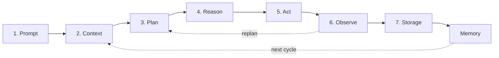
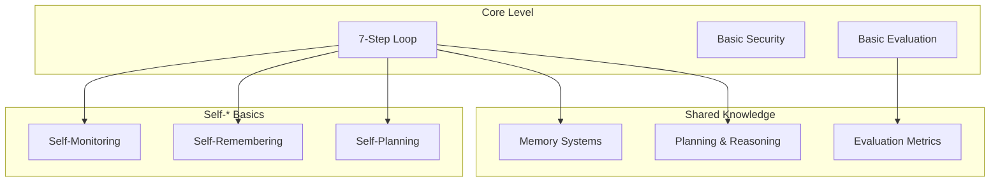

# Core (Concept)

The foundational agentic loop. Start here if you're new to agentic AI.

> **Self-* Capabilities:** Core level focuses on understanding. For autonomous capabilities, see [self/](../shared/self/) folder.

## What this covers

- 7-step loop: Prompt, Context, Plan, Reason, Act, Observe, Store/Memory
- Basic security awareness
- Basic evaluation metrics
- Smoke testing patterns
- Explainability basics
- Ethics basics

## Architecture

## Files

| File | Description |
|---|---|
| `agentic-ai-loop-guide.md` | Full guide with explanations, failure modes, examples |
| `agentic-ai-loop.mermaid` | Full diagram with security, evaluation, testing subgraphs |
| `agentic-ai-loop-core.mermaid` | Simplified diagram (loop only, 10 nodes) |

## When to use

- Teaching the concept of agentic AI
- Building a prototype or PoC
- Understanding the fundamentals before going deeper

## Shared resources for Core level

These shared resources provide the knowledge base for building agents:

### Memory & Planning

| Resource | What you learn | Diagram |
|---|---|---|
| [Memory Systems](../shared/memory-systems.md) | Short/long-term memory, vector stores, forgetting | [mermaid](../shared/memory-systems.mermaid) |
| [Planning & Reasoning](../shared/planning-reasoning.md) | CoT, ToT, ReAct, meta-reasoning | [mermaid](../shared/planning-reasoning.mermaid) |

### Evaluation & Safety

| Resource | What you learn | Diagram |
|---|---|---|
| [Evaluation Metrics](../shared/evaluation-metrics.md) | Core metrics, evaluation suites, A/B testing | [mermaid](../shared/evaluation-metrics.mermaid) |
| [Safety & Guardrails](../shared/safety-guardrails.md) | Threat modeling, sandboxing, adversarial testing | [mermaid](../shared/safety-guardrails.mermaid) |
| [Ethics & Compliance](../shared/ethics-compliance.md) | Ethical principles, bias testing, compliance | [mermaid](../shared/ethics-compliance.mermaid) |

## Self-* capabilities for Core level

At the Concept level, you need to understand these self-* patterns:

| Capability | What you learn | Deep dive | Diagram |
|---|---|---|---|
| **Self-Monitoring** | Basic metrics and health checks | [self-monitoring.md](../shared/self/self-monitoring.md) | [mermaid](../shared/self/self-monitoring.mermaid) |
| **Self-Remembering** | Simple storage and retrieval | [self-remembering.md](../shared/self/self-remembering.md) | [mermaid](../shared/self/self-remembering.mermaid) |
| **Self-Planning** | Basic goal decomposition | [self-planning.md](../shared/self/self-planning.md) | [mermaid](../shared/self/self-planning.mermaid) |

**Why these three?** They form the foundation: you need to *remember* what happened, *monitor* your performance, and *plan* your next steps. Without these, nothing else works.

## How it all connects

## Next level

Ready to go deeper? See [Production](../production/README.md) for safety, testing, and deployment.
