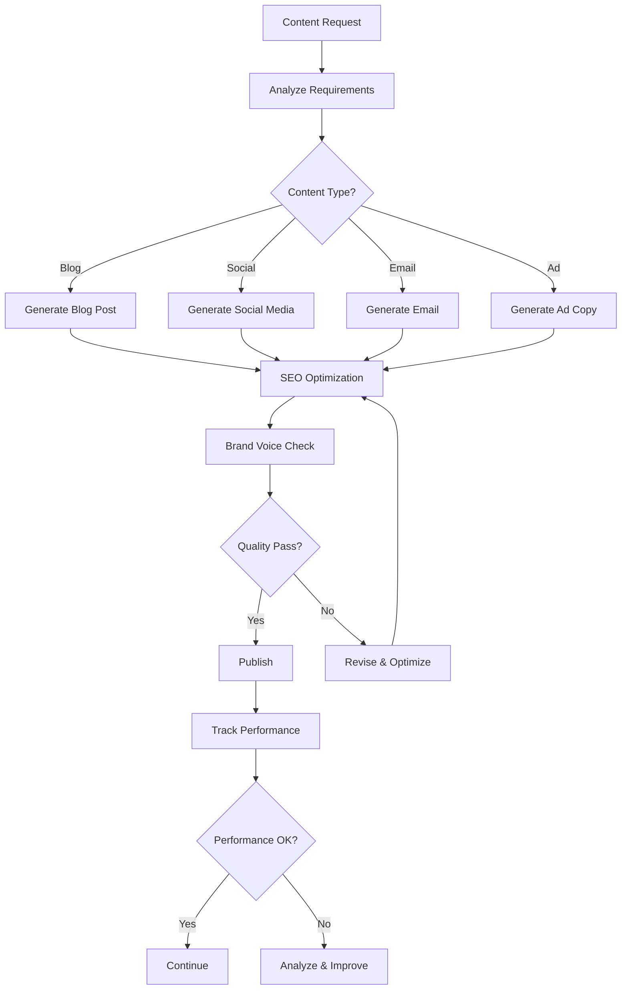

# Content Generation Agent Case Study

## Scenario

An autonomous content generation agent that creates, optimizes, and publishes content across multiple channels — adapting to brand voice, SEO requirements, and audience preferences without human intervention.

## Architecture



## Implementation

### Content Generator

```python
class ContentGenerator:
    def __init__(self, llm=None, brand_guidelines: dict = None):
        self.llm = llm
        self.brand_guidelines = brand_guidelines or {}
        self.content_history = []
    
    def generate(self, request: dict) -> dict:
        """Generate content based on request."""
        
        content_type = request.get("type", "blog")
        topic = request.get("topic", "")
        audience = request.get("audience", "general")
        
        # Generate content based on type
        if content_type == "blog":
            content = self.generate_blog(request)
        elif content_type == "social":
            content = self.generate_social(request)
        elif content_type == "email":
            content = self.generate_email(request)
        elif content_type == "ad":
            content = self.generate_ad(request)
        else:
            content = self.generate_generic(request)
        
        # Apply SEO optimization
        optimized = self.optimize_seo(content, topic)
        
        # Check brand voice
        brand_check = self.check_brand_voice(optimized)
        
        if brand_check["passed"]:
            # Store content
            self.content_history.append({
                "request": request,
                "content": optimized,
                "brand_check": brand_check,
                "timestamp": datetime.now().isoformat()
            })
            
            return {"success": True, "content": optimized}
        else:
            # Revise to match brand voice
            revised = self.revise_for_brand(optimized, brand_check["issues"])
            return {"success": True, "content": revised}
    
    def generate_blog(self, request: dict) -> dict:
        """Generate blog post."""
        
        topic = request.get("topic", "")
        audience = request.get("audience", "general")
        length = request.get("length", "medium")
        
        if self.llm:
            return self.generate_with_llm(topic, audience, length)
        
        # Fallback template
        return {
            "type": "blog",
            "title": f"Guide to {topic}",
            "content": f"This is a blog post about {topic}...",
            "audience": audience,
            "length": length
        }
    
    def generate_with_llm(self, topic: str, audience: str, length: str) -> dict:
        """Generate content using LLM."""
        
        prompt = f"""
        Write a {length} blog post about {topic} for {audience} audience.
        
        Requirements:
        - Engaging introduction
        - Clear structure with headings
        - Actionable insights
        - Strong conclusion
        
        Brand guidelines: {self.brand_guidelines}
        """
        
        try:
            response = self.llm.call(prompt)
            return {
                "type": "blog",
                "title": f"Guide to {topic}",
                "content": response,
                "audience": audience
            }
        except:
            return self.generate_generic({"topic": topic, "audience": audience})
    
    def generate_social(self, request: dict) -> dict:
        """Generate social media content."""
        
        topic = request.get("topic", "")
        platform = request.get("platform", "twitter")
        
        # Platform-specific formatting
        formats = {
            "twitter": {"max_length": 280, "hashtags": True},
            "linkedin": {"max_length": 3000, "hashtags": True},
            "instagram": {"max_length": 2200, "hashtags": True, "emojis": True}
        }
        
        format_config = formats.get(platform, formats["twitter"])
        
        return {
            "type": "social",
            "platform": platform,
            "content": f"Check out our latest post about {topic}! #{topic.replace(' ', '')}",
            "hashtags": [topic.replace(" ", ""), "tips", "guide"],
            "format_config": format_config
        }
    
    def generate_email(self, request: dict) -> dict:
        """Generate email content."""
        
        topic = request.get("topic", "")
        purpose = request.get("purpose", "newsletter")
        
        return {
            "type": "email",
            "purpose": purpose,
            "subject": f"Latest on {topic}",
            "content": f"Hi there,\n\nHere's what's new about {topic}...\n\nBest regards",
            "cta": "Read more"
        }
    
    def generate_ad(self, request: dict) -> dict:
        """Generate ad copy."""
        
        topic = request.get("topic", "")
        platform = request.get("platform", "google")
        
        return {
            "type": "ad",
            "platform": platform,
            "headline": f"Master {topic} Today",
            "description": f"Learn everything about {topic} with our comprehensive guide.",
            "cta": "Get Started"
        }
    
    def generate_generic(self, request: dict) -> dict:
        """Generate generic content."""
        
        topic = request.get("topic", "")
        return {
            "type": "generic",
            "content": f"Content about {topic}",
            "request": request
        }
```

### SEO Optimizer

```python
class SEOOptimizer:
    """Optimizes content for search engines."""
    
    def __init__(self):
        self.seo_rules = {
            "title_length": {"min": 30, "max": 60},
            "meta_description_length": {"min": 120, "max": 160},
            "keyword_density": {"min": 0.5, "max": 2.5},
            "heading_structure": True,
            "internal_links": {"min": 2}
        }
    
    def optimize(self, content: dict, primary_keyword: str) -> dict:
        """Optimize content for SEO."""
        
        optimized = content.copy()
        
        # Optimize title
        if "title" in optimized:
            optimized["title"] = self.optimize_title(optimized["title"], primary_keyword)
        
        # Add meta description
        if "content" in optimized:
            optimized["meta_description"] = self.generate_meta_description(
                optimized["content"], primary_keyword
            )
        
        # Check keyword density
        if "content" in optimized:
            density = self.calculate_keyword_density(optimized["content"], primary_keyword)
            optimized["keyword_density"] = density
        
        # Add internal links suggestions
        optimized["internal_link_suggestions"] = self.suggest_internal_links(primary_keyword)
        
        return optimized
    
    def optimize_title(self, title: str, keyword: str) -> str:
        """Optimize title for SEO."""
        
        # Ensure keyword is in title
        if keyword.lower() not in title.lower():
            title = f"{keyword}: {title}"
        
        # Check length
        if len(title) > 60:
            title = title[:57] + "..."
        
        return title
    
    def generate_meta_description(self, content: str, keyword: str) -> str:
        """Generate meta description."""
        
        # Extract first paragraph
        first_paragraph = content.split("\n\n")[0] if content else ""
        
        # Truncate to meta description length
        if len(first_paragraph) > 160:
            first_paragraph = first_paragraph[:157] + "..."
        
        return first_paragraph
    
    def calculate_keyword_density(self, content: str, keyword: str) -> float:
        """Calculate keyword density."""
        
        words = content.lower().split()
        keyword_count = content.lower().count(keyword.lower())
        
        if len(words) == 0:
            return 0.0
        
        return (keyword_count / len(words)) * 100
    
    def suggest_internal_links(self, topic: str) -> list:
        """Suggest internal links."""
        
        # In production, would query actual content database
        return [
            f"Related article 1 about {topic}",
            f"Related article 2 about {topic}",
            f"Related article 3 about {topic}"
        ]
```

### Brand Voice Checker

```python
class BrandVoiceChecker:
    """Checks content against brand guidelines."""
    
    def __init__(self, guidelines: dict = None):
        self.guidelines = guidelines or {
            "tone": "professional",
            "avoid_words": ["cheap", "free", "guaranteed"],
            "required_elements": ["call_to_action"]
        }
    
    def check(self, content: dict) -> dict:
        """Check content against brand guidelines."""
        
        issues = []
        
        # Check tone
        if not self.check_tone(content):
            issues.append({"type": "tone", "message": "Content doesn't match brand tone"})
        
        # Check banned words
        banned = self.check_banned_words(content)
        if banned:
            issues.append({"type": "banned_words", "words": banned})
        
        # Check required elements
        missing = self.check_required_elements(content)
        if missing:
            issues.append({"type": "missing_elements", "elements": missing})
        
        return {
            "passed": len(issues) == 0,
            "issues": issues
        }
    
    def check_tone(self, content: dict) -> bool:
        """Check if content matches brand tone."""
        
        content_str = str(content).lower()
        target_tone = self.guidelines.get("tone", "professional")
        
        # Simple tone checking
        if target_tone == "professional":
            informal_words = ["hey", "guys", "cool", "awesome"]
            for word in informal_words:
                if word in content_str:
                    return False
        
        return True
    
    def check_banned_words(self, content: dict) -> list:
        """Check for banned words."""
        
        content_str = str(content).lower()
        banned = self.guidelines.get("avoid_words", [])
        
        found = [word for word in banned if word.lower() in content_str]
        
        return found
    
    def check_required_elements(self, content: dict) -> list:
        """Check for required elements."""
        
        content_str = str(content).lower()
        required = self.guidelines.get("required_elements", [])
        
        missing = []
        for element in required:
            if element == "call_to_action":
                cta_words = ["click", "sign up", "learn more", "get started"]
                if not any(word in content_str for word in cta_words):
                    missing.append("call_to_action")
        
        return missing
```

## Usage Example

```python
# Create content generator with brand guidelines
generator = ContentGenerator(
    brand_guidelines={
        "tone": "professional",
        "avoid_words": ["cheap", "free", "guaranteed"],
        "required_elements": ["call_to_action"]
    }
)

# Generate blog post
request = {
    "type": "blog",
    "topic": "AI in healthcare",
    "audience": "medical professionals",
    "length": "medium"
}

result = generator.generate(request)
if result["success"]:
    print(f"Generated: {result['content']['title']}")
    print(f"Content length: {len(result['content']['content'])} chars")

# Generate social media post
social_request = {
    "type": "social",
    "topic": "AI in healthcare",
    "platform": "linkedin"
}

social_result = generator.generate(social_request)
print(f"Social post: {social_result['content']['content'][:100]}...")
```

## Self-* Capabilities Used

| Capability | How it's used |
|---|---|
| **Self-Adapting** | Adjusts content style based on platform and audience |
| **Self-Improving** | Learns from performance metrics what content works |
| **Self-Governing** | Enforces brand guidelines, SEO rules |
| **Self-Monitoring** | Tracks content performance, engagement metrics |
| **Self-Planning** | Plans content calendar, optimizes publishing schedule |

## Metrics

| Metric | Target | How to measure |
|---|---|---|
| Content quality score | > 80/100 | Brand voice check + SEO score |
| Engagement rate | > 5% | Interactions / impressions |
| SEO ranking improvement | > 10% | Average ranking position change |
| Content production speed | < 30 minutes | Time from request to publish |
| Brand consistency | > 95% | Content passing brand check / total |
