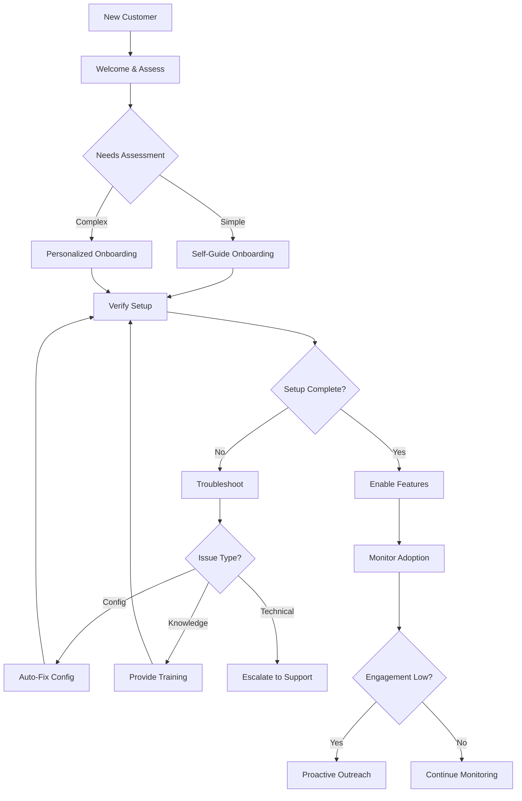

# Customer Onboarding Agent Case Study

## Scenario

An autonomous customer onboarding agent that guides new users through setup, verifies their configuration, troubleshoots issues, and ensures successful adoption — all without human intervention.

## Architecture



## Implementation

### Onboarding Agent

```python
class OnboardingAgent:
    def __init__(self, llm=None):
        self.llm = llm
        self.customer_profiles = {}
        self.onboarding_history = []
    
    def onboard(self, customer: dict) -> dict:
        """Start onboarding process for a new customer."""
        
        # Assess customer needs
        assessment = self.assess_needs(customer)
        
        # Create onboarding plan
        plan = self.create_plan(assessment)
        
        # Execute onboarding
        result = self.execute_onboarding(customer, plan)
        
        # Verify setup
        verification = self.verify_setup(customer)
        
        if verification["success"]:
            # Enable features
            self.enable_features(customer, plan["features"])
            
            # Store profile
            self.customer_profiles[customer["id"]] = {
                "customer": customer,
                "assessment": assessment,
                "plan": plan,
                "completed_at": datetime.now().isoformat()
            }
            
            return {"success": True, "status": "onboarded"}
        else:
            # Troubleshoot issues
            return self.troubleshoot(customer, verification["issues"])
    
    def assess_needs(self, customer: dict) -> dict:
        """Assess customer needs and technical level."""
        
        # Analyze customer information
        company_size = customer.get("company_size", "small")
        technical_level = customer.get("technical_level", "intermediate")
        use_case = customer.get("use_case", "general")
        
        # Determine complexity
        complexity = "simple"
        if company_size in ["medium", "large"]:
            complexity = "complex"
        if technical_level == "beginner":
            complexity = "simple"  # Simpler onboarding for beginners
        
        return {
            "company_size": company_size,
            "technical_level": technical_level,
            "use_case": use_case,
            "complexity": complexity,
            "recommended_features": self.get_recommended_features(use_case, company_size)
        }
    
    def get_recommended_features(self, use_case: str, company_size: str) -> list:
        """Get recommended features based on use case."""
        
        feature_map = {
            "analytics": ["dashboard", "reports", "alerts"],
            "automation": ["workflows", "triggers", "integrations"],
            "collaboration": ["teams", "sharing", "permissions"],
            "general": ["dashboard", "basic_reports"]
        }
        
        features = feature_map.get(use_case, ["dashboard"])
        
        # Add enterprise features for larger companies
        if company_size in ["medium", "large"]:
            features.extend(["sso", "audit_logs", "api_access"])
        
        return features
    
    def create_plan(self, assessment: dict) -> dict:
        """Create onboarding plan based on assessment."""
        
        complexity = assessment["complexity"]
        
        if complexity == "simple":
            return {
                "type": "self_guide",
                "steps": [
                    "Send welcome email",
                    "Provide getting started guide",
                    "Schedule check-in in 3 days"
                ],
                "features": assessment["recommended_features"]
            }
        else:
            return {
                "type": "personalized",
                "steps": [
                    "Schedule kickoff call",
                    "Understand requirements",
                    "Configure account",
                    "Set up integrations",
                    "Provide training",
                    "Verify setup",
                    "Schedule follow-up"
                ],
                "features": assessment["recommended_features"]
            }
    
    def execute_onboarding(self, customer: dict, plan: dict):
        """Execute onboarding plan."""
        
        if plan["type"] == "self_guide":
            return self.execute_self_guide(customer, plan)
        else:
            return self.execute_personalized(customer, plan)
    
    def execute_self_guide(self, customer: dict, plan: dict):
        """Execute self-guided onboarding."""
        
        # Send welcome email with resources
        self.send_welcome_email(customer, plan["features"])
        
        # Provide getting started guide
        guide = self.generate_guide(plan["features"])
        
        return {"status": "self_guide_sent", "guide": guide}
    
    def execute_personalized(self, customer: dict, plan: dict):
        """Execute personalized onboarding."""
        
        # This would involve more interactive steps
        return {"status": "personalized_started", "next_step": plan["steps"][0]}
    
    def send_welcome_email(self, customer: dict, features: list):
        """Send welcome email with onboarding resources."""
        
        email_content = {
            "to": customer.get("email"),
            "subject": "Welcome to our platform!",
            "body": f"""
            Hi {customer.get('name')},
            
            Welcome! Here's how to get started with your features:
            {chr(10).join(f'- {f}' for f in features)}
            
            Check out our getting started guide for detailed instructions.
            """
        }
        
        # In production, would send email
        print(f"Welcome email sent to {customer.get('email')}")
    
    def generate_guide(self, features: list) -> str:
        """Generate getting started guide."""
        
        guide = "# Getting Started Guide\n\n"
        
        for i, feature in enumerate(features, 1):
            guide += f"## {i}. {feature.replace('_', ' ').title()}\n\n"
            guide += f"Instructions for setting up {feature}...\n\n"
        
        return guide
    
    def verify_setup(self, customer: dict) -> dict:
        """Verify customer setup is complete."""
        
        customer_id = customer.get("id")
        profile = self.customer_profiles.get(customer_id)
        
        if not profile:
            return {"success": False, "issues": ["Customer not found"]}
        
        # Check if required features are enabled
        required_features = profile.get("plan", {}).get("features", [])
        
        # In production, would check actual feature status
        return {"success": True, "issues": []}
    
    def enable_features(self, customer: dict, features: list):
        """Enable features for customer."""
        
        for feature in features:
            print(f"Enabling feature: {feature}")
            # In production, would enable feature in system
    
    def troubleshoot(self, customer: dict, issues: list) -> dict:
        """Troubleshoot onboarding issues."""
        
        for issue in issues:
            issue_type = issue.get("type")
            
            if issue_type == "config":
                # Auto-fix configuration
                self.auto_fix_config(customer, issue)
            elif issue_type == "knowledge":
                # Provide training materials
                self.provide_training(customer, issue)
            elif issue_type == "technical":
                # Escalate to support
                self.escalate_to_support(customer, issue)
        
        return {"success": False, "status": "troubleshooting", "issues": issues}
    
    def auto_fix_config(self, customer: dict, issue: dict):
        """Auto-fix configuration issues."""
        
        print(f"Auto-fixing config issue for {customer.get('name')}")
        # In production, would fix configuration
    
    def provide_training(self, customer: dict, issue: dict):
        """Provide training materials."""
        
        print(f"Providing training for {customer.get('name')}")
        # In production, would send training resources
    
    def escalate_to_support(self, customer: dict, issue: dict):
        """Escalate to human support."""
        
        print(f"Escalating to support for {customer.get('name')}")
        # In production, would create support ticket
```

## Usage Example

```python
# Create onboarding agent
agent = OnboardingAgent()

# Onboard a new customer
customer = {
    "id": "cust_123",
    "name": "Acme Corp",
    "email": "onboarding@acme.com",
    "company_size": "medium",
    "technical_level": "intermediate",
    "use_case": "analytics"
}

result = agent.onboard(customer)
print(f"Onboarding status: {result['status']}")
```

## Self-* Capabilities Used

| Capability | How it's used |
|---|---|
| **Self-Planning** | Creates personalized onboarding plans based on customer assessment |
| **Self-Adapting** | Adjusts onboarding flow based on customer technical level |
| **Self-Governing** | Validates customer data, enforces onboarding policies |
| **Self-Remembering** | Stores customer profiles and onboarding history |
| **Self-Monitoring** | Tracks onboarding success rates, customer engagement |

## Metrics

| Metric | Target | How to measure |
|---|---|---|
| Onboarding completion rate | > 85% | Customers completing full onboarding / total customers |
| Time to value | < 24 hours | Time from signup to first meaningful action |
| Customer satisfaction | > 4.5/5 | Post-onboarding survey score |
| Support escalation rate | < 10% | Issues escalated to human support / total issues |
