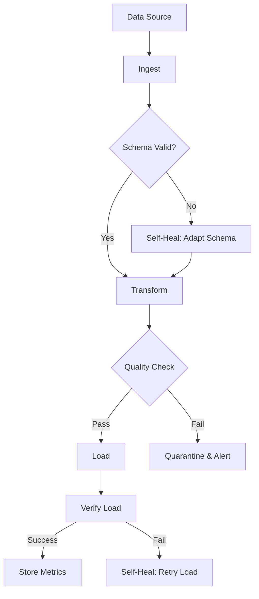

# Data Pipeline Agent Case Study

## Scenario

An autonomous data pipeline agent that ingests, transforms, validates, and loads data across multiple systems — handling schema changes, data quality issues, and system failures automatically.

## Architecture



## Implementation

### Data Ingestion Agent

```python
class DataIngestionAgent:
    def __init__(self, sources: list, llm=None):
        self.sources = sources
        self.llm = llm
        self.ingestion_history = []
    
    def ingest(self, source: dict) -> dict:
        """Ingest data from a source."""
        
        try:
            # Connect to source
            data = self.connect_and_read(source)
            
            # Validate schema
            schema_valid = self.validate_schema(data, source.get("expected_schema"))
            
            if not schema_valid:
                # Self-heal: adapt schema
                data = self.adapt_schema(data, source.get("expected_schema"))
            
            # Transform
            transformed = self.transform(data, source.get("transform_rules", []))
            
            # Quality check
            quality = self.quality_check(transformed)
            
            if quality["passed"]:
                # Load
                load_result = self.load(transformed, source.get("destination"))
                
                # Verify
                verified = self.verify_load(load_result, source.get("destination"))
                
                self.ingestion_history.append({
                    "source": source["name"],
                    "status": "success",
                    "records": len(transformed),
                    "timestamp": datetime.now().isoformat()
                })
                
                return {
                    "success": True,
                    "records": len(transformed),
                    "load_result": load_result
                }
            else:
                # Quarantine bad data
                self.quarantine(transformed, quality["issues"])
                
                return {
                    "success": False,
                    "reason": "Quality check failed",
                    "issues": quality["issues"]
                }
                
        except Exception as e:
            # Self-healing will handle this
            return {"success": False, "error": str(e)}
    
    def connect_and_read(self, source: dict):
        """Connect to data source and read data."""
        
        source_type = source.get("type")
        
        if source_type == "csv":
            return self.read_csv(source["path"])
        elif source_type == "api":
            return self.read_api(source["url"], source.get("params", {}))
        elif source_type == "database":
            return self.read_database(source["connection"], source["query"])
        elif source_type == "s3":
            return self.read_s3(source["bucket"], source["key"])
        
        raise ValueError(f"Unknown source type: {source_type}")
    
    def validate_schema(self, data: list, expected_schema: dict) -> bool:
        """Validate data against expected schema."""
        
        if not expected_schema:
            return True
        
        if not data:
            return False
        
        # Check required fields
        required = expected_schema.get("required", [])
        first_record = data[0] if data else {}
        
        for field in required:
            if field not in first_record:
                return False
        
        # Check field types
        types = expected_schema.get("types", {})
        for field, expected_type in types.items():
            if field in first_record:
                actual_type = type(first_record[field]).__name__
                if actual_type != expected_type:
                    return False
        
        return True
    
    def adapt_schema(self, data: list, expected_schema: dict) -> list:
        """Adapt data to match expected schema."""
        
        if not data or not expected_schema:
            return data
        
        adapted = []
        types = expected_schema.get("types", {})
        defaults = expected_schema.get("defaults", {})
        
        for record in data:
            adapted_record = record.copy()
            
            # Add missing fields with defaults
            for field, default in defaults.items():
                if field not in adapted_record:
                    adapted_record[field] = default
            
            # Convert types
            for field, expected_type in types.items():
                if field in adapted_record:
                    try:
                        if expected_type == "str":
                            adapted_record[field] = str(adapted_record[field])
                        elif expected_type == "int":
                            adapted_record[field] = int(adapted_record[field])
                        elif expected_type == "float":
                            adapted_record[field] = float(adapted_record[field])
                        elif expected_type == "bool":
                            adapted_record[field] = bool(adapted_record[field])
                    except (ValueError, TypeError):
                        adapted_record[field] = defaults.get(field)
            
            adapted.append(adapted_record)
        
        return adapted
    
    def transform(self, data: list, rules: list) -> list:
        """Apply transformation rules to data."""
        
        transformed = data
        
        for rule in rules:
            rule_type = rule.get("type")
            
            if rule_type == "rename":
                transformed = self.rename_fields(transformed, rule["mapping"])
            elif rule_type == "filter":
                transformed = self.filter_records(transformed, rule["condition"])
            elif rule_type == "aggregate":
                transformed = self.aggregate_data(transformed, rule["group_by"], rule["aggregations"])
            elif rule_type == "normalize":
                transformed = self.normalize_data(transformed, rule["fields"])
        
        return transformed
    
    def rename_fields(self, data: list, mapping: dict) -> list:
        """Rename fields in data."""
        
        renamed = []
        for record in data:
            new_record = {}
            for key, value in record.items():
                new_key = mapping.get(key, key)
                new_record[new_key] = value
            renamed.append(new_record)
        
        return renamed
    
    def filter_records(self, data: list, condition: dict) -> list:
        """Filter records based on condition."""
        
        field = condition.get("field")
        operator = condition.get("operator")
        value = condition.get("value")
        
        filtered = []
        for record in data:
            record_value = record.get(field)
            
            if operator == "eq" and record_value == value:
                filtered.append(record)
            elif operator == "neq" and record_value != value:
                filtered.append(record)
            elif operator == "gt" and record_value > value:
                filtered.append(record)
            elif operator == "lt" and record_value < value:
                filtered.append(record)
            elif operator == "contains" and value in str(record_value):
                filtered.append(record)
        
        return filtered
    
    def quality_check(self, data: list) -> dict:
        """Check data quality."""
        
        issues = []
        
        # Check for empty data
        if not data:
            issues.append({"type": "empty_data", "severity": "critical"})
            return {"passed": False, "issues": issues}
        
        # Check for null values
        null_counts = {}
        for record in data:
            for key, value in record.items():
                if value is None:
                    null_counts[key] = null_counts.get(key, 0) + 1
        
        for field, count in null_counts.items():
            if count / len(data) > 0.5:  # More than 50% null
                issues.append({
                    "type": "high_null_rate",
                    "field": field,
                    "null_rate": count / len(data),
                    "severity": "high"
                })
        
        # Check for duplicates
        seen = set()
        duplicates = 0
        for record in data:
            record_str = str(sorted(record.items()))
            if record_str in seen:
                duplicates += 1
            else:
                seen.add(record_str)
        
        if duplicates / len(data) > 0.1:  # More than 10% duplicates
            issues.append({
                "type": "high_duplicate_rate",
                "duplicate_rate": duplicates / len(data),
                "severity": "medium"
            })
        
        return {"passed": len(issues) == 0, "issues": issues}
    
    def load(self, data: list, destination: dict) -> dict:
        """Load data to destination."""
        
        dest_type = destination.get("type")
        
        if dest_type == "database":
            return self.load_to_database(data, destination)
        elif dest_type == "file":
            return self.load_to_file(data, destination)
        elif dest_type == "api":
            return self.load_to_api(data, destination)
        
        raise ValueError(f"Unknown destination type: {dest_type}")
    
    def load_to_database(self, data: list, destination: dict) -> dict:
        """Load data to database."""
        
        # Implementation would connect to database and insert
        return {"rows_inserted": len(data), "status": "success"}
    
    def verify_load(self, load_result: dict, destination: dict) -> bool:
        """Verify data was loaded correctly."""
        
        if load_result.get("status") != "success":
            return False
        
        # Verify row count
        expected_count = load_result.get("rows_inserted", 0)
        # In production, would query destination to verify
        
        return True
    
    def quarantine(self, data: list, issues: list):
        """Quarantine bad data for review."""
        
        quarantine_record = {
            "data": data[:10],  # Store sample
            "issues": issues,
            "quarantined_at": datetime.now().isoformat()
        }
        
        # In production, would store to quarantine location
        print(f"Quarantined {len(data)} records with issues: {[i['type'] for i in issues]}")
```

### Usage Example

```python
# Configure data source
source = {
    "name": "sales_data",
    "type": "csv",
    "path": "/data/sales.csv",
    "expected_schema": {
        "required": ["date", "product", "amount"],
        "types": {"date": "str", "product": "str", "amount": "float"},
        "defaults": {"region": "unknown"}
    },
    "transform_rules": [
        {"type": "rename", "mapping": {"prod": "product", "amt": "amount"}},
        {"type": "filter", "condition": {"field": "amount", "operator": "gt", "value": 0}}
    ],
    "destination": {"type": "database", "table": "sales"}
}

# Create agent and ingest
agent = DataIngestionAgent(sources=[source])
result = agent.ingest(source)

if result["success"]:
    print(f"Successfully ingested {result['records']} records")
else:
    print(f"Ingestion failed: {result.get('reason', result.get('error'))}")
```

## Self-* Capabilities Used

| Capability | How it's used |
|---|---|
| **Self-Healing** | Adapts schema when validation fails, retries failed loads |
| **Self-Monitoring** | Tracks ingestion metrics, quality scores |
| **Self-Improving** | Learns which transformations work for which data types |
| **Self-Remembering** | Stores schema patterns, quality issues, successful transformations |

## Metrics

| Metric | Target | How to measure |
|---|---|---|
| Ingestion success rate | > 95% | Records ingested / records attempted |
| Schema adaptation rate | < 10% of ingests | Schema adaptations / total ingests |
| Quality check pass rate | > 90% | Passed checks / total checks |
| Data latency | < 5 minutes | Time from source to destination |
