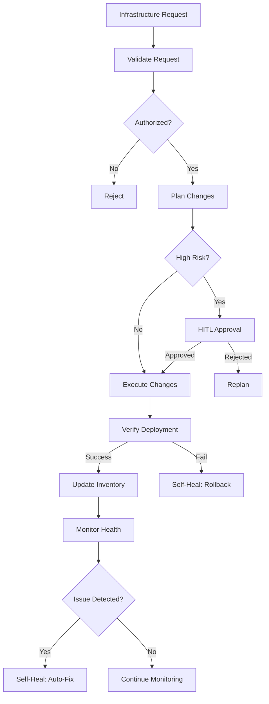

# Infrastructure Agent Case Study

## Scenario

An autonomous infrastructure agent that manages cloud resources, monitors health, handles scaling, and responds to incidents — all with minimal human oversight.

## Architecture



## Implementation

### Infrastructure Manager

```python
class InfrastructureManager:
    def __init__(self, cloud_provider: str, llm=None):
        self.cloud_provider = cloud_provider
        self.llm = llm
        self.inventory = {}
        self.change_history = []
    
    def provision(self, request: dict) -> dict:
        """Provision infrastructure based on request."""
        
        # Validate request
        validation = self.validate_request(request)
        if not validation["valid"]:
            return {"success": False, "reason": validation["reason"]}
        
        # Plan changes
        plan = self.plan_changes(request)
        
        # Check if high-risk
        if self.is_high_risk(plan):
            # Require HITL approval
            approval = self.request_approval(plan)
            if not approval["approved"]:
                return {"success": False, "reason": "Rejected by human"}
        
        # Execute changes
        result = self.execute_changes(plan)
        
        # Verify deployment
        verification = self.verify_deployment(result)
        
        if verification["success"]:
            # Update inventory
            self.update_inventory(result)
            
            # Store change
            self.change_history.append({
                "request": request,
                "plan": plan,
                "result": result,
                "timestamp": datetime.now().isoformat()
            })
            
            return {"success": True, "result": result}
        else:
            # Rollback on failure
            self.rollback(result)
            return {"success": False, "reason": "Deployment verification failed"}
    
    def validate_request(self, request: dict) -> dict:
        """Validate infrastructure request."""
        
        # Check required fields
        required = ["resource_type", "specifications", "environment"]
        for field in required:
            if field not in request:
                return {"valid": False, "reason": f"Missing required field: {field}"}
        
        # Check environment
        environment = request.get("environment")
        if environment not in ["dev", "staging", "production"]:
            return {"valid": False, "reason": f"Invalid environment: {environment}"}
        
        # Check resource type
        resource_type = request.get("resource_type")
        allowed_types = ["ec2", "rds", "s3", "lambda", "ecs"]
        if resource_type not in allowed_types:
            return {"valid": False, "reason": f"Unsupported resource type: {resource_type}"}
        
        return {"valid": True}
    
    def plan_changes(self, request: dict) -> dict:
        """Plan infrastructure changes."""
        
        return {
            "resource_type": request["resource_type"],
            "action": "create",
            "specifications": request["specifications"],
            "environment": request["environment"],
            "estimated_cost": self.estimate_cost(request),
            "rollback_plan": self.create_rollback_plan(request)
        }
    
    def is_high_risk(self, plan: dict) -> bool:
        """Determine if plan is high-risk."""
        
        # High risk if production or large resource
        if plan.get("environment") == "production":
            return True
        
        # Check resource size
        specs = plan.get("specifications", {})
        if specs.get("instance_type", "").endswith(("4xlarge", "8xlarge")):
            return True
        
        return False
    
    def estimate_cost(self, request: dict) -> float:
        """Estimate cost of infrastructure."""
        
        # Simplified cost estimation
        resource_costs = {
            "ec2": 0.1,  # per hour
            "rds": 0.5,  # per hour
            "s3": 0.02,  # per GB
            "lambda": 0.0000002,  # per request
            "ecs": 0.1   # per hour
        }
        
        resource_type = request.get("resource_type", "ec2")
        specs = request.get("specifications", {})
        
        # Simple estimation
        base_cost = resource_costs.get(resource_type, 0.1)
        
        # Scale by specifications
        multiplier = 1.0
        if "instance_count" in specs:
            multiplier *= specs["instance_count"]
        
        return base_cost * multiplier
    
    def execute_changes(self, plan: dict) -> dict:
        """Execute infrastructure changes."""
        
        # In production, would use cloud provider SDK
        # For example, boto3 for AWS
        
        result = {
            "resource_id": f"res_{str(uuid4())[:8]}",
            "resource_type": plan["resource_type"],
            "status": "created",
            "specifications": plan["specifications"],
            "created_at": datetime.now().isoformat()
        }
        
        return result
    
    def verify_deployment(self, result: dict) -> dict:
        """Verify deployment was successful."""
        
        # In production, would check resource status
        return {"success": True, "status": "verified"}
    
    def rollback(self, result: dict):
        """Rollback failed deployment."""
        
        print(f"Rolling back resource: {result.get('resource_id')}")
        # In production, would delete/restore resource
    
    def update_inventory(self, result: dict):
        """Update infrastructure inventory."""
        
        resource_id = result.get("resource_id")
        self.inventory[resource_id] = result
    
    def request_approval(self, plan: dict) -> dict:
        """Request human approval for high-risk changes."""
        
        # In production, would send notification and wait for approval
        return {"approved": True, "approver": "system"}
```

### Health Monitor

```python
class HealthMonitor:
    """Monitors infrastructure health."""
    
    def __init__(self, manager: InfrastructureManager):
        self.manager = manager
        self.health_checks = {}
        self.alerts = []
    
    def register_health_check(self, resource_id: str, check_fn: callable):
        """Register a health check for a resource."""
        
        self.health_checks[resource_id] = {
            "check": check_fn,
            "last_check": None,
            "status": "unknown"
        }
    
    def run_health_checks(self):
        """Run all health checks."""
        
        for resource_id, check_info in self.health_checks.items():
            try:
                result = check_info["check"]()
                check_info["status"] = "healthy" if result.get("healthy") else "unhealthy"
                check_info["last_check"] = datetime.now().isoformat()
                
                if check_info["status"] == "unhealthy":
                    self.trigger_alert(resource_id, result)
            except Exception as e:
                check_info["status"] = "error"
                self.trigger_alert(resource_id, {"error": str(e)})
    
    def trigger_alert(self, resource_id: str, details: dict):
        """Trigger an alert for unhealthy resource."""
        
        alert = {
            "resource_id": resource_id,
            "details": details,
            "timestamp": datetime.now().isoformat()
        }
        
        self.alerts.append(alert)
        print(f"ALERT: Resource {resource_id} is unhealthy: {details}")
```

### Auto-Healer

```python
class AutoHealer:
    """Automatically heals infrastructure issues."""
    
    def __init__(self, manager: InfrastructureManager):
        self.manager = manager
        self.healing_rules = {}
        self.healing_history = []
    
    def register_rule(self, issue_type: str, fix_fn: callable):
        """Register a healing rule."""
        
        self.healing_rules[issue_type] = fix_fn
    
    def heal(self, resource_id: str, issue: dict) -> dict:
        """Attempt to heal an issue."""
        
        issue_type = issue.get("type")
        
        if issue_type in self.healing_rules:
            try:
                fix_fn = self.healing_rules[issue_type]
                result = fix_fn(resource_id, issue)
                
                self.healing_history.append({
                    "resource_id": resource_id,
                    "issue": issue,
                    "fix_result": result,
                    "timestamp": datetime.now().isoformat()
                })
                
                return {"healed": True, "result": result}
            except Exception as e:
                return {"healed": False, "error": str(e)}
        
        return {"healed": False, "reason": "No healing rule found"}
```

## Usage Example

```python
# Create infrastructure manager
manager = InfrastructureManager(cloud_provider="aws")

# Provision a new EC2 instance
request = {
    "resource_type": "ec2",
    "specifications": {
        "instance_type": "t3.medium",
        "instance_count": 2,
        "region": "us-east-1"
    },
    "environment": "staging"
}

result = manager.provision(request)
print(f"Provisioned: {result}")

# Set up health monitoring
monitor = HealthMonitor(manager)
monitor.register_health_check("res_abc123", lambda: {"healthy": True})

# Set up auto-healing
healer = AutoHealer(manager)
healer.register_rule("instance_unhealthy", lambda rid, issue: manager.restart(rid))
```

## Self-* Capabilities Used

| Capability | How it's used |
|---|---|
| **Self-Healing** | Auto-restarts unhealthy instances, rolls back failed deployments |
| **Self-Monitoring** | Continuous health checks, alerting on issues |
| **Self-Retry** | Retries failed API calls to cloud providers |
| **Self-Governing** | Validates requests against policies, requires HITL for high-risk |
| **Self-Planning** | Plans infrastructure changes, creates rollback plans |

## Metrics

| Metric | Target | How to measure |
|---|---|---|
| Provisioning success rate | > 98% | Successful provisions / total attempts |
| Auto-healing success rate | > 90% | Successfully healed issues / total issues |
| Mean time to recovery | < 5 minutes | Time from issue detection to resolution |
| Infrastructure uptime | > 99.9% | Uptime percentage across all resources |
