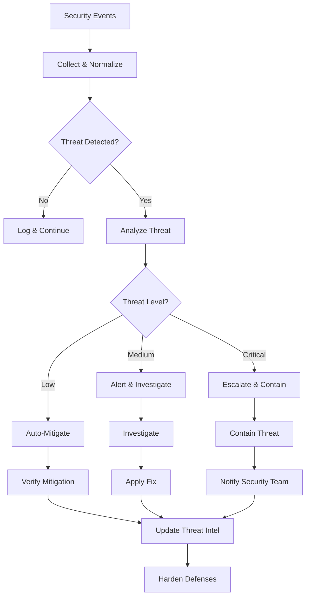

# Security Monitoring Agent Case Study

## Scenario

An autonomous security monitoring agent that detects threats, analyzes vulnerabilities, responds to incidents, and hardens defenses — operating 24/7 without human intervention for routine security tasks.

## Architecture



## Implementation

### Security Monitor

```python
class SecurityMonitor:
    def __init__(self, llm=None):
        self.llm = llm
        self.event_buffer = []
        self.threat_intel = {}
        self.alert_history = []
    
    def ingest_event(self, event: dict):
        """Ingest a security event."""
        
        # Normalize event
        normalized = self.normalize_event(event)
        
        # Add to buffer
        self.event_buffer.append(normalized)
        
        # Analyze for threats
        if len(self.event_buffer) >= 10:  # Batch analysis
            self.analyze_batch()
    
    def normalize_event(self, event: dict) -> dict:
        """Normalize event format."""
        
        return {
            "timestamp": event.get("timestamp", datetime.now().isoformat()),
            "source": event.get("source", "unknown"),
            "type": event.get("type", "unknown"),
            "severity": event.get("severity", "info"),
            "details": event.get("details", {}),
            "raw": event
        }
    
    def analyze_batch(self):
        """Analyze batch of events for threats."""
        
        events = self.event_buffer.copy()
        self.event_buffer = []
        
        # Look for threat patterns
        threats = self.detect_threats(events)
        
        for threat in threats:
            self.handle_threat(threat)
    
    def detect_threats(self, events: list) -> list:
        """Detect threats in events."""
        
        threats = []
        
        # Check for failed login attempts
        failed_logins = [e for e in events if e["type"] == "login_failed"]
        if len(failed_logins) >= 5:
            threats.append({
                "type": "brute_force",
                "severity": "high",
                "events": failed_logins,
                "source": failed_logins[0]["source"]
            })
        
        # Check for unusual access patterns
        access_events = [e for e in events if e["type"] == "access"]
        if self.detect_unusual_access(access_events):
            threats.append({
                "type": "unusual_access",
                "severity": "medium",
                "events": access_events
            })
        
        # Check for malware indicators
        for event in events:
            if self.check_malware_indicators(event):
                threats.append({
                    "type": "malware",
                    "severity": "critical",
                    "events": [event]
                })
        
        return threats
    
    def detect_unusual_access(self, events: list) -> bool:
        """Detect unusual access patterns."""
        
        if not events:
            return False
        
        # Check for off-hours access
        for event in events:
            timestamp = datetime.fromisoformat(event["timestamp"])
            if timestamp.hour < 6 or timestamp.hour > 22:  # Off hours
                return True
        
        return False
    
    def check_malware_indicators(self, event: dict) -> bool:
        """Check for malware indicators."""
        
        details = event.get("details", {})
        
        # Check for known malware signatures
        malware_signatures = ["malware", "virus", "trojan", "ransomware"]
        
        for signature in malware_signatures:
            if signature in str(details).lower():
                return True
        
        return False
    
    def handle_threat(self, threat: dict):
        """Handle a detected threat."""
        
        severity = threat.get("severity", "low")
        
        if severity == "critical":
            # Escalate immediately
            self.escalate(threat)
        elif severity == "high":
            # Alert and investigate
            self.alert(threat)
            self.investigate(threat)
        elif severity == "medium":
            # Auto-mitigate if possible
            self.auto_mitigate(threat)
        
        # Store threat
        self.alert_history.append({
            **threat,
            "handled_at": datetime.now().isoformat()
        })
    
    def escalate(self, threat: dict):
        """Escalate critical threat."""
        
        print(f"CRITICAL THREAT ESCALATED: {threat['type']}")
        # In production, would notify security team immediately
    
    def alert(self, threat: dict):
        """Alert on threat."""
        
        print(f"THREAT ALERT: {threat['type']} (severity: {threat['severity']})")
        # In production, would send alert
    
    def investigate(self, threat: dict):
        """Investigate a threat."""
        
        print(f"Investigating threat: {threat['type']}")
        # In production, would gather more information
    
    def auto_mitigate(self, threat: dict):
        """Automatically mitigate a threat."""
        
        print(f"Auto-mitigating: {threat['type']}")
        # In production, would apply automated fix
    
    def get_threat_summary(self) -> dict:
        """Get summary of detected threats."""
        
        return {
            "total_threats": len(self.alert_history),
            "by_severity": self._count_by_severity(),
            "by_type": self._count_by_type()
        }
    
    def _count_by_severity(self) -> dict:
        """Count threats by severity."""
        
        counts = {}
        for threat in self.alert_history:
            severity = threat.get("severity", "unknown")
            counts[severity] = counts.get(severity, 0) + 1
        
        return counts
    
    def _count_by_type(self) -> dict:
        """Count threats by type."""
        
        counts = {}
        for threat in self.alert_history:
            threat_type = threat.get("type", "unknown")
            counts[threat_type] = counts.get(threat_type, 0) + 1
        
        return counts
```

### Vulnerability Scanner

```python
class VulnerabilityScanner:
    """Scans for vulnerabilities in systems."""
    
    def __init__(self):
        self.scan_history = []
        self.known_vulnerabilities = {}
    
    def scan(self, target: dict) -> dict:
        """Scan target for vulnerabilities."""
        
        vulnerabilities = []
        
        # Check for known vulnerabilities
        for vuln_id, vuln_info in self.known_vulnerabilities.items():
            if self.check_vulnerability(target, vuln_info):
                vulnerabilities.append({
                    "id": vuln_id,
                    "severity": vuln_info["severity"],
                    "description": vuln_info["description"],
                    "remediation": vuln_info["remediation"]
                })
        
        # Check for misconfigurations
        misconfigs = self.check_misconfigurations(target)
        vulnerabilities.extend(misconfigs)
        
        scan_result = {
            "target": target,
            "vulnerabilities": vulnerabilities,
            "scan_time": datetime.now().isoformat(),
            "vulnerability_count": len(vulnerabilities)
        }
        
        self.scan_history.append(scan_result)
        
        return scan_result
    
    def check_vulnerability(self, target: dict, vuln_info: dict) -> bool:
        """Check if target is vulnerable."""
        
        # Simplified vulnerability check
        # In production, would use actual vulnerability scanning tools
        return False
    
    def check_misconfigurations(self, target: dict) -> list:
        """Check for misconfigurations."""
        
        misconfigs = []
        
        # Check common misconfigurations
        checks = [
            {"name": "open_ports", "severity": "medium", "description": "Unnecessary open ports"},
            {"name": "weak_passwords", "severity": "high", "description": "Weak default passwords"},
            {"name": "missing_updates", "severity": "medium", "description": "Missing security updates"}
        ]
        
        for check in checks:
            if self.run_check(target, check["name"]):
                misconfigs.append({
                    "type": "misconfiguration",
                    "severity": check["severity"],
                    "description": check["description"],
                    "remediation": f"Fix {check['name']}"
                })
        
        return misconfigs
    
    def run_check(self, target: dict, check_name: str) -> bool:
        """Run a specific security check."""
        
        # Simplified check
        return False
```

### Incident Responder

```python
class IncidentResponder:
    """Responds to security incidents."""
    
    def __init__(self, monitor: SecurityMonitor):
        self.monitor = monitor
        self.response_playbooks = {}
        self.response_history = []
    
    def respond(self, incident: dict) -> dict:
        """Respond to a security incident."""
        
        incident_type = incident.get("type")
        severity = incident.get("severity")
        
        # Get response playbook
        playbook = self.response_playbooks.get(incident_type)
        
        if playbook:
            # Execute playbook
            result = self.execute_playbook(playbook, incident)
        else:
            # Default response
            result = self.default_response(incident)
        
        # Record response
        self.response_history.append({
            "incident": incident,
            "response": result,
            "timestamp": datetime.now().isoformat()
        })
        
        return result
    
    def execute_playbook(self, playbook: dict, incident: dict) -> dict:
        """Execute a response playbook."""
        
        steps = playbook.get("steps", [])
        
        for step in steps:
            try:
                self.execute_step(step, incident)
            except Exception as e:
                return {"success": False, "error": str(e), "failed_step": step}
        
        return {"success": True, "playbook": playbook["name"]}
    
    def execute_step(self, step: dict, incident: dict):
        """Execute a playbook step."""
        
        action = step.get("action")
        
        if action == "isolate":
            self.isolate_system(incident)
        elif action == "contain":
            self.contain_threat(incident)
        elif action == "notify":
            self.notify_team(incident, step.get("team"))
        elif action == "document":
            self.document_incident(incident)
    
    def default_response(self, incident: dict) -> dict:
        """Default response for unknown incident types."""
        
        # Log the incident
        self.document_incident(incident)
        
        # Notify security team
        self.notify_team(incident, "security")
        
        return {"success": True, "response": "default"}
    
    def isolate_system(self, incident: dict):
        """Isolate affected system."""
        
        print(f"Isolating system: {incident.get('source')}")
        # In production, would isolate system from network
    
    def contain_threat(self, incident: dict):
        """Contain the threat."""
        
        print(f"Containing threat: {incident.get('type')}")
        # In production, would apply containment measures
    
    def notify_team(self, incident: dict, team: str):
        """Notify team about incident."""
        
        print(f"Notifying {team} about incident: {incident.get('type')}")
        # In production, would send notification
    
    def document_incident(self, incident: dict):
        """Document the incident."""
        
        print(f"Documenting incident: {incident.get('type')}")
        # In production, would create incident report
```

## Usage Example

```python
# Create security monitor
monitor = SecurityMonitor()

# Ingest security events
events = [
    {"source": "firewall", "type": "login_failed", "details": {"user": "admin"}},
    {"source": "firewall", "type": "login_failed", "details": {"user": "admin"}},
    {"source": "firewall", "type": "login_failed", "details": {"user": "admin"}},
    {"source": "firewall", "type": "login_failed", "details": {"user": "admin"}},
    {"source": "firewall", "type": "login_failed", "details": {"user": "admin"}}
]

for event in events:
    monitor.ingest_event(event)

# Get threat summary
summary = monitor.get_threat_summary()
print(f"Threats detected: {summary['total_threats']}")

# Create incident responder
responder = IncidentResponder(monitor)

# Add response playbook
responder.response_playbooks["brute_force"] = {
    "name": "Brute Force Response",
    "steps": [
        {"action": "isolate", "target": "source"},
        {"action": "notify", "team": "security"},
        {"action": "document"}
    ]
}
```

## Self-* Capabilities Used

| Capability | How it's used |
|---|---|
| **Self-Monitoring** | 24/7 security event monitoring, anomaly detection |
| **Self-Healing** | Auto-mitigation of known threats, system isolation |
| **Self-Retry** | Retries failed alert notifications, API calls |
| **Self-Governing** | Enforces security policies, access controls |
| **Self-Improving** | Learns from incidents, improves threat detection |

## Metrics

| Metric | Target | How to measure |
|---|---|---|
| Threat detection rate | > 95% | Threats detected / total threats |
| Mean time to detect | < 5 minutes | Time from event to detection |
| Mean time to respond | < 15 minutes | Time from detection to response |
| False positive rate | < 5% | False alerts / total alerts |
| Auto-mitigation rate | > 70% | Auto-mitigated / total threats |
