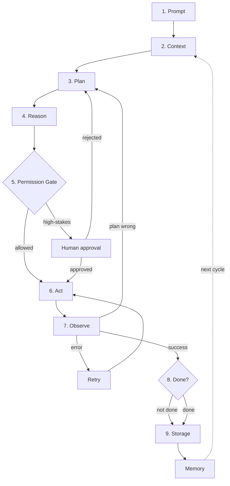
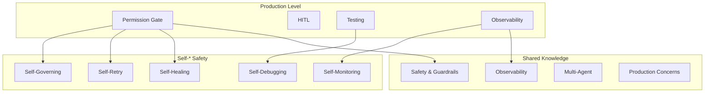

# Production

The safety-hardened agentic loop. Use this for real deployments.

> **Self-* Capabilities:** Production level adds safety and coordination. For autonomous capabilities, see [self/](../shared/self/) folder.

## What this covers

Everything in Core, plus:
- Permission Gate (authorization)
- Human-in-the-Loop (approval)
- Retry vs. Replan (failure handling)
- Goal Check (termination)
- Coordinator (multi-agent)
- Security at gate level
- Unit, integration, chaos, regression tests
- Explainability (decision traces, audit logs)
- Resource management (concurrency, scheduling)
- Lifecycle (deployment, monitoring, incident response)
- UX (progress, transparency, correction)
- Streaming basics
- Composition basics
- Ethics basics

## Architecture

## Files

| File | Description |
|---|---|
| `agentic-ai-loop-v2-guide.md` | Full guide with implementation patterns |
| `agentic-ai-loop-v2.mermaid` | Full diagram with 9 cross-cutting subgraphs |
| `agentic-ai-loop-v2-core.mermaid` | Simplified diagram (loop + safety only) |

## When to use

- Deploying against real systems
- Multi-agent orchestration
- High-stakes or irreversible actions
- Production with human oversight

## Shared resources for Production level

### Safety & Security

| Resource | What you learn | Diagram |
|---|---|---|
| [Safety & Guardrails](../shared/safety-guardrails.md) | Threat modeling, sandboxing, adversarial testing | [mermaid](../shared/safety-guardrails.mermaid) |
| [Ethics & Compliance](../shared/ethics-compliance.md) | Regulatory compliance, bias testing | [mermaid](../shared/ethics-compliance.mermaid) |

### Operations

| Resource | What you learn | Diagram |
|---|---|---|
| [Observability](../shared/observability.md) | Tracing, logging, metrics, alerting | [mermaid](../shared/observability.mermaid) |
| [Production Concerns](../shared/production-concerns.md) | Streaming, deployment, Agent-as-a-Service | [mermaid](../shared/production-concerns.mermaid) |
| [Multi-Agent Patterns](../shared/multi-agent-patterns.md) | Communication protocols, consensus | [mermaid](../shared/multi-agent-patterns.mermaid) |
| [Multi-Agent Orchestration](../shared/multi-agent-orchestration.md) | Task routing, agent coordination | [mermaid](../shared/multi-agent-orchestration.mermaid) |

### Quality & Cost

| Resource | What you learn | Diagram |
|---|---|---|
| [Evaluation Framework](../shared/evaluation-framework.md) | Benchmarking, A/B testing, regression gates | [mermaid](../shared/evaluation-framework.mermaid) |
| [Evaluation Metrics](../shared/evaluation-metrics.md) | Core metrics, evaluation suites | [mermaid](../shared/evaluation-metrics.mermaid) |
| [Cost Optimization](../shared/cost-optimization.md) | Model routing, caching, budget enforcement | [mermaid](../shared/cost-optimization.mermaid) |

## Self-* capabilities for Production level

Production level adds safety and coordination capabilities:

| Capability | What you learn | Deep dive | Diagram |
|---|---|---|---|
| **Self-Healing** | Error diagnosis and recovery | [self-healing.md](../shared/self/self-healing.md) | [mermaid](../shared/self/self-healing.mermaid) |
| **Self-Retry** | Smart backoff and circuit breakers | [self-retry.md](../shared/self/self-retry.md) | [mermaid](../shared/self/self-retry.mermaid) |
| **Self-Debugging** | Root cause analysis and fix generation | [self-debugging.md](../shared/self/self-debugging.md) | [mermaid](../shared/self/self-debugging.mermaid) |
| **Self-Governing** | Policy enforcement and compliance | [self-governing.md](../shared/self/self-governing.md) | [mermaid](../shared/self/self-governing.mermaid) |
| **Self-Monitoring** | Advanced health checks and alerting | [self-monitoring.md](../shared/self/self-monitoring.md) | [mermaid](../shared/self/self-monitoring.mermaid) |

**Why these five?** Production agents need to *heal* from failures, *retry* intelligently, *debug* issues, *govern* themselves within policy, and *monitor* their health. Without these, production deployments are fragile.

## How it all connects

## Next level

Ready for full autonomy? See [Autonomous](../autonomous/README.md) for self-healing, adaptive planning, and cost optimization.
