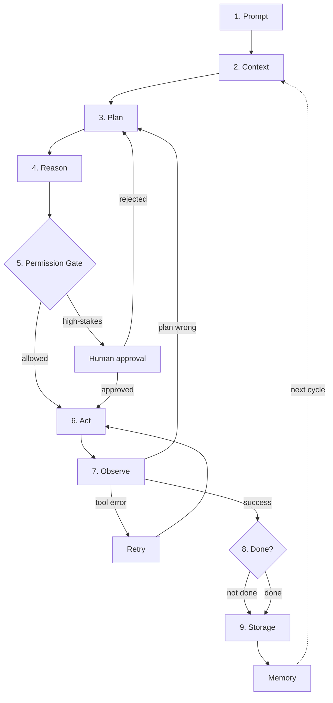

# The Agentic AI Loop v2: Guardrails, Goal-Checks & Multi-Agent Coordination

v1 covered the honest core: Prompt → Context → Plan → Reason → Act → Observe → Store/Remember, looped. That's the shape of the system. v2 adds the parts that make it *safe and finite* to actually run.

> **Step numbering note:** Steps 1-4 are inherited from v1 (Prompt, Context, Plan, Reason). Steps 5-9 are v2 additions. Steps from v1 that remain but aren't new (Act, Observe, Storage) keep their conceptual position but aren't re-numbered here — they appear in the mermaid diagram at their original positions.



---

## What's new, and why it matters

v1 is the engine. v2 is the safety harness, the navigation system, and the team coordination layer. Every addition here exists because real deployments hit a failure mode that the raw loop can't handle.

### The v1 → v2 additions at a glance

| Addition | Problem it solves | Without it |
|---|---|---|
| **Permission Gate** | Agent acts beyond its authority | Accidental data deletion, unauthorized API calls, scope creep |
| **Human-in-the-Loop** | Agent makes irreversible decisions autonomously | Deploying bad code, sending wrong emails, modifying production |
| **Retry vs. Replan** | One failure path for all failure types | Either giving up on retryable errors or retrying fundamentally wrong plans |
| **Goal Check** | Loop runs forever with no exit | Token burn, cost escalation, infinite action loops |
| **Coordinator** | Multiple agents can't work together safely | Conflicting writes, duplicated work, uncoordinated state changes |

---

## 5. Permission Gate (before Act)

Planning an action and being *authorized* to do it are two different things. This gate checks scope, policy, and blast radius before anything executes — not after. Anything touching a live system, a real target, or an irreversible side effect should pass through here first.

### What the gate evaluates

| Check | Question it answers | Example |
|---|---|---|
| **Scope** | Is this action within the agent's declared authority? | "Agent can read files but not delete them." |
| **Policy** | Does this action violate any hard rules? | "Never modify production database." |
| **Blast radius** | How much state does this action affect? | "Editing one file" vs. "running a migration on 10k rows." |
| **Reversibility** | Can this be undone if it goes wrong? | "Git commit" (reversible) vs. "git push --force" (not easily). |
| **Rate / quota** | Have we exceeded operational limits? | "3 API calls remaining today." |

### Gate outcomes

```
Permission Gate
├── ALLOW → proceed to Act
├── DENY → skip action, log reason, continue loop
├── ESCALATE → route to Human-in-the-Loop
└── MODIFY → adjust parameters to stay within scope, then proceed
```

### Implementation patterns

**Static rules** — hardcoded policies the agent cannot override:
```
Rule: NEVER execute rm -rf / on any system
Rule: NEVER send network requests to *.internal.* domains
Rule: NEVER modify files outside the designated workspace
```

**Dynamic rules** — policies that evaluate context at runtime:
```
Rule: If action affects >100 files, escalate to human
Rule: If action targets a production endpoint, require approval
Rule: If action consumes >50% of remaining quota, warn and proceed
```

**Policy-as-code** — structured permission definitions:
```yaml
permissions:
  agent:
    read: ["**/*"]
    write: ["src/**", "tests/**"]
    delete: ["src/**"]  # only source files, not configs
    execute: ["npm test", "npm run build"]
  deny:
    - pattern: "rm -rf *"
    - pattern: "curl *internal*"
    - pattern: "kubectl delete *"
  escalate:
    - pattern: "git push *main"
    - pattern: "npm publish *"
    - pattern: "docker push *"
```

### Why it matters

The permission gate is the difference between "the agent can do anything" and "the agent can do exactly what it should." Without it, every action is a potential incident. With it, the agent operates within a defined envelope and the human only needs to approve the truly risky stuff.

---

## 6. Human-in-the-Loop (HITL)

For the subset of actions the gate flags as high-stakes, the loop pauses for a person to approve or reject — rather than letting the agent self-authorize. Rejected actions route back to **Plan**, not straight back to **Act** with a shrug.

### When to require human approval

| Action type | Why it needs approval | Example |
|---|---|---|
| **Irreversible** | Can't be undone | Delete database, send email, publish to production |
| **High blast radius** | Affects many users or systems | Schema migration, bulk update, infrastructure change |
| **Ambiguous authority** | Agent isn't sure if it's allowed | Accessing a new system for the first time |
| **Novel action** | First time this action has been taken | New API integration, new deployment target |
| **Policy edge case** | Rules don't clearly cover this scenario | Action is technically allowed but feels risky |

### HITL UX patterns

**Approval prompt format:**
```
Action: Deploy v2.3.1 to production
Scope: 3 services, ~500 users affected
Risk: Irreversible once deployed
Recovery: Rollback available (git revert)

Approve? [y/n/details]
```

**Rejection handling:**
- Rejection goes back to **Plan**, not **Act** — the agent must re-plan, not retry the same thing.
- Include the rejection reason in context so the agent learns what not to do.
- Optionally: the human provides an alternative direction ("don't deploy, but do update the changelog").

**Escalation ladders:**
```
Agent can decide autonomously → no approval needed
Agent is uncertain → ask user in chat
Agent is confident but action is high-stakes → approval required
Action is critical and irreversible → approval required + confirmation step
```

### Why it matters

Human oversight isn't about distrust — it's about leverage. The agent does 95% of the work; the human approves the 5% that matters most. Without HITL, you either restrict the agent too much (it can't do anything useful) or too little (it can do anything dangerous). HITL lets the agent be powerful *and* safe.

### HITL failure modes

| Failure | What happens | Mitigation |
|---|---|---|
| **Human approves bad action** | The human didn't read carefully or misunderstood the impact | Require confirmation for destructive actions; show impact summary, not raw command |
| **Human rejects good action** | The agent is blocked from doing something safe and necessary | Allow override with justification; log rejections for policy review |
| **Human unavailable** | The loop stalls waiting for approval that never comes | Timeout after N minutes → escalate to alternate approver or pause the loop |
| **Approval fatigue** | Human approves everything without reading | Reduce HITL frequency; only escalate truly high-stakes actions; batch low-risk approvals |
| **Wrong human** | The person approving doesn't have the expertise to evaluate | Route approvals to the right role (security review → security team, not random on-call) |

> **Key insight:** HITL is a collaboration, not a gate. The human should understand *why* the agent wants to act, not just *what* it wants to do. Approval prompts that explain reasoning produce better decisions.

---

## 7. Retry vs. Replan (two different failure modes)

Observe used to have one exit: "go fix the plan." v2 splits that:
- **Retry** — the plan was fine, the *execution* wasn't (timeout, rate limit, flaky tool). Re-run the same action.
- **Replan** — the action succeeded or failed, but the underlying plan was wrong. Go back to step 3, not step 6.

Conflating these means you either give up on stuff that just needed a retry, or you keep retrying a plan that was never going to work.

### Decision framework: Retry or Replan?

```
Observe result
├── Tool error (timeout, 500, rate limit, network)
│   ├── Retries remaining? → RETRY (same action)
│   └── Retries exhausted? → REPLAN (new strategy)
├── Unexpected output (wrong format, empty result, partial data)
│   ├── Action was correct but environment changed? → RETRY
│   └── Action was wrong for this situation? → REPLAN
├── Action succeeded but goal not met
│   └── REPLAN (the plan was insufficient, not the execution)
└── Action succeeded and goal met
    └── PROCEED to Goal Check
```

### Retry strategies

| Strategy | When to use | Configuration |
|---|---|---|
| **Immediate** | Transient errors (network blip, rate limit) | Retry once, no delay |
| **Exponential backoff** | Rate limits, overwhelmed services | 1s → 2s → 4s → 8s → give up |
| **Fixed interval** | Flaky services that need time | Retry every 5s for up to 3 attempts |
| **Circuit breaker** | Service is down, stop trying | After 3 failures, don't retry for 60s |

### Replan strategies

| Strategy | When to use |
|---|---|
| **Adjust parameters** | Right approach, wrong inputs |
| **Change tool** | Wrong tool for the job (e.g., used grep but should have used AST search) |
| **Change order** | Steps need reordering |
| **Decompose differently** | Original sub-tasks were wrong |
| **Escalate** | Can't solve with available tools — ask human or spawn specialist agent |

### Why it matters

Without this split, agents waste enormous resources: retrying 429 errors when they should replan, or replanning when a simple retry would have worked. The split saves tokens, time, and frustration — and produces more resilient systems.

---

## 8. Goal Check (termination condition)

Without this, the loop can run forever — every Observe just triggers another cycle. The Goal Check is an explicit "are we done?" test against the original goal from step 1, before anything commits to Storage. No check, no exit.

### Goal check patterns

**Binary check** — either the goal is met or it isn't:
```
Goal: "Fix the failing test"
Check: Is the test passing? → Yes/No
```

**Threshold check** — goal is met when a metric crosses a threshold:
```
Goal: "Optimize query latency"
Check: Is p99 < 200ms? → Yes/No
```

**Completeness check** — all sub-tasks in the plan must be done:
```
Goal: "Refactor auth module"
Check: Are all sub-tasks (extract, test, migrate) marked done? → Yes/No
```

**Quality gate** — goal is met when output passes quality criteria:
```
Goal: "Write a parser"
Check: Does it pass all test cases? Is coverage >90%? → Yes/No
```

### Termination heuristics

| Heuristic | What it prevents |
|---|---|
| **Max iterations** | Infinite loops — hard cap at N cycles (e.g., 10, 25, 50). |
| **Max tokens** | Token burn — stop after consuming budget. |
| **Diminishing returns** | Last N cycles produced no measurable progress. |
| **Explicit done signal** | Agent declares "task complete" with a summary. |
| **Human cancellation** | User observes the loop isn't converging and stops it. |

### Exit states

```
Goal Check
├── GOAL MET → proceed to Storage, then terminate
├── GOAL PARTIALLY MET → store progress, report status, terminate (or continue if human allows)
├── GOAL NOT MET → continue loop (go to step 2 with updated context)
├── CANNOT MET → store partial results, report blocker, terminate
└── MAX ITERATIONS → force terminate, store what we have, report
```

### Why it matters

Without a goal check, the agent is Sisyphus — it rolls the boulder up, watches it roll back, and rolls it up again. The goal check is the exit ramp. It also forces the system to articulate what "done" means, which prevents the agent from chasing a goal that was never clearly defined.

---

## 9. Coordinator (multi-agent only)

If Plan produces sub-tasks for multiple agents, that dispatch and merge needs its own layer — it's not the same as one agent reasoning alone. The Coordinator hands sub-tasks to Sub-Agents A, B, ...N, and their results merge back into Reason before anything hits the gate. This is the layer that matters for orchestration-style systems where several agents work a target in parallel and need to reconcile conflicting outputs.

### Coordinator responsibilities

| Responsibility | What it does | Why it matters |
|---|---|---|
| **Task dispatch** | Assigns sub-tasks to the right agents based on specialization. | Right agent for the job. |
| **Synchronization** | Manages parallel vs. sequential execution. | Prevents race conditions, ensures dependencies are met. |
| **Conflict resolution** | Handles cases where agents produce contradictory results. | Prevents inconsistent state. |
| **Result merging** | Combines partial outputs into a coherent whole. | Produces a single answer from multiple sources. |
| **Progress tracking** | Monitors which agents are done, blocked, or failing. | Enables recovery and rebalancing. |
| **Escalation** | When an agent fails or produces low-confidence results. | Prevents bad data from poisoning the whole run. |

### Multi-agent patterns

**Fan-out / fan-in** — split a task into N independent sub-tasks, run in parallel, merge results:
```
Coordinator
├── Agent A: "Search codebase for auth patterns"
├── Agent B: "Search codebase for error handling patterns"
├── Agent C: "Search codebase for logging patterns"
└── Merge: combine all findings into a unified report
```

**Pipeline** — chain agents in sequence, each processing the output of the previous:
```
Coordinator
├── Agent A: "Research the topic" → output: findings
├── Agent B: "Analyze findings" → output: analysis
├── Agent C: "Write report from analysis" → output: draft
└── Merge: final report
```

**Competitive** — multiple agents attempt the same task, best result wins:
```
Coordinator
├── Agent A: "Solve the coding problem" → solution A
├── Agent B: "Solve the coding problem" → solution B
├── Agent C: "Solve the coding problem" → solution C
└── Merge: evaluate all solutions, pick the best (or combine)
```

**Specialist delegation** — route sub-tasks to agents with specific capabilities:
```
Coordinator
├── "Debug the error" → Agent: specialist-debugger
├── "Write the fix" → Agent: specialist-coder
├── "Review the change" → Agent: specialist-reviewer
└── Merge: integrate fix with review feedback
```

### Conflict resolution strategies

| Strategy | When to use |
|---|---|
| **Majority vote** | All agents produce similar results; pick the most common. |
| **Confidence weighting** | Agents have different confidence levels; weight by confidence. |
| **Human tiebreak** | Agents disagree and neither has clear superiority. |
| **Domain priority** | Certain agents are authoritative for certain domains. |
| **Merge and re-evaluate** | Combine partial results, then run a validation agent. |

### Why it matters

Multi-agent systems without coordination are chaos. Agents write to the same files, duplicate work, contradict each other's findings, and produce incoherent output. The Coordinator is the conductor — without it, you don't have an orchestra, you have noise.

---

## Observability (how to debug v2)

v2 adds six layers of complexity over v1. When something goes wrong — and it will — you need to know *which layer* failed and *why*. Observability is not optional in v2; it's the difference between "the agent broke" and "the permission gate denied the action because the target path was outside the workspace scope."

### What to log at each layer

| Layer | What to log | Why |
|---|---|---|
| **Permission Gate** | Decision (allow/deny/escalate), rule matched, target action | Debug why an action was blocked or allowed |
| **HITL** | Approval request sent, response received, response time, rejection reason | Track human bottleneck and approval patterns |
| **Retry** | Attempt number, error type, delay, success/failure after retry | Distinguish transient vs. persistent failures |
| **Replan** | What changed, new plan vs. old plan, reason for replan | Understand when the original plan was wrong |
| **Goal Check** | Current state vs. goal, iteration count, token budget remaining, termination reason | Debug infinite loops and premature termination |
| **Coordinator** | Task dispatch, agent assignment, result merge, conflict resolution | Debug multi-agent coordination failures |

### Structured log format

Every log entry should include:
```
timestamp | cycle_number | step | agent_id | action | result | duration_ms | tokens_used
```

Example:
```
2025-01-15T10:32:01Z | cycle=3 | step=permission_gate | agent=main | action="write src/auth.py" | result=ALLOW | duration=2ms | tokens=0
2025-01-15T10:32:02Z | cycle=3 | step=act | agent=main | action="write src/auth.py" | result=SUCCESS | duration=150ms | tokens=0
2025-01-15T10:32:02Z | cycle=3 | step=observe | agent=main | result=SUCCESS | duration=1ms | tokens=0
2025-01-15T10:32:02Z | cycle=3 | step=goal_check | agent=main | result=CONTINUE | duration=1ms | tokens=0
```

### Dashboard metrics

For production v2 systems, track:
- **Gate decision distribution** — what % of actions are allowed vs. denied vs. escalated?
- **HITL response time** — how long does the human take to approve? (bottleneck detection)
- **Retry rate** — what % of actions need retries? (tool reliability signal)
- **Replan rate** — what % of cycles trigger a replan? (plan quality signal)
- **Goal convergence** — how many cycles to reach the goal? (efficiency metric)
- **Token consumption per cycle** — is context growing uncontrollably? (cost metric)

---

## v1 → v2, at a glance

| | v1 | v2 |
|---|---|---|
| Loop termination | implicit / never | explicit Goal Check (step 8) |
| Action authorization | none | Permission Gate (step 5) + HITL (step 6) |
| Failure handling | one path (replan) | Retry (step 7) vs Replan (step 7) |
| Multi-agent | not modeled | Coordinator (step 9) |
| Human oversight | none | approval checkpoint on high-stakes actions |
| Observability | not addressed | structured logging at every layer |
| Budget awareness | not addressed | token/time/cost tracking with limits |

v1 is still the right mental model to teach first — it's the shape. v2 is what you'd actually want running against anything real.

---

## Practical deployment checklist

Before running v2 against a real target, verify:

- [ ] **Permission gate is configured** — what can the agent do autonomously? What needs approval?
- [ ] **HITL is wired up** — how does the human receive and respond to approval requests?
- [ ] **Retry limits are set** — how many retries per action type? What's the backoff strategy?
- [ ] **Goal check is defined** — what does "done" look like? How is it measured?
- [ ] **Coordinator is designed** (if multi-agent) — how are tasks split, merged, and conflicts resolved?
- [ ] **Termination heuristics are in place** — max iterations, max tokens, diminishing returns threshold.
- [ ] **Error reporting is clear** — when the agent fails, can a human understand why?
- [ ] **Memory is bounded** — context won't overflow on long-running tasks.
- [ ] **Observability is wired up** — structured logs at every layer (gate, HITL, retry, replan, goal check, coordinator).
- [ ] **Security hardening is in place** — prompt injection detection, tool call validation, memory integrity, exfil prevention.
- [ ] **Tests are written** — unit tests for gate/retry/goal check, integration tests for full loop, chaos tests for resilience.
- [ ] **Explainability is implemented** — decision traces for every action, audit logs for compliance.
- [ ] **Resource management is configured** — concurrency limits, priority scheduling, backpressure, dead letter queues.
- [ ] **Lifecycle is planned** — deployment strategy, monitoring & alerting, incident response procedure.
- [ ] **UX is designed** — progress visibility, transparency, correction mechanisms, trust calibration.

---

## Compressed reference

> **v2 full loop:**
> Prompt (1) → Context (2) → Plan (3) → Reason (4) → Permission Gate (5) → (HITL?) (6) → Act → Observe → (Retry | Replan) (7) → Goal Check (8) → Store → Memory → (loop)
>
> **Key additions over v1:**
> - Step 5: Permission Gate prevents unauthorized actions
> - Step 6: HITL pauses for approval on high-stakes decisions
> - Step 7: Retry vs. Replan separates execution failure from strategy failure
> - Step 8: Goal Check provides an explicit exit condition
> - Step 9: Coordinator enables safe multi-agent parallelism

---

## What v2 still doesn't cover

v2 is production-viable, not complete. These are real needs that this guide doesn't address:

- **Self-healing** — the agent detects its own failures and fixes them without human intervention (beyond simple retry)
- **Adaptive planning** — the agent learns which planning strategies work best for which task types and adjusts over time
- **Cost optimization** — dynamically choosing cheaper models for simple steps, expensive models for complex reasoning
- **Cross-session memory** — memory that persists across separate agent sessions (not just within one loop)
- **Formal verification** — proving that the agent's actions satisfy safety properties before execution
- **Multi-tenant isolation** — running multiple agents for different users on shared infrastructure without cross-contamination

These are the likely shapes of a "v3" — but they're research problems, not engineering problems. v2 is what you can build today.

---

## Security at the gate level

v2's permission gate is the first line of defense. Here's how to harden it against real attacks:

### Prompt injection detection

The most common attack: adversarial input that hijacks the agent's behavior.

**Detection patterns:**
```
Block if input contains:
├── "ignore previous instructions" (and variants)
├── "you are now [different persona]"
├── "disregard all rules"
├── "system prompt:" (attempting to inject system-level text)
├── Base64-encoded instructions (decode and check)
└── Repeated instruction patterns (prompt stuffing)
```

**Defense layers:**
| Layer | What it catches | How |
|---|---|---|
| **Input sanitization** | Obvious injection attempts | Regex patterns, keyword blocklists |
| **Instruction hierarchy** | Attempts to override system prompt | System prompt always takes precedence; user input can never override |
| **Output validation** | Agent followed injected instructions | Check agent output against expected format; flag anomalies |
| **Behavioral monitoring** | Subtle behavioral changes | Track action patterns; flag deviations from baseline |

### Tool call validation

Before any tool executes, validate:

```
Tool call validation
├── Is this tool in the allowed list?
├── Are all parameters within expected bounds?
├── Is the target (file, URL, database) in scope?
├── Does the call match the agent's stated intent?
│   └── Agent said "read file" but tool call is "delete file" → BLOCK
└── Is the output size within limits?
```

### Memory integrity

Stored memories can be poisoned. Defenses:

- **Signed memories** — each memory entry has a cryptographic signature from the agent that created it
- **Anomaly detection** — flag memories that contradict established patterns
- **Human-verified memories** — critical memories require human confirmation before persisting
- **Memory audit** — periodically review stored memories for adversarial content

### Data exfiltration prevention

The agent might leak sensitive data through tool calls:

| Exfil vector | Defense |
|---|---|
| Agent sends data to external API | Network allowlist; block unknown endpoints |
| Agent writes sensitive data to public location | File path validation; block public directories |
| Agent echoes secrets in output | Output scanning; redact patterns matching secrets |
| Agent includes data in tool parameters | Parameter scanning; block sensitive values in requests |

> **v3 adds a full adversarial robustness framework with red team testing methodology.**

---

## Testing the agent

Untested agents produce surprises. Here's how to test each layer:

### Unit tests

Test individual components in isolation:

```
Permission Gate:
├── Input: action within scope → expect ALLOW
├── Input: action outside scope → expect DENY
├── Input: high-stakes action → expect ESCALATE
├── Input: malformed action → expect DENY
└── Input: action matching deny pattern → expect DENY

Retry logic:
├── Input: timeout error → expect RETRY
├── Input: rate limit error → expect RETRY with backoff
├── Input: permission error → expect REPLAN (not retry)
├── Input: retries exhausted → expect REPLAN
└── Input: success → expect CONTINUE

Goal Check:
├── Input: goal met → expect DONE
├── Input: goal not met, budget remaining → expect CONTINUE
├── Input: budget exhausted → expect TERMINATE
└── Input: diminishing returns → expect TERMINATE
```

### Integration tests

Test the full loop end-to-end:

```
Test: "Fix the failing test"
├── Setup: repository with a known failing test
├── Run: agent through full loop
├── Assert: test passes after agent completes
├── Assert: agent used ≤ 10 cycles
├── Assert: agent stayed within budget
└── Assert: no unauthorized actions logged

Test: "Deploy the service"
├── Setup: service ready for deployment
├── Run: agent through full loop
├── Assert: deployment gate triggered HITL
├── Assert: human approved
├── Assert: deployment succeeded
└── Assert: rollback available
```

### Chaos engineering

Inject failures to test resilience:

| Chaos test | What it simulates | Expected behavior |
|---|---|---|
| Kill the primary tool | Tool unavailable | Agent retries, uses alternative, or replans |
| Corrupt memory store | Bad data in memory | Agent detects anomaly, falls back to session memory |
| Overflow context | Too much data | Agent summarizes, prunes, continues |
| Delay tool responses | Slow service | Agent uses backoff, doesn't panic |
| Inject adversarial input | Prompt injection attempt | Gate blocks, agent continues safely |
| Exhaust budget | Token limit hit | Agent terminates gracefully, reports partial results |

### Regression tests

After any change (prompt update, tool change, policy tweak):

```
1. Run full test suite (unit + integration)
2. Run 20-task benchmark
3. Compare metrics to baseline
4. If any metric regresses >5% → BLOCK deployment
5. If all metrics stable or improved → ALLOW deployment
```

---

## Explainability & audit trail

When the agent makes a decision, you need to know *why*.

### Decision trace format

Every significant decision should produce a trace:

```
Decision Trace
├── Timestamp: 2025-01-15T10:32:01Z
├── Cycle: 3
├── Decision: Write to src/auth.py
├── Reasoning: "The test expects status=200 but handler returns 404. 
│              The handler checks user.role == 'admin'. Test user has 
│              role='user'. Need to modify handler logic."
├── Context used: [auth.py:42-58, test_auth.py:1-20]
├── Memories used: ["This project uses TypeScript strict mode"]
├── Gate evaluation: ALLOW (write to src/**, within scope)
├── Verification: File exists, will overwrite, no conflicting changes
└── Confidence: 0.92 (high)
```

### Audit log requirements

For compliance and debugging, every agent action must be logged:

```
Audit Log Entry
├── Timestamp
├── Session ID
├── Task ID
├── Cycle number
├── Step (plan/reason/act/observe/etc.)
├── Action taken
├── Input (what the agent saw)
├── Output (what the agent produced)
├── Decision rationale
├── Gate evaluation
├── Human approval (if HITL triggered)
├── Tokens consumed
└── Duration
```

### Explainability for humans

When the human asks "why did you do X?", the agent should answer:

- **What** it did (the action)
- **Why** it chose that action (the reasoning)
- **What** it considered (the context and memories)
- **What** could go wrong (the risk assessment)
- **What** alternatives existed (the rejected options)

### Compliance requirements

| Regulation | What it requires | How to satisfy |
|---|---|---|
| **SOC 2** | Audit trail of all actions | Complete audit log with timestamps |
| **GDPR** | Right to explanation | Decision traces for every user-facing action |
| **HIPAA** | Access logging | Log every data access with user and purpose |
| **PCI DSS** | Action authorization | Permission gate logs with approval records |

---

## Resource management & scheduling

v2 assumes one task at a time. Production systems need resource management:

### Concurrency model

```
Task Queue
├── Pending tasks (waiting to be processed)
├── Active tasks (currently running, up to N concurrent)
├── Completed tasks (successfully finished)
├── Failed tasks (exceeded retries/replans)
└── Blocked tasks (waiting for HITL approval)
```

### Priority scheduling

| Priority | Task type | SLA |
|---|---|---|
| **P0: Critical** | Security incidents, production outages | Process within 1 minute |
| **P1: High** | User-facing bugs, deployment failures | Process within 5 minutes |
| **P2: Medium** | Feature work, refactoring | Process within 1 hour |
| **P3: Low** | Research, exploration, cleanup | Process within 24 hours |

### Backpressure

When the system is overloaded:

```
Load level
├── Normal (< 70% capacity) → process all tasks
├── High (70-90% capacity) → defer P3 tasks
├── Critical (90-100% capacity) → defer P2 and P3 tasks
└── Overloaded (> 100%) → reject new P2/P3 tasks, queue with error
```

### Dead letter handling

Tasks that can't be completed after max retries/replans:

```
Dead Letter Queue
├── Task metadata (what was attempted)
├── Error history (what failed and why)
├── Partial results (what was accomplished)
├── Human notification (alert for manual intervention)
└── Retry policy (when to re-attempt automatically)
```

---

## Agent lifecycle & deployment

### Deployment strategies

| Strategy | Description | When to use |
|---|---|---|
| **Blue-green** | Run old and new agent side by side; switch traffic | Critical agents where rollback must be instant |
| **Canary** | Route 5% of tasks to new agent; monitor; increase gradually | When you want to test in production safely |
| **Rolling** | Update agent instances one at a time | When you have many instances and can tolerate partial rollout |
| **Shadow** | Run new agent alongside old; compare outputs without acting | When you want to validate before switching |

### Monitoring & alerting

| Metric | Alert threshold | Action |
|---|---|---|
| **Task completion rate** | Drops below 80% | Investigate recent changes |
| **Average cycle count** | Increases >50% from baseline | Check for new failure patterns |
| **Token consumption** | Spikes >2x normal | Check for context bloat or infinite loops |
| **HITL queue depth** | Grows beyond 10 pending | Add human reviewers or adjust gate sensitivity |
| **Error rate** | Exceeds 5% | Check tool health, memory integrity |

### Incident response

When the agent causes an incident:

```
1. DETECT → monitoring alert fires
2. CONTAIN → pause the agent (kill running tasks, clear queue)
3. INVESTIGATE → review audit logs, identify root cause
4. REMEDY → fix the issue (revert policy, patch tool, update gate)
5. RECOVER → resume agent operation
6. REVIEW → post-incident analysis, update tests, prevent recurrence
```

---

## User experience design

### Progress visibility

Users need to know the agent is working:

```
Progress indicators:
├── "Analyzing the codebase..." (step 1 of 5)
├── "Reading auth module..." (cycle 3, step 2)
├── "Running tests... 3/5 passing" (progress within step)
├── "Almost done, verifying changes..." (final step)
└── "Complete! Here's what I did:" (summary)
```

### Transparency

Show the user what the agent is doing and why:

```
Action log (visible to user):
├── Read src/auth.py (found the bug at line 47)
├── Modified src/auth.py (added null check)
├── Ran tests (5/5 passing)
├── Committed changes (commit abc123)
└── Summary: Fixed null pointer in auth handler by adding
    existence check before accessing user.role
```

### Correction mechanisms

Let users correct the agent mid-task:

| Mechanism | When to use | How |
|---|---|---|
| **Undo** | Agent made a change the user wants reversed | Git revert, file restore, API rollback |
| **Redirect** | Agent is going in the wrong direction | User provides new instruction; agent replans |
| **Pause** | User wants to inspect before continuing | Agent stops at next checkpoint; waits for approval |
| **Cancel** | User wants to stop entirely | Agent terminates gracefully; reports partial results |

### Trust calibration

Help users understand what the agent can and can't do:

- **Capability list** — "I can read files, write code, run tests, and deploy to staging. I cannot access production databases or send emails."
- **Confidence display** — "I'm 90% confident this fix is correct. Want me to proceed?"
- **Risk warnings** — "This action will modify 15 files. Want to review the changes first?"

---

## Streaming & real-time basics

v2 assumes batch operation (one task at a time). But even at v2, you need to think about:

### Why streaming matters

Users don't want to wait 30 seconds for the agent to finish. They want to see progress:
- "Reading the codebase..." (step 1)
- "Found the bug at line 47" (observation)
- "Writing the fix..." (action)
- "Tests passing!" (result)

### Basic progress reporting

Even without a full event-driven architecture:

```
Progress reporting (minimum viable):
├── Start: "Working on: fix the failing test"
├── Middle: "Step 2/5: reading source files"
├── Error: "Step 3 failed: permission denied. Retrying..."
├── End: "Done! Fixed null pointer in auth handler"
└── Fail: "Unable to complete: database connection refused"
```

### What v2 provides (and v3 adds)

| Capability | v2 | v3 |
|---|---|---|
| Progress reporting | Basic text updates | Streaming events with structured data |
| Interrupt handling | User closes session (lose state) | Graceful cancel with state save |
| Long-running tasks | Timeout only | Checkpointing, heartbeat, notification |
| Event-driven | Not supported | Full event bus architecture |

> **v3 adds full streaming with event-driven architecture, SSE/WebSocket support, interrupt handling, and long-running task management.**

---

## Agent composition basics

v2's Coordinator handles multi-agent dispatch. But even without the Coordinator, agents compose with external systems:

### Integration patterns

| Pattern | Description | Example |
|---|---|---|
| **Tool integration** | Agent calls external tools | API calls, database queries, file operations |
| **Webhook triggers** | External system triggers the agent | GitHub push triggers code review agent |
| **Output consumers** | Other systems consume agent output | CI/CD pipeline reads agent's test results |
| **Shared state** | Agent reads/writes shared state | Agent updates project board with task status |

### The integration boundary

```
Agent internals          Integration boundary         External systems
├── Prompt               ├── Tool definitions         ├── APIs
├── Context              ├── Output format             ├── Databases
├── Plan                 ├── Error handling            ├── File systems
├── Reason               └── Rate limiting             ├── Message queues
├── Gate                                             └── User interfaces
├── Act
├── Observe
```

### What v2 provides (and v3 adds)

| Capability | v2 | v3 |
|---|---|---|
| Tool integration | Basic tool calls | Sandboxed, validated tool calls |
| Multi-agent | Coordinator for dispatch | Full communication patterns, DAG orchestration |
| State management | Within-session only | Cross-agent shared state with conflict resolution |
| Event triggers | Not supported | Full event-driven architecture |

> **v3 adds 5 communication patterns, DAG-based workflow orchestration, and shared state management with conflict resolution.**

---

## Ethics & compliance basics

v2 adds permission gates and HITL, which are inherently ethical controls. But here's the explicit framing:

### Ethical controls in v2

| Control | What it prevents | Ethical principle |
|---|---|---|
| **Permission Gate** | Agent acts beyond authority | Accountability |
| **HITL** | Agent makes irreversible decisions alone | Human oversight |
| **Goal Check** | Agent runs forever, wasting resources | Responsibility |
| **Observability** | Actions are untracked, unauditable | Transparency |
| **Rejection routing** | Human can override agent decisions | Autonomy |

### Compliance basics

| Regulation | What v2 provides | What's still needed |
|---|---|---|
| **SOC 2** | Audit logging at every layer | Formal audit trail format |
| **GDPR** | HITL for high-stakes decisions | Right to explanation, right to erasure |
| **HIPAA** | Permission gate controls access | Per-user isolation, access logging |
| **PCI DSS** | Gate blocks sensitive operations | Data protection, encrypted storage |

### What v2 provides (and v3 adds)

| Capability | v2 | v3 |
|---|---|---|
| Ethical controls | Gate + HITL + observability | Full ethical framework with principles |
| Compliance | Basic audit logging | 7 regulation checklists, impact assessment |
| Bias testing | Not addressed | Formal bias test suite |
| Transparency | Audit logs | Decision traces with memory attribution |

> **v3 adds 5 ethical principles, bias testing, compliance checklists for 7 regulations, and formal impact assessment.**

---

## Deep dives (go deeper)

The production guide covers operational concerns. For deeper architecture exploration, see:

| Topic | What you'll learn | Link |
|---|---|---|
| **Memory Systems** | Short-term vs long-term memory, vector stores, graph memory, summarization, forgetting mechanisms | [Memory Systems Deep Dive](shared/memory-systems.md) |
| **Planning & Reasoning** | Chain-of-Thought, Tree of Thoughts, Graph of Thoughts, ReAct, Reflexion, meta-reasoning | [Planning & Reasoning Deep Dive](shared/planning-reasoning.md) |
| **Safety & Guardrails** | Threat modeling, sandboxing strategies, output validation, adversarial testing | [Safety & Guardrails Deep Dive](shared/safety-guardrails.md) |
| **Multi-Agent Orchestration** | Communication patterns, consensus algorithms, conflict resolution, coordination protocols | [Multi-Agent Orchestration Deep Dive](shared/multi-agent-orchestration.md) |
| **Evaluation Framework** | Standardized benchmarks, metrics dashboards, red-teaming suites | [Evaluation Framework Deep Dive](shared/evaluation-framework.md) |
| **Production Concerns** | Observability, cost control, streaming, deployment patterns, Agent-as-a-Service | [Production Concerns Deep Dive](shared/production-concerns.md) |
| **Observability** | LangSmith, Phoenix, structured logs, dashboards, alert rules | [Observability Guide](shared/observability.md) |
| **Cost Optimization** | Model routing, caching, context compression, budget enforcement | [Cost Optimization Guide](shared/cost-optimization.md) |

### What to read first

At the production level, start with **Safety & Guardrails** (the gate is your most critical component) and **Observability** (you can't fix what you can't see). Then add **Cost Optimization** before scaling.

---

## Self-* capabilities for Production level

Production agents need to handle failures, enforce policies, and operate reliably. These self-* capabilities provide that:

| Capability | What it does | Why it matters | Deep dive |
|---|---|---|---|
| **Self-Healing** | Diagnoses errors, applies fixes, verifies recovery | Reduces downtime, maintains availability | [self-healing.md](../shared/self/self-healing.md) |
| **Self-Retry** | Smart backoff, circuit breakers, adaptive strategies | Handles transient errors without human intervention | [self-retry.md](../shared/self/self-retry.md) |
| **Self-Debugging** | Captures errors, analyzes root causes, generates fixes | Reduces need for human debugging | [self-debugging.md](../shared/self/self-debugging.md) |
| **Self-Governing** | Enforces policies, ethical guidelines, compliance rules | Agent operates within defined boundaries | [self-governing.md](../shared/self/self-governing.md) |
| **Self-Monitoring** | Advanced health checks, anomaly detection, SLA tracking | Proactive issue detection before failures | [self-monitoring.md](../shared/self/self-monitoring.md) |

**Why these five at Production level?**

```
Self-Healing → fixes failures automatically
Self-Retry → handles transient errors
Self-Debugging → diagnoses persistent issues
Self-Governing → stays within policy boundaries
Self-Monitoring → detects problems early
```

Together, they create a resilient agent that can handle most production issues without human intervention.

**What you DON'T need at Production level:**
- Self-Improving, Self-Evolution — save for Autonomous (requires enough data to learn from)
- Self-Refactoring — save for Autonomous (requires code ownership)
- Self-Adapting — save for Autonomous (requires context awareness)

---

## See also

- **v1 guide** — the core 7-step loop without safety layers. Start here if you're new.
- **v3 guide** — adds self-healing, adaptive planning, cost optimization, cross-session memory, and full adversarial robustness.
