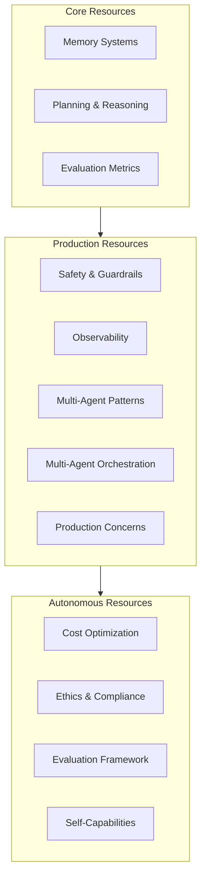

# Shared Resources

Common resources that apply across all maturity levels (Core, Production, Autonomous).

> **Architecture:** See the [Self-* Capabilities](self/README.md) folder for 13 deep dives on autonomous agent capabilities.

## Overview

## Quick Reference

| Resource | Lines | When to use |
|---|---|---|
| [Evaluation & Metrics](evaluation-metrics.md) | 619 | Measuring agent performance, defining success criteria |
| [Observability & Monitoring](observability.md) | 617 | Tracking agent health, debugging issues in production |
| [Cost Optimization](cost-optimization.md) | 605 | Reducing LLM costs, model routing, caching |
| [Ethics & Compliance](ethics-compliance.md) | 407 | Regulatory compliance, bias testing, accountability |
| [Multi-Agent Patterns](multi-agent-patterns.md) | 686 | Communication protocols, consensus, conflict resolution |
| [Memory Systems](memory-systems.md) | 437 | Short/long-term memory, vector stores, forgetting |
| [Planning & Reasoning](planning-reasoning.md) | 493 | CoT, ToT, GoT, ReAct, meta-reasoning |
| [Safety & Guardrails](safety-guardrails.md) | 682 | Threat modeling, sandboxing, adversarial testing |
| [Multi-Agent Orchestration](multi-agent-orchestration.md) | 511 | Task routing, agent coordination, result aggregation |
| [Evaluation Framework](evaluation-framework.md) | 420 | Benchmarking, A/B testing, regression gates |
| [Production Concerns](production-concerns.md) | 599 | Streaming, deployment, Agent-as-a-Service |
| [Self-Capabilities](self-capabilities.md) | 1546 | Overview of all 13 self-* capabilities |

## Deep Dives

### Memory Systems
**File:** [memory-systems.md](memory-systems.md) | **Lines:** 437 | **Diagram:** [mermaid](memory-systems.mermaid)

How agents remember, forget, and manage knowledge:
- **Short-term memory** — working memory, context windows, eviction strategies
- **Long-term memory** — vector stores, graph databases, persistence
- **Summarization** — windowed, hierarchical, recursive compression
- **Forgetting** — time-based, access-based, importance-based decay
- **Consolidation** — merging related memories, building knowledge graphs

### Planning & Reasoning
**File:** [planning-reasoning.md](planning-reasoning.md) | **Lines:** 493 | **Diagram:** [mermaid](planning-reasoning.mermaid)

How agents think and decide:
- **Chain-of-Thought** — step-by-step reasoning for simple problems
- **Tree of Thoughts** — exploring multiple paths with backtracking
- **Graph of Thoughts** — graph-structured reasoning for complex dependencies
- **ReAct** — interleaving reasoning with tool use
- **Reflexion** — self-reflection to learn from mistakes
- **Meta-reasoning** — choosing the right strategy for each problem

### Safety & Guardrails
**File:** [safety-guardrails.md](safety-guardrails.md) | **Lines:** 682 | **Diagram:** [mermaid](safety-guardrails.mermaid)

Protecting agents from attacks and misuse:
- **Threat modeling** — 8 attack vectors, 5 threat actors
- **Prompt injection defense** — 4-layer defense (input, hierarchy, output, monitoring)
- **Sandboxing** — process, container, VM, network isolation
- **Output validation** — secrets, PII, format checking
- **Adversarial testing** — red team methodology, test suites

### Evaluation Metrics
**File:** [evaluation-metrics.md](evaluation-metrics.md) | **Lines:** 619 | **Diagram:** [mermaid](evaluation-metrics.mermaid)

Measuring what matters:
- **Core metrics** — completion rate, accuracy, cycles, cost, tokens
- **Safety metrics** — injection defense, exfil prevention, tool abuse blocking
- **Efficiency metrics** — token efficiency, cache hit rate, model routing accuracy
- **Evaluation suites** — coding, research, support, data analysis templates
- **A/B testing** — running experiments, statistical significance, recommendations

### Evaluation Framework
**File:** [evaluation-framework.md](evaluation-framework.md) | **Lines:** 420 | **Diagram:** [mermaid](evaluation-framework.mermaid)

Building a complete evaluation system:
- **Standardized benchmarks** — GAIA, AgentBench, SWE-bench
- **Custom benchmarks** — task suite design, scoring, reporting
- **Metrics dashboards** — real-time monitoring, alerting
- **A/B testing** — experiment design, analysis, deployment gates
- **Regression checking** — automated quality gates

### Observability & Monitoring
**File:** [observability.md](observability.md) | **Lines:** 617 | **Diagram:** [mermaid](observability.mermaid)

Seeing what your agent is doing:
- **Tracing** — LangSmith, OpenTelemetry integration
- **Logging** — structured logs, audit trails
- **Metrics** — Prometheus, Grafana dashboards
- **Alerting** — threshold-based, anomaly detection
- **Session replay** — debugging agent behavior

### Cost Optimization
**File:** [cost-optimization.md](cost-optimization.md) | **Lines:** 605 | **Diagram:** [mermaid](cost-optimization.mermaid)

Spending less on LLMs:
- **Model routing** — selecting cheapest capable model per task
- **Caching** — response, tool result, semantic caching
- **Context compression** — summarization, deduplication
- **Batching** — parallel processing for efficiency
- **Budget enforcement** — tracking, alerts, degradation

### Ethics & Compliance
**File:** [ethics-compliance.md](ethics-compliance.md) | **Lines:** 407 | **Diagram:** [mermaid](ethics-compliance.mermaid)

Operating responsibly:
- **Ethical principles** — transparency, accountability, fairness, privacy, safety
- **Bias testing** — demographic, phrasing, stereotyping, accessibility
- **Regulatory compliance** — GDPR, SOC 2, HIPAA, PCI DSS, EU AI Act
- **Impact assessment** — pre-deployment review templates
- **Accountability framework** — roles, responsibilities, escalation paths

### Multi-Agent Patterns
**File:** [multi-agent-patterns.md](multi-agent-patterns.md) | **Lines:** 686 | **Diagram:** [mermaid](multi-agent-patterns.mermaid)

Agents working together:
- **Communication protocols** — request-response, pub-sub, message queue, blackboard
- **Consensus algorithms** — majority vote, weighted voting, Byzantine fault tolerance
- **Conflict resolution** — merge, operational transformation, CRDTs
- **Workflow orchestration** — DAG execution, pipeline patterns
- **Shared state** — versioning, locking, conflict detection

### Multi-Agent Orchestration
**File:** [multi-agent-orchestration.md](multi-agent-orchestration.md) | **Lines:** 511 | **Diagram:** [mermaid](multi-agent-orchestration.mermaid)

Coordinating multiple agents:
- **Agent registry** — capabilities, status, history tracking
- **Task routing** — capability matching, scoring, load balancing
- **Conflict resolution** — voting, priority, merging, human escalation
- **Result aggregation** — combining, selecting best, merging
- **Load balancing** — distributing work evenly across agents

### Production Concerns
**File:** [production-concerns.md](production-concerns.md) | **Lines:** 599 | **Diagram:** [mermaid](production-concerns.mermaid)

Running agents in production:
- **Streaming** — SSE, WebSocket, real-time responses
- **Deployment** — blue-green, canary, rolling strategies
- **Agent-as-a-Service** — REST API, auth, rate limiting, SLAs
- **Cost control** — model routing, caching, budget enforcement
- **Observability** — tracing, logging, metrics, alerting

### Self-Capabilities
**File:** [self-capabilities.md](self-capabilities.md) | **Lines:** 1546 | **Diagram:** [mermaid](self-capabilities.mermaid)

Autonomous agent capabilities (overview):
- **13 self-* capabilities** — complete implementations
- **Architecture patterns** — detection, diagnosis, adaptation, evolution
- **Integration guide** — how capabilities work together
- **Deep dives** — see [self/](self/) folder for detailed implementations

### Self-* Capabilities (Deep Dives)
**Folder:** [self/](self/) | **Files:** 13 | **Total Lines:** 10,000+

Individual deep dives for each autonomous capability:
- [self-healing.md](self/self-healing.md) — Error classification, pattern database, fix execution
- [self-retry.md](self/self-retry.md) — Smart backoff, circuit breakers, adaptive strategies
- [self-improving.md](self/self-improving.md) — Pattern extraction, strategy optimization
- [self-monitoring.md](self/self-monitoring.md) — Metrics, health checks, alerts, anomaly detection
- [self-debugging.md](self/self-debugging.md) — Error capture, code context, fix generation
- [self-refactoring.md](self/self-refactoring.md) — Code analysis, smell detection, refactoring
- [multi-agent-orchestration.md](self/multi-agent-orchestration.md) — Agent registry, task routing
- [self-evolution.md](self/self-evolution.md) — Skill discovery, architecture adaptation
- [self-observing.md](self/self-observing.md) — Decision tracing, meta-cognition, reflection
- [self-planning.md](self/self-planning.md) — Goal analysis, plan generation, replanning
- [self-adapting.md](self/self-adapting.md) — Context detection, strategy selection, configuration
- [self-governing.md](self/self-governing.md) — Policy engine, ethical framework, compliance
- [self-remembering.md](self/self-remembering.md) — Input filtering, relevance scoring, consolidation

## How resources connect

## Reading order by goal

| Goal | Start here | Then read |
|---|---|---|
| **Build my first agent** | [Memory Systems](memory-systems.md) | [Planning & Reasoning](planning-reasoning.md) |
| **Make it safe** | [Safety & Guardrails](safety-guardrails.md) | [Ethics & Compliance](ethics-compliance.md) |
| **Make it cheap** | [Cost Optimization](cost-optimization.md) | [Evaluation Metrics](evaluation-metrics.md) |
| **Make it observable** | [Observability](observability.md) | [Production Concerns](production-concerns.md) |
| **Make it autonomous** | [Self-Capabilities](self-capabilities.md) | [self/](self/) folder |
| **Scale to multiple agents** | [Multi-Agent Patterns](multi-agent-patterns.md) | [Multi-Agent Orchestration](multi-agent-orchestration.md) |
| **Evaluate quality** | [Evaluation Metrics](evaluation-metrics.md) | [Evaluation Framework](evaluation-framework.md) |

## File counts

| Category | Files | Total Lines |
|---|---|---|
| Core resources | 3 | 1,549 |
| Production resources | 5 | 2,895 |
| Autonomous resources | 4 | 2,978 |
| Self-* deep dives | 13 | 10,000+ |
| **Total** | **25** | **17,000+** |
