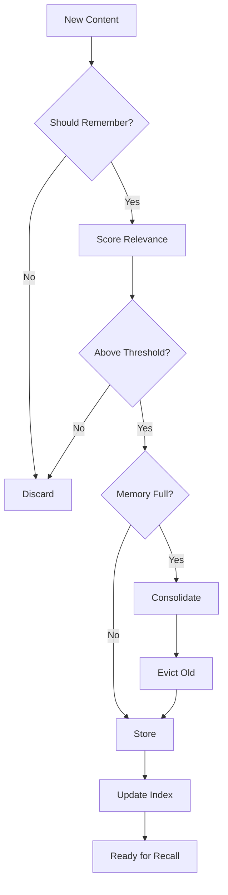

# Memory Systems Deep Dive

> **Diagram:** [memory-systems.mermaid](memory-systems.mermaid)



## Memory Architecture Overview

```
┌─────────────────────────────────────────────────────────────┐
│                    MEMORY SYSTEM                             │
├─────────────────┬─────────────────┬─────────────────────────┤
│  Working Memory  │  Episodic Memory │  Semantic Memory        │
│  (Context Window)│  (Session Log)   │  (Knowledge Base)       │
├─────────────────┼─────────────────┼─────────────────────────┤
│  Current task    │  Past tasks      │  Facts, rules, patterns │
│  Current context │  Outcomes        │  User preferences       │
│  Active goals    │  Learned fixes   │  Domain knowledge       │
│  Temporary state │  Decision traces │  Tool reliability       │
└─────────────────┴─────────────────┴─────────────────────────┘
         │                   │                    │
         ▼                   ▼                    ▼
┌─────────────────────────────────────────────────────────────┐
│                 PERSISTENCE LAYER                            │
├─────────────────┬─────────────────┬─────────────────────────┤
│  Vector Store    │  Graph Database │  Key-Value Store        │
│  (Embeddings)    │  (Relationships)│  (Structured Data)      │
├─────────────────┼─────────────────┼─────────────────────────┤
│  Semantic search │  Entity graphs  │  Configuration          │
│  RAG retrieval   │  Causal chains  │  Session state          │
│  Similarity      │  Dependency maps│  Cache                  │
└─────────────────┴─────────────────┴─────────────────────────┘
```

## Short-Term Memory (Working Memory)

### Implementation

```python
class WorkingMemory:
    def __init__(self, max_tokens: int = 8000):
        self.max_tokens = max_tokens
        self.entries = []
        self.total_tokens = 0
    
    def add(self, entry: dict, tokens: int):
        """Add entry to working memory."""
        self.entries.append({
            **entry,
            "timestamp": datetime.now(),
            "tokens": tokens
        })
        self.total_tokens += tokens
        
        # Evict if over budget
        while self.total_tokens > self.max_tokens:
            self.evict_oldest()
    
    def evict_oldest(self):
        """Remove oldest entry."""
        if self.entries:
            oldest = self.entries.pop(0)
            self.total_tokens -= oldest["tokens"]
    
    def get_context(self) -> list:
        """Get current working memory as context."""
        return self.entries
    
    def clear(self):
        """Clear working memory."""
        self.entries = []
        self.total_tokens = 0
```

### Eviction Strategies

| Strategy | When to use | How it works |
|---|---|---|
| **LRU (Least Recently Used)** | General purpose | Remove entry accessed longest ago |
| **LFU (Least Frequently Used)** | Stable workloads | Remove entry accessed least often |
| **Priority-based** | Task-aware systems | Remove lowest priority entries first |
| **Token-budget** | Token-limited models | Remove entries until under budget |
| **Time-based** | Long-running agents | Remove entries older than threshold |

```python
class PriorityEviction:
    def evict(self, entries: list, target_tokens: int) -> list:
        """Evict entries by priority."""
        # Sort by priority (lower = evict first)
        sorted_entries = sorted(entries, key=lambda x: x.get("priority", 0))
        
        kept = []
        total = 0
        
        for entry in sorted_entries:
            if total + entry["tokens"] <= target_tokens:
                kept.append(entry)
                total += entry["tokens"]
        
        return kept
```

## Long-Term Memory

### Vector Store Implementation

```python
from sentence_transformers import SentenceTransformer
import numpy as np

class VectorMemory:
    def __init__(self, embedding_model: str = "all-MiniLM-L6-v2"):
        self.model = SentenceTransformer(embedding_model)
        self.vectors = []
        self.metadata = []
    
    def store(self, content: str, metadata: dict):
        """Store content with embedding."""
        embedding = self.model.encode(content)
        
        self.vectors.append(embedding)
        self.metadata.append({
            "content": content,
            "metadata": metadata,
            "timestamp": datetime.now(),
            "access_count": 0
        })
    
    def search(self, query: str, top_k: int = 5) -> list:
        """Search by semantic similarity."""
        query_embedding = self.model.encode(query)
        
        similarities = [
            self.cosine_similarity(query_embedding, v)
            for v in self.vectors
        ]
        
        # Get top-k
        top_indices = np.argsort(similarities)[-top_k:][::-1]
        
        results = []
        for idx in top_indices:
            self.metadata[idx]["access_count"] += 1
            results.append({
                "content": self.metadata[idx]["content"],
                "score": similarities[idx],
                "metadata": self.metadata[idx]["metadata"]
            })
        
        return results
    
    def cosine_similarity(self, a, b) -> float:
        """Compute cosine similarity."""
        return np.dot(a, b) / (np.linalg.norm(a) * np.linalg.norm(b))
```

### Graph Memory Implementation

```python
import networkx as nx

class GraphMemory:
    def __init__(self):
        self.graph = nx.DiGraph()
    
    def add_entity(self, entity: str, entity_type: str, properties: dict):
        """Add entity to graph."""
        self.graph.add_node(entity, type=entity_type, **properties)
    
    def add_relation(self, source: str, target: str, relation: str, properties: dict):
        """Add relation between entities."""
        self.graph.add_edge(source, target, relation=relation, **properties)
    
    def query(self, entity: str, max_depth: int = 2) -> dict:
        """Query entity and its relationships."""
        if entity not in self.graph:
            return {}
        
        # BFS to get neighbors
        neighbors = {}
        for depth in range(max_depth + 1):
            nodes_at_depth = nx.single_source_shortest_path_length(
                self.graph, entity, cutoff=depth
            )
            for node, dist in nodes_at_depth.items():
                if node != entity:
                    edges = self.graph.edges(entity, data=True)
                    neighbors[node] = {
                        "distance": dist,
                        "relations": [
                            e[2]["relation"] for e in edges if e[1] == node
                        ]
                    }
        
        return {
            "entity": entity,
            "type": self.graph.nodes[entity].get("type"),
            "properties": dict(self.graph.nodes[entity]),
            "neighbors": neighbors
        }
    
    def find_path(self, source: str, target: str) -> list:
        """Find path between two entities."""
        try:
            path = nx.shortest_path(self.graph, source, target)
            return path
        except nx.NetworkXNoPath:
            return []
```

## Summarization Strategies

### Windowed Summarization

```python
class WindowedSummarizer:
    def __init__(self, llm, window_size: int = 10):
        self.llm = llm
        self.window_size = window_size
    
    def summarize(self, entries: list) -> str:
        """Summarize entries using sliding window."""
        if len(entries) <= self.window_size:
            return self.summarize_chunk(entries)
        
        # Summarize in windows
        summaries = []
        for i in range(0, len(entries), self.window_size):
            chunk = entries[i:i + self.window_size]
            summary = self.summarize_chunk(chunk)
            summaries.append(summary)
        
        # Recursively summarize if still too long
        if len(summaries) > self.window_size:
            return self.summarize(summaries)
        
        return self.summarize_chunk(summaries)
    
    def summarize_chunk(self, entries: list) -> str:
        """Summarize a chunk of entries."""
        return self.llm.call(f"""
            Summarize these entries concisely:
            {entries}
            
            Focus on:
            - Key decisions made
            - Important findings
            - Action items
        """)
```

### Hierarchical Summarization

```python
class HierarchicalSummarizer:
    def __init__(self, llm):
        self.llm = llm
    
    def summarize(self, entries: list) -> dict:
        """Create hierarchical summary."""
        
        # Level 1: Individual entry summaries
        entry_summaries = [
            self.summarize_entry(entry) for entry in entries
        ]
        
        # Level 2: Group summaries (by topic or time)
        groups = self.group_entries(entry_summaries)
        group_summaries = [
            self.summarize_group(group) for group in groups
        ]
        
        # Level 3: Overall summary
        overall = self.summarize_overall(group_summaries)
        
        return {
            "overall": overall,
            "groups": group_summaries,
            "entries": entry_summaries
        }
    
    def group_entries(self, entries: list) -> list:
        """Group entries by topic or time."""
        # Simple grouping by topic keywords
        groups = {}
        for entry in entries:
            topic = self.extract_topic(entry)
            if topic not in groups:
                groups[topic] = []
            groups[topic].append(entry)
        
        return list(groups.values())
```

## Forgetting Mechanisms

### Time-Based Forgetting

```python
class TimeBasedForgetting:
    def __init__(self, half_life_days: int = 30):
        self.half_life = timedelta(days=half_life_days)
    
    def calculate_relevance(self, entry: dict) -> float:
        """Calculate relevance based on age."""
        age = datetime.now() - entry["timestamp"]
        
        # Exponential decay
        decay = 0.5 ** (age / self.half_life)
        
        # Boost if accessed recently
        if "last_accessed" in entry:
            recency = datetime.now() - entry["last_accessed"]
            recency_boost = 1.0 / (1.0 + recency.days / 7)
            decay *= (1 + recency_boost)
        
        return decay
    
    def should_forget(self, entry: dict, threshold: float = 0.1) -> bool:
        """Check if entry should be forgotten."""
        return self.calculate_relevance(entry) < threshold
```

### Access-Based Forgetting

```python
class AccessBasedForgetting:
    def __init__(self, min_access_count: int = 3, max_age_days: int = 90):
        self.min_access_count = min_access_count
        self.max_age = timedelta(days=max_age_days)
    
    def should_forget(self, entry: dict) -> bool:
        """Check if entry should be forgotten."""
        age = datetime.now() - entry["timestamp"]
        access_count = entry.get("access_count", 0)
        
        # Forget if old and rarely accessed
        if age > self.max_age and access_count < self.min_access_count:
            return True
        
        return False
```

### Importance-Based Forgetting

```python
class ImportanceBasedForgetting:
    def __init__(self, importance_threshold: float = 0.3):
        self.importance_threshold = importance_threshold
    
    def calculate_importance(self, entry: dict) -> float:
        """Calculate importance score."""
        score = 0.0
        
        # Factor 1: Decision impact
        if entry.get("was_successful"):
            score += 0.3
        
        # Factor 2: Error prevention
        if entry.get("prevented_error"):
            score += 0.4
        
        # Factor 3: User feedback
        if entry.get("user_positive_feedback"):
            score += 0.2
        
        # Factor 4: Novelty
        if entry.get("is_novel"):
            score += 0.1
        
        return score
    
    def should_forget(self, entry: dict) -> bool:
        """Check if entry should be forgotten."""
        return self.calculate_importance(entry) < self.importance_threshold
```

## Memory Consolidation

```python
class MemoryConsolidator:
    def __init__(self, llm, vector_store, graph_store):
        self.llm = llm
        self.vector_store = vector_store
        self.graph_store = graph_store
    
    def consolidate(self, session_memories: list):
        """Consolidate session memories into long-term memory."""
        
        # 1. Extract key facts
        facts = self.extract_facts(session_memories)
        
        # 2. Extract relationships
        relationships = self.extract_relationships(session_memories)
        
        # 3. Update vector store
        for fact in facts:
            self.vector_store.store(
                content=fact["content"],
                metadata={
                    "type": "fact",
                    "source": "consolidation",
                    "importance": fact["importance"]
                }
            )
        
        # 4. Update graph store
        for rel in relationships:
            self.graph_store.add_entity(rel["source"], "entity", {})
            self.graph_store.add_entity(rel["target"], "entity", {})
            self.graph_store.add_relation(
                rel["source"],
                rel["target"],
                rel["relation"],
                {}
            )
    
    def extract_facts(self, memories: list) -> list:
        """Extract key facts from memories."""
        return self.llm.call(f"""
            Extract key facts from these memories:
            {memories}
            
            Return as JSON array with:
            - content: the fact
            - importance: 0-1 score
            - category: type of fact
        """)
    
    def extract_relationships(self, memories: list) -> list:
        """Extract relationships from memories."""
        return self.llm.call(f"""
            Extract relationships between entities in these memories:
            {memories}
            
            Return as JSON array with:
            - source: entity 1
            - target: entity 2
            - relation: relationship type
        """)
```
