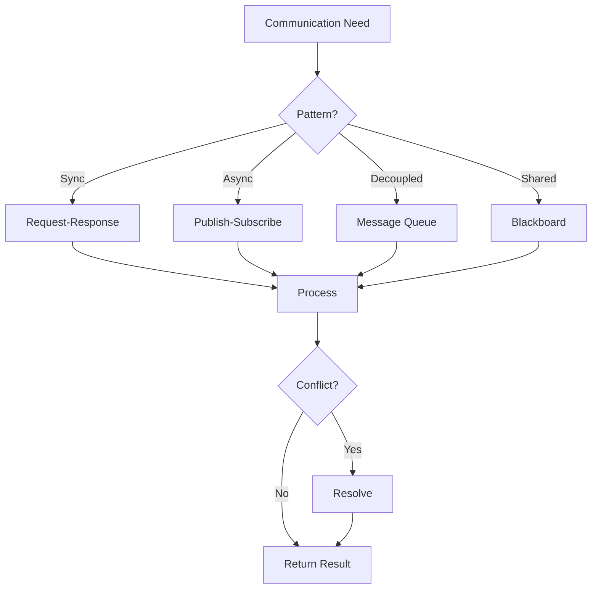

# Multi-Agent Patterns

> **Diagram:** [multi-agent-patterns.mermaid](multi-agent-patterns.mermaid)



## Communication Protocols

### Request-Response (Synchronous)

```python
class RequestResponseAgent:
    def __init__(self, agent_id: str, message_bus):
        self.agent_id = agent_id
        self.message_bus = message_bus
    
    def request(self, target_agent: str, task: str, timeout: int = 30) -> dict:
        """Send request to another agent and wait for response."""
        
        request_id = str(uuid4())
        
        # Send request
        self.message_bus.send(
            to=target_agent,
            message={
                "type": "request",
                "request_id": request_id,
                "from": self.agent_id,
                "task": task,
                "timestamp": datetime.now().isoformat()
            }
        )
        
        # Wait for response
        response = self.message_bus.wait_for_response(
            request_id=request_id,
            timeout=timeout
        )
        
        return response
    
    def handle_request(self, message: dict) -> dict:
        """Handle incoming request."""
        
        task = message.get("task")
        request_id = message.get("request_id")
        
        # Process task
        result = self.process_task(task)
        
        # Send response
        self.message_bus.send(
            to=message["from"],
            message={
                "type": "response",
                "request_id": request_id,
                "result": result,
                "timestamp": datetime.now().isoformat()
            }
        )
```

### Publish-Subscribe (Asynchronous)

```python
class PubSubAgent:
    def __init__(self, agent_id: str, event_bus):
        self.agent_id = agent_id
        self.event_bus = event_bus
        self.subscriptions = {}
    
    def publish(self, topic: str, data: dict):
        """Publish event for all subscribers."""
        
        event = {
            "topic": topic,
            "data": data,
            "source": self.agent_id,
            "timestamp": datetime.now().isoformat(),
            "event_id": str(uuid4())
        }
        
        self.event_bus.publish(topic=topic, event=event)
    
    def subscribe(self, topic: str, handler: callable):
        """Subscribe to events."""
        
        if topic not in self.subscriptions:
            self.subscriptions[topic] = []
        
        self.subscriptions[topic].append(handler)
        
        # Register with event bus
        self.event_bus.subscribe(
            topic=topic,
            callback=lambda event: self.handle_event(topic, event)
        )
    
    def handle_event(self, topic: str, event: dict):
        """Handle incoming event."""
        
        handlers = self.subscriptions.get(topic, [])
        
        for handler in handlers:
            try:
                handler(event)
            except Exception as e:
                print(f"Error handling event {topic}: {e}")
```

### Message Queue (Decoupled)

```python
class MessageQueueAgent:
    def __init__(self, agent_id: str, queue_client):
        self.agent_id = agent_id
        self.queue = queue_client
        self.handlers = {}
    
    def enqueue(self, queue_name: str, message: dict):
        """Add message to queue."""
        
        enriched_message = {
            **message,
            "source": self.agent_id,
            "timestamp": datetime.now().isoformat(),
            "message_id": str(uuid4())
        }
        
        self.queue.put(queue_name, enriched_message)
    
    def dequeue(self, queue_name: str, timeout: int = 5) -> dict:
        """Get next message from queue."""
        
        return self.queue.get(queue_name, timeout=timeout)
    
    def register_handler(self, message_type: str, handler: callable):
        """Register handler for message type."""
        
        self.handlers[message_type] = handler
    
    async def consume(self, queue_name: str):
        """Consume messages from queue."""
        
        while True:
            message = await self.queue.async_get(queue_name)
            
            if message:
                handler = self.handlers.get(message.get("type"))
                
                if handler:
                    try:
                        await handler(message)
                    except Exception as e:
                        print(f"Error processing message: {e}")
```

### Blackboard (Shared State)

```python
class BlackboardAgent:
    def __init__(self, agent_id: str, blackboard):
        self.agent_id = agent_id
        self.blackboard = blackboard
    
    def write(self, key: str, value: any):
        """Write to blackboard."""
        
        self.blackboard.write(
            key=key,
            value=value,
            agent_id=self.agent_id
        )
    
    def read(self, key: str) -> any:
        """Read from blackboard."""
        
        return self.blackboard.read(key)
    
    def read_all(self) -> dict:
        """Read entire blackboard."""
        
        return self.blackboard.read_all()
    
    def observe(self, callback: callable):
        """Observe changes to blackboard."""
        
        self.blackboard.add_observer(
            agent_id=self.agent_id,
            callback=callback
        )
```

## Consensus Patterns

### Majority Vote

```python
def consensus_vote(agents: list, task: str) -> dict:
    """Get consensus from multiple agents."""
    
    votes = []
    
    # Collect votes
    for agent in agents:
        vote = agent.run(task)
        votes.append(vote)
    
    # Count votes
    vote_counts = Counter(votes)
    
    # Get majority
    majority = vote_counts.most_common(1)[0]
    
    return {
        "consensus": majority[0],
        "votes_for": majority[1],
        "total_votes": len(votes),
        "details": dict(vote_counts)
    }
```

### Confidence Weighting

```python
def weighted_consensus(agents: list, task: str) -> dict:
    """Weight votes by agent confidence."""
    
    results = []
    
    for agent in agents:
        result = agent.run_with_confidence(task)
        results.append({
            "result": result["answer"],
            "confidence": result["confidence"],
            "agent": agent.id
        })
    
    # Weight by confidence
    weighted_scores = defaultdict(float)
    
    for r in results:
        weighted_scores[r["result"]] += r["confidence"]
    
    # Get weighted winner
    winner = max(weighted_scores, key=weighted_scores.get)
    
    return {
        "consensus": winner,
        "weighted_score": weighted_scores[winner],
        "results": results
    }
```

### Domain Priority

```python
def domain_consensus(agents: dict, task: str, domain: str) -> dict:
    """Use domain expert for domain-specific tasks."""
    
    # Route to domain expert
    expert = agents.get(domain)
    
    if not expert:
        # Fall back to general agent
        expert = agents.get("general")
    
    # Get expert opinion
    expert_result = expert.run(task)
    
    # Validate with other agents
    validations = []
    
    for name, agent in agents.items():
        if name != domain:
            validation = agent.validate(expert_result)
            validations.append({
                "agent": name,
                "valid": validation["valid"],
                "confidence": validation.get("confidence", 0.5)
            })
    
    # Calculate agreement
    valid_count = sum(1 for v in validations if v["valid"])
    total_validations = len(validations)
    
    return {
        "consensus": expert_result if valid_count > total_validations / 2 else None,
        "expert": domain,
        "validations": validations,
        "agreement": valid_count / total_validations if total_validations > 0 else 0
    }
```

## Conflict Resolution

### Merge and Re-evaluate

```python
def merge_and_revaluate(results: list, validator_agent) -> dict:
    """Merge conflicting results and validate."""
    
    # Merge partial results
    merged = {}
    
    for result in results:
        for key, value in result.items():
            if key not in merged:
                merged[key] = []
            merged[key].append(value)
    
    # Resolve conflicts
    resolved = {}
    conflicts = []
    
    for key, values in merged.items():
        if len(set(str(v) for v in values)) == 1:
            # No conflict
            resolved[key] = values[0]
        else:
            # Conflict detected
            conflicts.append({
                "key": key,
                "values": values,
                "sources": [r.get("source", "unknown") for r in results]
            })
            
            # Use validator to resolve
            resolution = validator_agent.resolve(key, values)
            resolved[key] = resolution
    
    return {
        "resolved": resolved,
        "conflicts": conflicts,
        "conflict_count": len(conflicts)
    }
```

### Last-Write-Wins with Versioning

```python
class VersionedSharedState:
    def __init__(self):
        self.state = {}
        self.versions = {}
        self.history = []
    
    def write(self, key: str, value: any, agent_id: str) -> dict:
        """Write to shared state with versioning."""
        
        # Increment version
        current_version = self.versions.get(key, 0)
        new_version = current_version + 1
        
        # Store with metadata
        self.state[key] = {
            "value": value,
            "version": new_version,
            "agent": agent_id,
            "timestamp": datetime.now().isoformat()
        }
        
        self.versions[key] = new_version
        
        # Log to history
        self.history.append({
            "key": key,
            "version": new_version,
            "agent": agent_id,
            "action": "write"
        })
        
        return {"version": new_version, "success": True}
    
    def read(self, key: str) -> dict:
        """Read from shared state."""
        
        entry = self.state.get(key)
        
        if entry:
            return {
                "value": entry["value"],
                "version": entry["version"],
                "agent": entry["agent"]
            }
        
        return None
    
    def detect_conflict(self, key: str, window_seconds: int = 5) -> list:
        """Detect concurrent writes to same key."""
        
        cutoff = datetime.now() - timedelta(seconds=window_seconds)
        
        recent_writes = [
            h for h in self.history
            if h["key"] == key
            and h["action"] == "write"
            and datetime.fromisoformat(h.get("timestamp", "2000-01-01")) > cutoff
        ]
        
        # Group by agent
        agents = defaultdict(int)
        for write in recent_writes:
            agents[write["agent"]] += 1
        
        # Conflict if multiple agents wrote
        conflicting_agents = [a for a, count in agents.items() if count > 0]
        
        return conflicting_agents if len(conflicting_agents) > 1 else []
```

### Operational Transformation

```python
class OperationalTransformer:
    def transform(self, op1: dict, op2: dict) -> dict:
        """Transform two concurrent operations."""
        
        # Determine operation types
        op1_type = op1.get("type")
        op2_type = op2.get("type")
        
        # Transform based on operation types
        if op1_type == "insert" and op2_type == "insert":
            return self.transform_insert_insert(op1, op2)
        elif op1_type == "delete" and op2_type == "insert":
            return self.transform_delete_insert(op1, op2)
        elif op1_type == "insert" and op2_type == "delete":
            return self.transform_insert_delete(op1, op2)
        elif op1_type == "delete" and op2_type == "delete":
            return self.transform_delete_delete(op1, op2)
        elif op1_type == "update" and op2_type == "update":
            return self.transform_update_update(op1, op2)
        
        return op2  # Default: no transformation
    
    def transform_insert_insert(self, op1: dict, op2: dict) -> dict:
        """Transform two insert operations."""
        
        pos1 = op1.get("position", 0)
        pos2 = op2.get("position", 0)
        
        if pos1 < pos2:
            # op2 goes after op1
            return {**op2, "position": pos2 + 1}
        elif pos1 > pos2:
            # op1 goes after op2
            return op2
        else:
            # Same position - use agent ID for deterministic ordering
            if op1.get("agent_id", "") < op2.get("agent_id", ""):
                return {**op2, "position": pos2 + 1}
            else:
                return op2
    
    def transform_delete_insert(self, op1: dict, op2: dict) -> dict:
        """Transform delete and insert operations."""
        
        delete_pos = op1.get("position", 0)
        insert_pos = op2.get("position", 0)
        
        if delete_pos < insert_pos:
            # Insert after delete
            return op2
        elif delete_pos > insert_pos:
            # Delete after insert - adjust delete position
            return {**op1, "position": delete_pos + 1}
        else:
            # Same position - cancel out
            return None
    
    def transform_insert_delete(self, op1: dict, op2: dict) -> dict:
        """Transform insert and delete operations."""
        
        return self.transform_delete_insert(op2, op1)
    
    def transform_delete_delete(self, op1: dict, op2: dict) -> dict:
        """Transform two delete operations."""
        
        pos1 = op1.get("position", 0)
        pos2 = op2.get("position", 0)
        
        if pos1 == pos2:
            # Same position - both succeed (idempotent)
            return op2
        elif pos1 < pos2:
            # op2 position shifts left
            return {**op2, "position": pos2 - 1}
        else:
            # op1 position shifts left
            return op1
    
    def transform_update_update(self, op1: dict, op2: dict) -> dict:
        """Transform two update operations."""
        
        # Last-write-wins based on timestamp
        if op1.get("timestamp", "") > op2.get("timestamp", ""):
            return op1
        return op2
```

## Workflow Orchestration

### DAG Execution

```python
class DAGWorkflow:
    def __init__(self):
        self.nodes = {}
        self.edges = defaultdict(list)
        self.results = {}
    
    def add_node(self, name: str, agent, dependencies: list = None):
        """Add node to workflow."""
        
        self.nodes[name] = agent
        
        if dependencies:
            for dep in dependencies:
                self.edges[dep].append(name)
    
    def execute(self, inputs: dict) -> dict:
        """Execute workflow in dependency order."""
        
        # Topological sort
        order = self.topological_sort()
        
        results = inputs.copy()
        
        for node_name in order:
            agent = self.nodes[node_name]
            
            # Gather inputs from dependencies
            deps = [n for n in order if n in self.edges and node_name in self.edges[n]]
            node_inputs = {dep: results.get(dep) for dep in deps}
            
            # Execute
            results[node_name] = agent.run(node_inputs)
        
        return results
    
    def topological_sort(self) -> list:
        """Sort nodes in dependency order."""
        
        visited = set()
        order = []
        
        def dfs(node):
            if node in visited:
                return
            visited.add(node)
            
            for neighbor in self.edges[node]:
                dfs(neighbor)
            
            order.append(node)
        
        for node in self.nodes:
            dfs(node)
        
        return order
```

### Pipeline Execution

```python
class Pipeline:
    def __init__(self):
        self.stages = []
        self.hooks = {
            "before_stage": [],
            "after_stage": [],
            "on_error": []
        }
    
    def add_stage(self, name: str, agent, transform: callable = None):
        """Add stage to pipeline."""
        
        self.stages.append({
            "name": name,
            "agent": agent,
            "transform": transform or (lambda x: x)
        })
    
    def execute(self, initial_input: any) -> dict:
        """Execute pipeline sequentially."""
        
        current = initial_input
        stage_results = []
        
        for stage in self.stages:
            # Before stage hook
            for hook in self.hooks["before_stage"]:
                hook(stage["name"], current)
            
            try:
                # Execute stage
                result = stage["agent"].run(current)
                
                # Transform output
                current = stage["transform"](result)
                
                stage_results.append({
                    "stage": stage["name"],
                    "success": True,
                    "result": result
                })
                
                # After stage hook
                for hook in self.hooks["after_stage"]:
                    hook(stage["name"], result)
                    
            except Exception as e:
                stage_results.append({
                    "stage": stage["name"],
                    "success": False,
                    "error": str(e)
                })
                
                # Error hook
                for hook in self.hooks["on_error"]:
                    hook(stage["name"], e)
                
                raise
        
        return {
            "final_result": current,
            "stages": stage_results
        }
```

## Example: Code Review System

```python
# Define agents
security_agent = SecurityAgent()
performance_agent = PerformanceAgent()
style_agent = StyleAgent()
merge_agent = MergeAgent()

# Create workflow
review_workflow = DAGWorkflow()

# Add nodes (parallel reviews)
review_workflow.add_node("security", security_agent, [])
review_workflow.add_node("performance", performance_agent, [])
review_workflow.add_node("style", style_agent, [])

# Add merge node (depends on all reviews)
review_workflow.add_node("merge", merge_agent, ["security", "performance", "style"])

# Execute
results = review_workflow.execute({"pr": pr_data})

# Results:
# {
#   "security": {"issues": [...], "risk_level": "medium"},
#   "performance": {"issues": [...], "optimizations": [...]},
#   "style": {"issues": [...], "suggestions": [...]},
#   "merge": {
#     "all_issues": [...],
#     "priority": "high",
#     "recommendation": "request_changes"
#   }
# }
```

## Example: Research Pipeline

```python
# Define pipeline stages
search_agent = SearchAgent()
read_agent = ReadAgent()
analyze_agent = AnalyzeAgent()
write_agent = WriteAgent()

# Create pipeline
research_pipeline = Pipeline()

# Add stages
research_pipeline.add_stage("search", search_agent)
research_pipeline.add_stage("read", read_agent)
research_pipeline.add_stage("analyze", analyze_agent)
research_pipeline.add_stage("write", write_agent)

# Execute
result = research_pipeline.execute({"topic": "multi-agent systems"})

# Result contains final research report and stage-by-stage results
```
