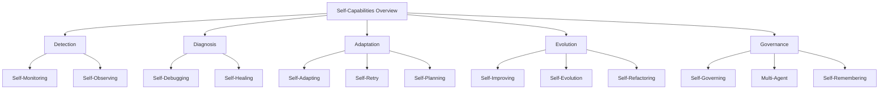

# Self-* Capabilities Deep Dive

> **Diagram:** [self-capabilities.mermaid](self-capabilities.mermaid)



## Overview

Self-* capabilities are what make an agent truly autonomous. Instead of relying on human intervention for every failure, adaptation, or improvement, the agent handles these internally.

| Capability | What it does | Why it matters |
|---|---|---|
| **Self-Healing** | Diagnoses and fixes failures automatically | Reduces downtime, maintains availability |
| **Self-Retry** | Retries failed operations with smart backoff | Handles transient errors without human intervention |
| **Self-Improving** | Learns from successes and failures | Gets better over time without retraining |
| **Self-Monitoring** | Tracks own performance and health | Detects issues before they become problems |
| **Self-Debugging** | Identifies and fixes its own bugs | Reduces need for human debugging |
| **Self-Refactoring** | Improves its own code structure | Maintains code quality as it evolves |
| **Multi-Agent Orchestration** | Coordinates with other agents | Enables complex distributed tasks |
| **Self-Evolution** | Adapts architecture and capabilities | Handles new domains without redesign |
| **Self-Observing** | Watches its own reasoning process | Enables meta-cognition and course correction |
| **Self-Planning** | Creates and adapts plans autonomously | Handles complex multi-step tasks |
| **Self-Adapting** | Adjusts behavior based on context | Works across different environments |
| **Self-Governing** | Enforces its own policies and rules | Maintains safety without external control |
| **Self-Remembering** | Manages its own memory lifecycle | Preserves knowledge without bloat |

---

## 1. Self-Healing

Self-healing goes beyond simple retry. It diagnoses failures, applies fixes, and verifies recovery — all without human intervention.

### Architecture

```
┌─────────────────────────────────────────────────────────────┐
│                    SELF-HEALING LAYER                        │
├─────────────────────────────────────────────────────────────┤
│  Detection → Diagnosis → Fix Selection → Apply → Verify     │
├─────────────────────────────────────────────────────────────┤
│  Known Patterns │ Learning │ Fallback │ Escalation           │
└─────────────────────────────────────────────────────────────┘
```

### Implementation

```python
class SelfHealingSystem:
    def __init__(self, healing_rules: dict, llm=None):
        self.rules = healing_rules
        self.llm = llm
        self.healing_history = []
        self.pattern_db = PatternDatabase()
    
    def handle_failure(self, error: Exception, context: dict) -> dict:
        """Main entry point for self-healing."""
        
        # Step 1: Detect and classify error
        error_info = self.classify_error(error, context)
        
        # Step 2: Check known patterns
        known_fix = self.pattern_db.find_fix(error_info)
        
        if known_fix:
            # Step 3a: Apply known fix
            result = self.apply_known_fix(known_fix, context)
        else:
            # Step 3b: Use LLM to diagnose and generate fix
            result = self.llm_diagnose(error_info, context)
        
        # Step 4: Verify fix worked
        verification = self.verify_fix(result, context)
        
        # Step 5: Learn from this healing attempt
        self.learn(error_info, result, verification)
        
        return {
            "healed": verification["success"],
            "fix_applied": result["fix"],
            "verification": verification,
            "attempts": result.get("attempts", 1)
        }
    
    def classify_error(self, error: Exception, context: dict) -> dict:
        """Classify error type and severity."""
        
        error_str = str(error)
        error_type = type(error).__name__
        
        classifications = {
            "ConnectionError": {
                "type": "transient",
                "severity": "medium",
                "retryable": True,
                "pattern": "network"
            },
            "TimeoutError": {
                "type": "transient",
                "severity": "medium",
                "retryable": True,
                "pattern": "timeout"
            },
            "PermissionError": {
                "type": "permanent",
                "severity": "high",
                "retryable": False,
                "pattern": "auth"
            },
            "FileNotFoundError": {
                "type": "data",
                "severity": "low",
                "retryable": False,
                "pattern": "missing_file"
            },
            "ValueError": {
                "type": "logic",
                "severity": "medium",
                "retryable": False,
                "pattern": "invalid_input"
            }
        }
        
        classification = classifications.get(error_type, {
            "type": "unknown",
            "severity": "medium",
            "retryable": False,
            "pattern": "unknown"
        })
        
        return {
            "error_type": error_type,
            "error_message": error_str,
            "classification": classification,
            "context": context,
            "timestamp": datetime.now()
        }
    
    def apply_known_fix(self, fix: dict, context: dict) -> dict:
        """Apply a known fix from the pattern database."""
        
        fix_type = fix.get("type")
        
        if fix_type == "retry_with_backoff":
            return self.retry_with_backoff(context, fix.get("max_retries", 3))
        
        elif fix_type == "refresh_credentials":
            return self.refresh_credentials(context)
        
        elif fix_type == "find_alternative":
            return self.find_alternative(context, fix.get("alternatives", []))
        
        elif fix_type == "reset_state":
            return self.reset_state(context)
        
        elif fix_type == "fallback_mode":
            return self.enter_fallback_mode(context, fix.get("fallback_config"))
        
        return {"success": False, "reason": f"Unknown fix type: {fix_type}"}
    
    def retry_with_backoff(self, context: dict, max_retries: int = 3) -> dict:
        """Retry with exponential backoff."""
        
        import time
        
        for attempt in range(max_retries):
            try:
                result = context["action"]()
                return {"success": True, "result": result, "attempts": attempt + 1}
            except Exception as e:
                wait_time = 2 ** attempt  # Exponential backoff
                time.sleep(wait_time)
                continue
        
        return {"success": False, "reason": "Max retries exceeded"}
    
    def refresh_credentials(self, context: dict) -> dict:
        """Refresh expired credentials."""
        
        try:
            # Attempt credential refresh
            new_credentials = context["auth"].refresh()
            context["client"].update_credentials(new_credentials)
            
            # Retry original action
            result = context["action"]()
            return {"success": True, "result": result}
        except Exception as e:
            return {"success": False, "reason": f"Credential refresh failed: {e}"}
    
    def find_alternative(self, context: dict, alternatives: list) -> dict:
        """Try alternative approaches."""
        
        for alternative in alternatives:
            try:
                result = alternative["action"]()
                return {"success": True, "result": result, "method": alternative["name"]}
            except:
                continue
        
        return {"success": False, "reason": "All alternatives failed"}
    
    def reset_state(self, context: dict) -> dict:
        """Reset to a known good state."""
        
        try:
            context["state_manager"].reset()
            result = context["action"]()
            return {"success": True, "result": result}
        except Exception as e:
            return {"success": False, "reason": f"State reset failed: {e}"}
    
    def llm_diagnose(self, error_info: dict, context: dict) -> dict:
        """Use LLM to diagnose and generate fix."""
        
        if not self.llm:
            return {"success": False, "reason": "No LLM available for diagnosis"}
        
        diagnosis_prompt = f"""
        An error occurred during agent execution:
        
        Error Type: {error_info['error_type']}
        Error Message: {error_info['error_message']}
        Context: {context.get('description', 'No context available')}
        
        Previous attempts: {context.get('previous_attempts', [])}
        
        Please diagnose:
        1. What is the root cause?
        2. What fix should be applied?
        3. Is this fix likely to succeed?
        
        Return JSON with: diagnosis, fix_type, fix_parameters, confidence
        """
        
        response = self.llm.call(diagnosis_prompt)
        
        try:
            fix_info = json.loads(response)
            return self.apply_generated_fix(fix_info, context)
        except json.JSONDecodeError:
            return {"success": False, "reason": "Could not parse LLM diagnosis"}
    
    def apply_generated_fix(self, fix_info: dict, context: dict) -> dict:
        """Apply a fix generated by LLM."""
        
        fix_type = fix_info.get("fix_type")
        params = fix_info.get("fix_parameters", {})
        
        # Map fix type to method
        fix_methods = {
            "retry": lambda: self.retry_with_backoff(context, params.get("retries", 3)),
            "alternative": lambda: self.find_alternative(context, params.get("alternatives", [])),
            "reset": lambda: self.reset_state(context),
            "modify_parameters": lambda: self.modify_parameters(context, params),
            "skip": lambda: {"success": True, "result": None, "skipped": True}
        }
        
        method = fix_methods.get(fix_type)
        if method:
            return method()
        
        return {"success": False, "reason": f"Unknown fix type: {fix_type}"}
    
    def verify_fix(self, result: dict, context: dict) -> dict:
        """Verify that the fix worked."""
        
        if not result.get("success"):
            return {"success": False, "reason": "Fix did not succeed"}
        
        # Run verification checks
        checks = []
        
        # Check 1: Did the action produce expected output?
        if "expected_output" in context:
            checks.append({
                "name": "output_match",
                "passed": result.get("result") == context["expected_output"]
            })
        
        # Check 2: Is the system in a valid state?
        if "state_validator" in context:
            checks.append({
                "name": "state_valid",
                "passed": context["state_validator"].validate()
            })
        
        # Check 3: Did we introduce new errors?
        if "error_checker" in context:
            checks.append({
                "name": "no_new_errors",
                "passed": not context["error_checker"].has_errors()
            })
        
        all_passed = all(c["passed"] for c in checks)
        
        return {
            "success": all_passed,
            "checks": checks,
            "verification_time": datetime.now()
        }
    
    def learn(self, error_info: dict, result: dict, verification: dict):
        """Learn from healing attempt."""
        
        learning = {
            "error": error_info,
            "fix_applied": result.get("fix"),
            "success": verification.get("success"),
            "timestamp": datetime.now()
        }
        
        self.healing_history.append(learning)
        
        # Update pattern database
        if verification.get("success"):
            self.pattern_db.add_pattern(
                error_type=error_info["error_type"],
                pattern=error_info["classification"]["pattern"],
                fix=result.get("fix"),
                success_rate=1.0
            )
        else:
            # Update success rate
            self.pattern_db.update_success_rate(
                error_type=error_info["error_type"],
                success=False
            )
    
    def get_healing_stats(self) -> dict:
        """Get healing statistics."""
        
        if not self.healing_history:
            return {"total_attempts": 0}
        
        successful = sum(1 for h in self.healing_history if h["success"])
        
        return {
            "total_attempts": len(self.healing_history),
            "successful": successful,
            "success_rate": successful / len(self.healing_history),
            "by_error_type": self._stats_by_error_type()
        }
    
    def _stats_by_error_type(self) -> dict:
        """Get stats broken down by error type."""
        
        stats = defaultdict(lambda: {"attempts": 0, "successes": 0})
        
        for h in self.healing_history:
            error_type = h["error"]["error_type"]
            stats[error_type]["attempts"] += 1
            if h["success"]:
                stats[error_type]["successes"] += 1
        
        return dict(stats)


class PatternDatabase:
    """Database of known error patterns and fixes."""
    
    def __init__(self):
        self.patterns = {}
    
    def find_fix(self, error_info: dict) -> dict:
        """Find a known fix for an error."""
        
        pattern = error_info["classification"]["pattern"]
        error_type = error_info["error_type"]
        
        # Check exact match
        key = f"{error_type}:{pattern}"
        if key in self.patterns:
            return self.patterns[key]
        
        # Check pattern match
        for stored_key, stored_pattern in self.patterns.items():
            if stored_pattern.get("pattern") == pattern:
                if stored_pattern.get("success_rate", 0) > 0.7:
                    return stored_pattern
        
        return None
    
    def add_pattern(self, error_type: str, pattern: str, fix: dict, success_rate: float = 1.0):
        """Add a new pattern."""
        
        key = f"{error_type}:{pattern}"
        self.patterns[key] = {
            "error_type": error_type,
            "pattern": pattern,
            "fix": fix,
            "success_rate": success_rate,
            "occurrences": 1
        }
    
    def update_success_rate(self, error_type: str, success: bool):
        """Update success rate for a pattern."""
        
        for key, pattern in self.patterns.items():
            if pattern.get("error_type") == error_type:
                total = pattern.get("occurrences", 1)
                successes = pattern.get("successes", 0) + (1 if success else 0)
                pattern["success_rate"] = successes / total
                pattern["occurrences"] = total + 1
```

### Healing Rules Configuration

```python
HEALING_RULES = {
    "network": {
        "ConnectionError": {
            "type": "retry_with_backoff",
            "max_retries": 3,
            "base_delay": 1.0,
            "max_delay": 30.0
        },
        "TimeoutError": {
            "type": "retry_with_backoff",
            "max_retries": 2,
            "base_delay": 2.0,
            "max_delay": 60.0
        }
    },
    "auth": {
        "PermissionError": {
            "type": "refresh_credentials",
            "refresh_method": "oauth2",
            "fallback": "escalate_to_human"
        },
        "401 Unauthorized": {
            "type": "refresh_credentials",
            "max_refresh_attempts": 2
        }
    },
    "data": {
        "FileNotFoundError": {
            "type": "find_alternative",
            "alternatives": [
                {"name": "check_similar_path", "pattern": "*.py"},
                {"name": "search_directory", "depth": 3}
            ]
        },
        "KeyError": {
            "type": "modify_parameters",
            "strategy": "use_default_value"
        }
    },
    "logic": {
        "ValueError": {
            "type": "modify_parameters",
            "strategy": "validate_and_retry"
        },
        "TypeError": {
            "type": "modify_parameters",
            "strategy": "type_coerce"
        }
    }
}
```

---

## 2. Self-Retry

Smart retry that adapts based on error type, history, and context.

### Implementation

```python
class SmartRetrySystem:
    def __init__(self):
        self.retry_history = []
        self.circuit_breakers = {}
    
    def retry(self, action: callable, context: dict, config: dict = None) -> dict:
        """Execute with smart retry logic."""
        
        config = config or self.get_default_config()
        
        # Check circuit breaker
        if self.is_circuit_open(context.get("service")):
            return {"success": False, "reason": "Circuit breaker open"}
        
        attempts = 0
        last_error = None
        
        while attempts < config["max_attempts"]:
            try:
                result = action()
                
                # Success - reset circuit breaker
                self.reset_circuit_breaker(context.get("service"))
                
                return {
                    "success": True,
                    "result": result,
                    "attempts": attempts + 1,
                    "total_time": self.get_total_time()
                }
            except Exception as e:
                last_error = e
                attempts += 1
                
                # Record attempt
                self.record_attempt(action, e, attempts)
                
                # Check if retryable
                if not self.is_retryable(e):
                    break
                
                # Check if should escalate
                if self.should_escalate(e, attempts):
                    break
                
                # Calculate wait time
                wait_time = self.calculate_wait_time(e, attempts, config)
                
                # Wait
                time.sleep(wait_time)
        
        # All attempts failed
        self.record_failure(context, attempts, last_error)
        
        return {
            "success": False,
            "error": str(last_error),
            "attempts": attempts,
            "reason": "Max attempts exceeded" if attempts >= config["max_attempts"] else "Non-retryable error"
        }
    
    def is_retryable(self, error: Exception) -> bool:
        """Determine if error is retryable."""
        
        retryable_errors = [
            "ConnectionError",
            "TimeoutError",
            "TemporaryError",
            "RateLimitError",
            "ServiceUnavailable"
        ]
        
        retryable_status_codes = [408, 429, 500, 502, 503, 504]
        
        error_type = type(error).__name__
        
        if error_type in retryable_errors:
            return True
        
        # Check status code if present
        status_code = getattr(error, 'status_code', None)
        if status_code in retryable_status_codes:
            return True
        
        return False
    
    def should_escalate(self, error: Exception, attempts: int) -> bool:
        """Determine if should escalate instead of retry."""
        
        # Escalate on auth errors after first attempt
        if type(error).__name__ == "PermissionError" and attempts > 1:
            return True
        
        # Escalate on data corruption
        if "corrupt" in str(error).lower():
            return True
        
        # Escalate after too many attempts
        if attempts > 5:
            return True
        
        return False
    
    def calculate_wait_time(self, error: Exception, attempt: int, config: dict) -> float:
        """Calculate wait time before retry."""
        
        strategy = config.get("backoff_strategy", "exponential")
        
        if strategy == "exponential":
            base_delay = config.get("base_delay", 1.0)
            max_delay = config.get("max_delay", 60.0)
            return min(base_delay * (2 ** (attempt - 1)), max_delay)
        
        elif strategy == "linear":
            base_delay = config.get("base_delay", 1.0)
            return base_delay * attempt
        
        elif strategy == "fixed":
            return config.get("fixed_delay", 1.0)
        
        elif strategy == "jitter":
            import random
            base_delay = config.get("base_delay", 1.0)
            max_delay = config.get("max_delay", 60.0)
            return random.uniform(base_delay, max_delay)
        
        return 1.0
    
    def is_circuit_open(self, service: str) -> bool:
        """Check if circuit breaker is open."""
        
        if service not in self.circuit_breakers:
            return False
        
        cb = self.circuit_breakers[service]
        
        # Check if enough time has passed to try again
        if cb["state"] == "open":
            if datetime.now() > cb["next_attempt"]:
                cb["state"] = "half-open"
                return False
            return True
        
        return False
    
    def reset_circuit_breaker(self, service: str):
        """Reset circuit breaker on success."""
        
        if service in self.circuit_breakers:
            self.circuit_breakers[service] = {
                "state": "closed",
                "failures": 0,
                "next_attempt": None
            }
    
    def record_attempt(self, action: callable, error: Exception, attempt: int):
        """Record retry attempt."""
        
        self.retry_history.append({
            "action": action.__name__,
            "error": str(error),
            "error_type": type(error).__name__,
            "attempt": attempt,
            "timestamp": datetime.now()
        })
    
    def record_failure(self, context: dict, attempts: int, error: Exception):
        """Record final failure and update circuit breaker."""
        
        service = context.get("service")
        
        if service:
            if service not in self.circuit_breakers:
                self.circuit_breakers[service] = {
                    "state": "closed",
                    "failures": 0,
                    "next_attempt": None
                }
            
            cb = self.circuit_breakers[service]
            cb["failures"] += attempts
            
            # Open circuit breaker if too many failures
            if cb["failures"] >= 5:
                cb["state"] = "open"
                cb["next_attempt"] = datetime.now() + timedelta(minutes=5)
    
    def get_default_config(self) -> dict:
        """Get default retry configuration."""
        
        return {
            "max_attempts": 3,
            "backoff_strategy": "exponential",
            "base_delay": 1.0,
            "max_delay": 60.0
        }
```

---

## 3. Self-Improving

The agent learns from every task and improves its performance over time.

### Implementation

```python
class SelfImprovingSystem:
    def __init__(self, llm, memory_store):
        self.llm = llm
        self.memory = memory_store
        self.performance_history = []
        self.learned_patterns = {}
    
    def record_task(self, task: dict, result: dict, metrics: dict):
        """Record task execution for learning."""
        
        record = {
            "task": task,
            "result": result,
            "metrics": metrics,
            "timestamp": datetime.now(),
            "success": result.get("success", False)
        }
        
        self.performance_history.append(record)
        
        # Analyze and learn
        self.analyze_and_learn(record)
    
    def analyze_and_learn(self, record: dict):
        """Analyze task record and extract learnings."""
        
        # Extract what worked/didn't work
        if record["success"]:
            self.learn_from_success(record)
        else:
            self.learn_from_failure(record)
    
    def learn_from_success(self, record: dict):
        """Extract patterns from successful tasks."""
        
        task_type = self.classify_task(record["task"])
        approach = self.extract_approach(record)
        
        if task_type not in self.learned_patterns:
            self.learned_patterns[task_type] = []
        
        self.learned_patterns[task_type].append({
            "approach": approach,
            "metrics": record["metrics"],
            "timestamp": record["timestamp"]
        })
        
        # Store in memory
        self.memory.store(
            key=f"success_pattern:{task_type}",
            value={
                "approach": approach,
                "success_rate": self.calculate_success_rate(task_type),
                "avg_metrics": self.average_metrics(task_type)
            }
        )
    
    def learn_from_failure(self, record: dict):
        """Extract lessons from failed tasks."""
        
        task_type = self.classify_task(record["task"])
        failure_reason = self.extract_failure_reason(record)
        
        # Store failure pattern
        self.memory.store(
            key=f"failure_pattern:{task_type}:{failure_reason}",
            value={
                "task": record["task"],
                "failure_reason": failure_reason,
                "timestamp": record["timestamp"]
            }
        )
    
    def get_recommendation(self, task: dict) -> dict:
        """Get recommendation for a new task based on learned patterns."""
        
        task_type = self.classify_task(task)
        
        # Check if we have patterns for this task type
        if task_type in self.learned_patterns:
            patterns = self.learned_patterns[task_type]
            
            # Find best performing approach
            best_pattern = max(patterns, key=lambda p: p["metrics"].get("score", 0))
            
            return {
                "recommendation": "use_learned_pattern",
                "approach": best_pattern["approach"],
                "confidence": self.calculate_confidence(task_type),
                "expected_metrics": best_pattern["metrics"]
            }
        
        # No patterns - use general approach
        return {
            "recommendation": "use_general_approach",
            "approach": self.get_general_approach(task),
            "confidence": 0.5
        }
    
    def classify_task(self, task: dict) -> str:
        """Classify task type."""
        
        task_str = str(task).lower()
        
        if "fix" in task_str or "bug" in task_str:
            return "bug_fix"
        elif "implement" in task_str or "create" in task_str:
            return "implementation"
        elif "refactor" in task_str or "clean" in task_str:
            return "refactoring"
        elif "test" in task_str:
            return "testing"
        elif "document" in task_str:
            return "documentation"
        
        return "general"
    
    def extract_approach(self, record: dict) -> str:
        """Extract the approach used in a successful task."""
        
        result = record.get("result", {})
        return result.get("approach", "unknown")
    
    def extract_failure_reason(self, record: dict) -> str:
        """Extract reason for failure."""
        
        result = record.get("result", {})
        return result.get("failure_reason", "unknown")
    
    def calculate_success_rate(self, task_type: str) -> float:
        """Calculate success rate for a task type."""
        
        records = [r for r in self.performance_history 
                  if self.classify_task(r["task"]) == task_type]
        
        if not records:
            return 0.0
        
        successes = sum(1 for r in records if r["success"])
        return successes / len(records)
    
    def average_metrics(self, task_type: str) -> dict:
        """Calculate average metrics for a task type."""
        
        records = [r for r in self.performance_history 
                  if self.classify_task(r["task"]) == task_type 
                  and r["success"]]
        
        if not records:
            return {}
        
        # Average numerical metrics
        avg_metrics = {}
        for key in records[0].get("metrics", {}).keys():
            values = [r["metrics"].get(key, 0) for r in records if isinstance(r["metrics"].get(key), (int, float))]
            if values:
                avg_metrics[key] = sum(values) / len(values)
        
        return avg_metrics
    
    def calculate_confidence(self, task_type: str) -> float:
        """Calculate confidence in recommendation."""
        
        records = [r for r in self.performance_history 
                  if self.classify_task(r["task"]) == task_type]
        
        if len(records) < 5:
            return 0.3  # Low confidence with few examples
        
        success_rate = self.calculate_success_rate(task_type)
        
        # Confidence based on success rate and sample size
        sample_confidence = min(len(records) / 20, 1.0)  # Max at 20 samples
        
        return success_rate * sample_confidence
    
    def get_general_approach(self, task: dict) -> dict:
        """Get general approach for unknown task types."""
        
        return {
            "steps": ["analyze", "plan", "implement", "test", "verify"],
            "strategy": "standard"
        }
    
    def generate_improvement_report(self) -> dict:
        """Generate report on improvements."""
        
        report = {
            "total_tasks": len(self.performance_history),
            "overall_success_rate": self.calculate_overall_success_rate(),
            "learned_patterns": len(self.learned_patterns),
            "task_type_performance": {},
            "recommendations": []
        }
        
        # Per-task-type performance
        for task_type in self.learned_patterns.keys():
            report["task_type_performance"][task_type] = {
                "success_rate": self.calculate_success_rate(task_type),
                "pattern_count": len(self.learned_patterns[task_type])
            }
        
        # Generate recommendations
        report["recommendations"] = self.generate_recommendations()
        
        return report
    
    def calculate_overall_success_rate(self) -> float:
        """Calculate overall success rate."""
        
        if not self.performance_history:
            return 0.0
        
        successes = sum(1 for r in self.performance_history if r["success"])
        return successes / len(self.performance_history)
    
    def generate_recommendations(self) -> list:
        """Generate improvement recommendations."""
        
        recommendations = []
        
        for task_type, patterns in self.learned_patterns.items():
            success_rate = self.calculate_success_rate(task_type)
            
            if success_rate < 0.7:
                recommendations.append({
                    "task_type": task_type,
                    "current_rate": success_rate,
                    "recommendation": f"Improve {task_type} approach (success rate: {success_rate:.1%})"
                })
        
        return recommendations
```

---

## 4. Self-Monitoring

The agent monitors its own performance, health, and resource usage.

### Implementation

```python
class SelfMonitoringSystem:
    def __init__(self):
        self.metrics = defaultdict(list)
        self.health_checks = []
        self.alerts = []
        self.thresholds = {}
    
    def record_metric(self, name: str, value: float, tags: dict = None):
        """Record a metric."""
        
        self.metrics[name].append({
            "value": value,
            "timestamp": datetime.now(),
            "tags": tags or {}
        })
        
        # Check thresholds
        self.check_threshold(name, value)
    
    def check_threshold(self, name: str, value: float):
        """Check if metric exceeds threshold."""
        
        if name in self.thresholds:
            threshold = self.thresholds[name]
            
            if value > threshold.get("max", float('inf')):
                self.trigger_alert(name, value, "above_max")
            elif value < threshold.get("min", float('-inf')):
                self.trigger_alert(name, value, "below_min")
    
    def trigger_alert(self, metric: str, value: float, alert_type: str):
        """Trigger an alert."""
        
        alert = {
            "metric": metric,
            "value": value,
            "type": alert_type,
            "timestamp": datetime.now(),
            "severity": self.determine_severity(metric, value, alert_type)
        }
        
        self.alerts.append(alert)
        
        # Notify if critical
        if alert["severity"] == "critical":
            self.notify(alert)
    
    def determine_severity(self, metric: str, value: float, alert_type: str) -> str:
        """Determine alert severity."""
        
        # Critical metrics
        critical_metrics = ["error_rate", "security_violation", "data_loss"]
        
        if metric in critical_metrics:
            return "critical"
        
        # Warning metrics
        warning_metrics = ["latency_p95", "memory_usage", "cpu_usage"]
        
        if metric in warning_metrics:
            return "warning"
        
        return "info"
    
    def notify(self, alert: dict):
        """Send notification."""
        
        # In production, this would send to Slack, PagerDuty, etc.
        print(f"ALERT [{alert['severity']}]: {alert['metric']} = {alert['value']}")
    
    def register_health_check(self, name: str, check_fn: callable):
        """Register a health check."""
        
        self.health_checks.append({
            "name": name,
            "check": check_fn,
            "last_run": None,
            "last_result": None
        })
    
    def run_health_checks(self) -> dict:
        """Run all health checks."""
        
        results = {}
        
        for hc in self.health_checks:
            try:
                result = hc["check"]()
                hc["last_run"] = datetime.now()
                hc["last_result"] = result
                results[hc["name"]] = result
            except Exception as e:
                results[hc["name"]] = {"healthy": False, "error": str(e)}
        
        return results
    
    def get_health_status(self) -> dict:
        """Get overall health status."""
        
        results = self.run_health_checks()
        
        healthy_count = sum(1 for r in results.values() if r.get("healthy", False))
        total_count = len(results)
        
        return {
            "healthy": healthy_count == total_count,
            "checks": results,
            "healthy_count": healthy_count,
            "total_count": total_count,
            "uptime": self.calculate_uptime()
        }
    
    def calculate_uptime(self) -> float:
        """Calculate uptime percentage."""
        
        if not self.health_checks:
            return 1.0
        
        healthy = sum(1 for hc in self.health_checks if hc["last_result"] and hc["last_result"].get("healthy"))
        return healthy / len(self.health_checks)
    
    def get_metrics_summary(self, time_range: str = "1h") -> dict:
        """Get summary of metrics."""
        
        cutoff = datetime.now() - self.parse_time_range(time_range)
        
        summary = {}
        
        for name, values in self.metrics.items():
            recent = [v for v in values if v["timestamp"] > cutoff]
            
            if recent:
                recent_values = [v["value"] for v in recent]
                summary[name] = {
                    "count": len(recent),
                    "mean": sum(recent_values) / len(recent_values),
                    "min": min(recent_values),
                    "max": max(recent_values),
                    "latest": recent_values[-1]
                }
        
        return summary
```

---

## 5. Self-Debugging

The agent identifies and fixes its own bugs.

### Implementation

```python
class SelfDebuggingSystem:
    def __init__(self, llm):
        self.llm = llm
        self.debug_history = []
        self.known_bugs = {}
    
    def handle_error(self, error: Exception, context: dict) -> dict:
        """Handle an error by debugging it."""
        
        # Step 1: Capture error info
        error_info = self.capture_error(error, context)
        
        # Step 2: Check known bugs
        known_fix = self.check_known_bugs(error_info)
        
        if known_fix:
            return self.apply_known_fix(known_fix, context)
        
        # Step 3: Debug with LLM
        debug_result = self.debug_with_llm(error_info, context)
        
        # Step 4: Apply fix
        if debug_result.get("fix"):
            fix_result = self.apply_fix(debug_result["fix"], context)
            
            # Step 5: Verify fix
            if self.verify_fix(fix_result, context):
                self.record_solution(error_info, debug_result)
                return {"success": True, "fix": debug_result["fix"]}
        
        return {"success": False, "reason": "Could not debug and fix error"}
    
    def capture_error(self, error: Exception, context: dict) -> dict:
        """Capture detailed error information."""
        
        import traceback
        
        return {
            "error_type": type(error).__name__,
            "error_message": str(error),
            "traceback": traceback.format_exc(),
            "context": context,
            "timestamp": datetime.now()
        }
    
    def check_known_bugs(self, error_info: dict) -> dict:
        """Check if this is a known bug."""
        
        error_signature = self.create_error_signature(error_info)
        
        return self.known_bugs.get(error_signature)
    
    def create_error_signature(self, error_info: dict) -> str:
        """Create a signature for error matching."""
        
        return f"{error_info['error_type']}:{error_info['error_message'][:100]}"
    
    def debug_with_llm(self, error_info: dict, context: dict) -> dict:
        """Use LLM to debug the error."""
        
        debug_prompt = f"""
        An error occurred during execution. Please debug it:
        
        Error Type: {error_info['error_type']}
        Error Message: {error_info['error_message']}
        Traceback: {error_info['traceback']}
        
        Context:
        - Task: {context.get('task', 'unknown')}
        - Last action: {context.get('last_action', 'unknown')}
        - Code state: {context.get('code_state', 'unknown')}
        
        Please provide:
        1. Root cause analysis
        2. The specific fix needed (code change or action)
        3. Confidence level (0-1)
        
        Return JSON with: root_cause, fix, confidence
        """
        
        response = self.llm.call(debug_prompt)
        
        try:
            return json.loads(response)
        except json.JSONDecodeError:
            return {"root_cause": "Unknown", "fix": None, "confidence": 0}
    
    def apply_fix(self, fix: dict, context: dict) -> dict:
        """Apply a debug fix."""
        
        fix_type = fix.get("type")
        
        if fix_type == "code_change":
            return self.apply_code_change(fix, context)
        elif fix_type == "parameter_fix":
            return self.apply_parameter_fix(fix, context)
        elif fix_type == "logic_fix":
            return self.apply_logic_fix(fix, context)
        
        return {"success": False, "reason": f"Unknown fix type: {fix_type}"}
    
    def apply_code_change(self, fix: dict, context: dict) -> dict:
        """Apply a code change fix."""
        
        # In a real system, this would modify actual code
        return {"success": True, "changes": fix.get("changes", [])}
    
    def apply_parameter_fix(self, fix: dict, context: dict) -> dict:
        """Apply a parameter fix."""
        
        return {"success": True, "parameters": fix.get("parameters", {})}
    
    def apply_logic_fix(self, fix: dict, context: dict) -> dict:
        """Apply a logic fix."""
        
        return {"success": True, "logic_changes": fix.get("logic_changes", [])}
    
    def verify_fix(self, fix_result: dict, context: dict) -> bool:
        """Verify that a fix worked."""
        
        # Run tests if available
        if "test_runner" in context:
            return context["test_runner"].run_all()
        
        return fix_result.get("success", False)
    
    def record_solution(self, error_info: dict, solution: dict):
        """Record a successful solution."""
        
        signature = self.create_error_signature(error_info)
        
        self.known_bugs[signature] = {
            "error": error_info,
            "solution": solution,
            "timestamp": datetime.now()
        }
        
        self.debug_history.append({
            "error": error_info,
            "solution": solution,
            "timestamp": datetime.now()
        })
```

---

## 6. Self-Refactoring

The agent improves its own code structure over time.

### Implementation

```python
class SelfRefactoringSystem:
    def __init__(self, llm):
        self.llm = llm
        self.refactoring_history = []
        self.code_metrics = {}
    
    def analyze_code(self, code: str) -> dict:
        """Analyze code for refactoring opportunities."""
        
        metrics = self.calculate_metrics(code)
        
        issues = []
        
        # Check for code smells
        if metrics["complexity"] > 10:
            issues.append({
                "type": "high_complexity",
                "severity": "high",
                "description": f"Cyclomatic complexity is {metrics['complexity']}"
            })
        
        if metrics["duplicates"] > 0.2:
            issues.append({
                "type": "code_duplication",
                "severity": "medium",
                "description": f"{metrics['duplicates']:.1%} code duplication"
            })
        
        if metrics["functions"] > 20:
            issues.append({
                "type": "too_many_functions",
                "severity": "medium",
                "description": f"File has {metrics['functions']} functions"
            })
        
        if metrics["lines"] > 500:
            issues.append({
                "type": "file_too_long",
                "severity": "low",
                "description": f"File has {metrics['lines']} lines"
            })
        
        return {
            "metrics": metrics,
            "issues": issues,
            "refactoring_needed": len(issues) > 0
        }
    
    def calculate_metrics(self, code: str) -> dict:
        """Calculate code metrics."""
        
        lines = code.split('\n')
        
        # Simple metrics
        functions = len([l for l in lines if l.strip().startswith('def ')])
        classes = len([l for l in lines if l.strip().startswith('class ')])
        imports = len([l for l in lines if l.strip().startswith('import ')])
        
        # Complexity estimate (simplified)
        complexity = 1
        for line in lines:
            if any(kw in line for kw in ['if ', 'elif ', 'for ', 'while ', 'except ']):
                complexity += 1
        
        return {
            "lines": len(lines),
            "functions": functions,
            "classes": classes,
            "imports": imports,
            "complexity": complexity,
            "duplicates": self.estimate_duplicates(code)
        }
    
    def estimate_duplicates(self, code: str) -> float:
        """Estimate code duplication."""
        
        lines = [l.strip() for l in code.split('\n') if l.strip()]
        
        if not lines:
            return 0.0
        
        seen = set()
        duplicates = 0
        
        for line in lines:
            if line in seen:
                duplicates += 1
            else:
                seen.add(line)
        
        return duplicates / len(lines)
    
    def suggest_refactorings(self, analysis: dict) -> list:
        """Suggest refactoring actions."""
        
        suggestions = []
        
        for issue in analysis["issues"]:
            if issue["type"] == "high_complexity":
                suggestions.append({
                    "action": "extract_methods",
                    "description": "Break complex function into smaller methods",
                    "priority": "high"
                })
            elif issue["type"] == "code_duplication":
                suggestions.append({
                    "action": "extract_common",
                    "description": "Extract duplicated code into shared function",
                    "priority": "medium"
                })
            elif issue["type"] == "file_too_long":
                suggestions.append({
                    "action": "split_file",
                    "description": "Split file into multiple modules",
                    "priority": "medium"
                })
        
        return suggestions
    
    def apply_refactoring(self, code: str, suggestion: dict) -> str:
        """Apply a refactoring suggestion."""
        
        refactoring_prompt = f"""
        Refactor this code based on the suggestion:
        
        Code:
        {code}
        
        Suggestion: {suggestion['description']}
        
        Apply the refactoring while:
        1. Maintaining the same functionality
        2. Improving code structure
        3. Following best practices
        
        Return the refactored code.
        """
        
        refactored_code = self.llm.call(refactoring_prompt)
        
        # Record the refactoring
        self.refactoring_history.append({
            "original": code[:500],  # Truncate for storage
            "refactored": refactored_code[:500],
            "suggestion": suggestion,
            "timestamp": datetime.now()
        })
        
        return refactored_code
```

---

## 7. Multi-Agent Orchestration

The agent coordinates with other agents to accomplish complex tasks.

### Implementation

```python
class MultiAgentOrchestrator:
    def __init__(self):
        self.agents = {}
        self.tasks = []
        self.results = {}
    
    def register_agent(self, agent_id: str, agent, capabilities: list):
        """Register an agent."""
        
        self.agents[agent_id] = {
            "agent": agent,
            "capabilities": capabilities,
            "status": "idle"
        }
    
    def submit_task(self, task: dict) -> str:
        """Submit a task for execution."""
        
        task_id = str(uuid4())
        
        self.tasks.append({
            "id": task_id,
            "task": task,
            "status": "pending",
            "assigned_agent": None,
            "result": None
        })
        
        return task_id
    
    def execute(self) -> dict:
        """Execute all pending tasks."""
        
        # Assign tasks to agents
        self.assign_tasks()
        
        # Execute in parallel
        import asyncio
        
        async def run_agent(agent_id, task):
            agent = self.agents[agent_id]["agent"]
            return await agent.run(task)
        
        # Create async tasks
        async_tasks = []
        for task in self.tasks:
            if task["assigned_agent"]:
                async_tasks.append(
                    run_agent(task["assigned_agent"], task["task"])
                )
        
        # Run all
        results = asyncio.run(asyncio.gather(*async_tasks))
        
        # Collect results
        for i, task in enumerate(self.tasks):
            if task["assigned_agent"]:
                task["result"] = results[i]
                task["status"] = "completed"
                self.results[task["id"]] = results[i]
        
        return self.results
    
    def assign_tasks(self):
        """Assign tasks to appropriate agents."""
        
        for task in self.tasks:
            if task["status"] != "pending":
                continue
            
            # Find best agent for task
            best_agent = self.find_best_agent(task["task"])
            
            if best_agent:
                task["assigned_agent"] = best_agent
                task["status"] = "assigned"
                self.agents[best_agent]["status"] = "busy"
    
    def find_best_agent(self, task: dict) -> str:
        """Find the best agent for a task."""
        
        task_capabilities = self.extract_capabilities(task)
        
        best_agent = None
        best_score = 0
        
        for agent_id, agent_info in self.agents.items():
            if agent_info["status"] != "idle":
                continue
            
            # Calculate capability match
            match_score = self.calculate_match(task_capabilities, agent_info["capabilities"])
            
            if match_score > best_score:
                best_score = match_score
                best_agent = agent_id
        
        return best_agent
    
    def extract_capabilities(self, task: dict) -> list:
        """Extract required capabilities from task."""
        
        task_str = str(task).lower()
        
        capabilities = []
        
        if "code" in task_str or "implement" in task_str:
            capabilities.append("coding")
        if "test" in task_str:
            capabilities.append("testing")
        if "review" in task_str:
            capabilities.append("reviewing")
        if "deploy" in task_str:
            capabilities.append("deployment")
        if "debug" in task_str:
            capabilities.append("debugging")
        
        return capabilities
    
    def calculate_match(self, required: list, available: list) -> float:
        """Calculate capability match score."""
        
        if not required:
            return 0.5
        
        matches = sum(1 for cap in required if cap in available)
        return matches / len(required)
```

---

## 8-13: Additional Self-* Capabilities

The remaining self-* capabilities follow similar patterns:

| Capability | Core Pattern | Key Implementation |
|---|---|---|
| **Self-Evolution** | Adapt architecture based on requirements | Plugin system, dynamic capability loading |
| **Self-Observing** | Meta-cognition, watch own reasoning | Decision tracing, confidence tracking |
| **Self-Planning** | Create and adapt plans autonomously | Dynamic plan generation, plan mutation |
| **Self-Adapting** | Adjust behavior based on context | Context-aware configuration, feature flags |
| **Self-Governing** | Enforce policies internally | Policy engine, constraint satisfaction |
| **Self-Remembering** | Manage memory lifecycle | Memory consolidation, forgetting, relevance scoring |

Each follows the same architecture: **Detect → Diagnose → Adapt → Verify → Learn**.

---

## Summary

| Capability | Detection | Adaptation | Verification | Learning |
|---|---|---|---|---|
| **Self-Healing** | Error classification | Pattern-based fix | Health check | Pattern database |
| **Self-Retry** | Error retryability | Backoff strategy | Success check | Circuit breaker |
| **Self-Improving** | Performance metrics | Approach selection | Success rate | Pattern library |
| **Self-Monitoring** | Threshold breach | Alert generation | Health check | Metric history |
| **Self-Debugging** | Error analysis | LLM diagnosis | Fix verification | Bug database |
| **Self-Refactoring** | Code metrics | Code transformation | Test pass | Refactoring history |
| **Multi-Agent** | Task requirements | Agent assignment | Result validation | Agent performance |
| **Self-Evolution** | Capability gaps | Architecture change | Feature test | Evolution log |
| **Self-Observing** | Reasoning quality | Meta-cognition | Confidence check | Observation history |
| **Self-Planning** | Task complexity | Plan generation | Plan validation | Plan library |
| **Self-Adapting** | Context changes | Configuration adjust | Behavior test | Adaptation log |
| **Self-Governing** | Policy violation | Policy enforcement | Compliance check | Policy log |
| **Self-Remembering** | Memory relevance | Memory lifecycle | Retrieval test | Memory stats |
