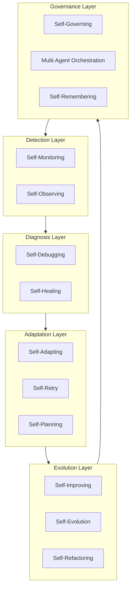

# Self-* Capabilities

13 self-* capability deep dives, each 700+ lines with complete Python implementations.

## Overview

Self-* capabilities are what make an agent truly autonomous. Instead of relying on human intervention for every failure, adaptation, or improvement, the agent handles these internally.

## Files

| File | Lines | What it covers |
|---|---|---|
| [self-healing.md](self-healing.md) | 942 | Error classification, pattern database, fix execution, LLM diagnosis |
| [self-retry.md](self-retry.md) | 915 | Smart backoff, circuit breakers, adaptive strategies, fallback patterns |
| [self-remembering.md](self-remembering.md) | 899 | Input filtering, relevance scoring, consolidation, forgetting, validation |
| [self-observing.md](self-observing.md) | 897 | Decision tracing, meta-cognition, behavior tracking, self-reflection |
| [multi-agent-orchestration.md](multi-agent-orchestration.md) | 899 | Agent registry, task routing, conflict resolution, load balancing |
| [self-planning.md](self-planning.md) | 886 | Goal analysis, plan generation, progress tracking, dynamic replanning |
| [self-governing.md](self-governing.md) | 875 | Policy engine, ethical framework, compliance checking, risk assessment |
| [self-monitoring.md](self-monitoring.md) | 863 | Metrics collection, health checks, alerts, anomaly detection, SLA |
| [self-refactoring.md](self-refactoring.md) | 855 | Code analysis, smell detection, refactoring strategies, quality metrics |
| [self-improving.md](self-improving.md) | 818 | Pattern extraction, strategy optimization, benchmarking, A/B testing |
| [self-evolution.md](self-evolution.md) | 829 | Skill discovery, architecture adaptation, knowledge transfer, fitness |
| [self-debugging.md](self-debugging.md) | 732 | Error capture, code context, fix generation, verification |
| [self-adapting.md](self-adapting.md) | 724 | Context detection, strategy selection, configuration adaptation |

## Architecture Overview



## How capabilities interact

| Capability | Detects | Diagnoses | Adapts | Evolves |
|---|---|---|---|---|
| **Self-Monitoring** | Anomalies, health issues | Performance degradation | Threshold adjustments | Monitoring rules |
| **Self-Observing** | Decision quality, reasoning gaps | Why decisions failed | Reasoning strategies | Observation patterns |
| **Self-Debugging** | Errors, bugs | Root cause analysis | Code fixes | Bug databases |
| **Self-Healing** | Failures, errors | Error classification | Fix strategies | Healing patterns |
| **Self-Adapting** | Context changes | Optimal response | Configuration | Adaptation rules |
| **Self-Retry** | Transient failures | Retryability | Backoff strategies | Circuit breakers |
| **Self-Planning** | Task requirements | Optimal approach | Execution plans | Plan templates |
| **Self-Improving** | Performance gaps | What works/doesn't | Strategies | Knowledge base |
| **Self-Evolution** | Capability gaps | Missing skills | Architecture | New capabilities |
| **Self-Refactoring** | Code quality issues | Code smells | Code structure | Refactoring patterns |
| **Self-Governing** | Policy violations | Compliance gaps | Enforcement | Policies |
| **Multi-Agent** | Task complexity | Agent capabilities | Task routing | Agent pool |
| **Self-Remembering** | Relevant information | What to remember | Memory lifecycle | Knowledge base |

## Quick start

```python
# Import the capabilities you need
from self.self_healing import SelfHealingSystem
from self.self_retry import SmartRetrySystem
from self.self_monitoring import SelfMonitoringSystem

# Initialize
healer = SelfHealingSystem()
retry = SmartRetrySystem()
monitor = SelfMonitoringSystem()

# Use them together
try:
    result = api_call()
except Exception as e:
    # Self-healing attempts to fix
    healing_result = healer.handle_error(e, {"action": api_call})
    
    if not healing_result["healed"]:
        # Self-retry as fallback
        retry_result = retry.execute_with_retry(api_call)
```

## Diagrams

Each file has a corresponding `.mermaid` diagram showing its internal flow:

| Diagram | File |
|---|---|
| [self-healing.mermaid](self-healing.mermaid) | Self-healing pipeline |
| [self-retry.mermaid](self-retry.mermaid) | Retry with circuit breaker |
| [self-improving.mermaid](self-improving.mermaid) | Improvement cycle |
| [self-monitoring.mermaid](self-monitoring.mermaid) | Monitoring pipeline |
| [self-debugging.mermaid](self-debugging.mermaid) | Debug workflow |
| [self-refactoring.mermaid](self-refactoring.mermaid) | Refactoring pipeline |
| [multi-agent-orchestration.mermaid](multi-agent-orchestration.mermaid) | Task routing |
| [self-evolution.mermaid](self-evolution.mermaid) | Evolution cycle |
| [self-observing.mermaid](self-observing.mermaid) | Observation cycle |
| [self-planning.mermaid](self-planning.mermaid) | Planning cycle |
| [self-remembering.mermaid](self-remembering.mermaid) | Memory lifecycle |
| [self-governing.mermaid](self-governing.mermaid) | Policy enforcement |
| [self-adapting.mermaid](self-adapting.mermaid) | Adaptation cycle |
