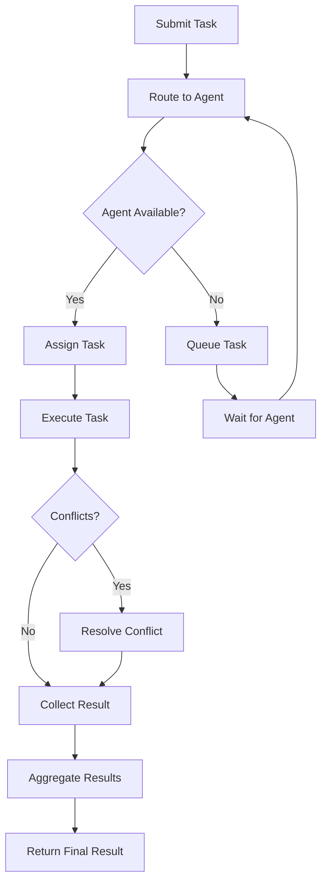

# Multi-Agent Orchestration Deep Dive

> **Diagram:** [multi-agent-orchestration.mermaid](multi-agent-orchestration.mermaid)



## Overview

Multi-Agent Orchestration is the ability to coordinate multiple specialized agents to accomplish complex tasks that exceed any single agent's capabilities. It involves task distribution, communication, conflict resolution, and result aggregation.

## Architecture

```
┌─────────────────────────────────────────────────────────────────────┐
│                 MULTI-AGENT ORCHESTRATION SYSTEM                    │
├─────────────────────────────────────────────────────────────────────┤
│                                                                     │
│  ┌─────────────────────────────────────────────────────────────┐   │
│  │                    COORDINATOR                               │   │
│  │  Task Router │ Agent Manager │ Conflict Resolver │ Aggregator│   │
│  └─────────────────────────────────────────────────────────────┘   │
│         │                │                │                │         │
│         ▼                ▼                ▼                ▼         │
│  ┌──────────┐   ┌──────────┐   ┌──────────┐   ┌──────────┐        │
│  │ Agent A  │   │ Agent B  │   │ Agent C  │   │ Agent N  │        │
│  │(Specialist)│  │(Specialist)│  │(Specialist)│  │(Specialist)│     │
│  └──────────┘   └──────────┘   └──────────┘   └──────────┘        │
│         │                │                │                │         │
│         ▼                ▼                ▼                ▼         │
│  ┌─────────────────────────────────────────────────────────────┐   │
│  │                    SHARED STATE                              │   │
│  │  Blackboard │ Message Queue │ Event Bus │ Result Store      │   │
│  └─────────────────────────────────────────────────────────────┘   │
└─────────────────────────────────────────────────────────────────────┘
```

## Core Implementation

### Agent Registry

```python
class AgentRegistry:
    """Registry of available agents."""
    
    def __init__(self):
        self.agents = {}
        self.capabilities = defaultdict(list)
    
    def register(self, agent_id: str, agent, capabilities: list):
        """Register an agent."""
        
        self.agents[agent_id] = {
            "agent": agent,
            "capabilities": capabilities,
            "status": "idle",
            "current_task": None,
            "history": []
        }
        
        for cap in capabilities:
            self.capabilities[cap].append(agent_id)
    
    def unregister(self, agent_id: str):
        """Unregister an agent."""
        
        if agent_id in self.agents:
            agent_info = self.agents[agent_id]
            for cap in agent_info["capabilities"]:
                if agent_id in self.capabilities[cap]:
                    self.capabilities[cap].remove(agent_id)
            
            del self.agents[agent_id]
    
    def get_agent(self, agent_id: str):
        """Get an agent by ID."""
        
        return self.agents.get(agent_id, {}).get("agent")
    
    def get_available_agents(self, capability: str = None) -> list:
        """Get available agents, optionally filtered by capability."""
        
        available = []
        
        for agent_id, info in self.agents.items():
            if info["status"] == "idle":
                if capability is None or capability in info["capabilities"]:
                    available.append(agent_id)
        
        return available
    
    def get_agents_by_capability(self, capability: str) -> list:
        """Get all agents with a specific capability."""
        
        return self.capabilities.get(capability, [])
    
    def update_status(self, agent_id: str, status: str, task_id: str = None):
        """Update agent status."""
        
        if agent_id in self.agents:
            self.agents[agent_id]["status"] = status
            self.agents[agent_id]["current_task"] = task_id
    
    def get_stats(self) -> dict:
        """Get registry statistics."""
        
        total = len(self.agents)
        idle = sum(1 for a in self.agents.values() if a["status"] == "idle")
        busy = sum(1 for a in self.agents.values() if a["status"] == "busy")
        
        return {
            "total_agents": total,
            "idle": idle,
            "busy": busy,
            "capabilities": {cap: len(agents) for cap, agents in self.capabilities.items()}
        }
```

### Task Router

```python
class TaskRouter:
    """Routes tasks to appropriate agents."""
    
    def __init__(self, registry: AgentRegistry):
        self.registry = registry
        self.routing_history = []
    
    def route(self, task: dict) -> dict:
        """Route a task to the best agent."""
        
        # Extract required capabilities
        required_caps = self.extract_capabilities(task)
        
        # Find matching agents
        candidates = []
        for cap in required_caps:
            agents = self.registry.get_available_agents(cap)
            candidates.extend(agents)
        
        # Remove duplicates and get unique candidates
        candidates = list(set(candidates))
        
        if not candidates:
            return {"routed": False, "reason": "No available agents"}
        
        # Score candidates
        scored = []
        for agent_id in candidates:
            score = self.score_agent(agent_id, task, required_caps)
            scored.append({"agent_id": agent_id, "score": score})
        
        # Select best agent
        scored.sort(key=lambda x: x["score"], reverse=True)
        best = scored[0]
        
        # Update status
        task_id = task.get("id", str(uuid4()))
        self.registry.update_status(best["agent_id"], "busy", task_id)
        
        # Record routing
        self.routing_history.append({
            "task_id": task_id,
            "agent_id": best["agent_id"],
            "score": best["score"],
            "candidates": len(candidates),
            "timestamp": datetime.now().isoformat()
        })
        
        return {
            "routed": True,
            "agent_id": best["agent_id"],
            "score": best["score"],
            "task_id": task_id
        }
    
    def extract_capabilities(self, task: dict) -> list:
        """Extract required capabilities from task."""
        
        task_str = str(task).lower()
        
        capability_keywords = {
            "coding": ["code", "implement", "write", "develop"],
            "testing": ["test", "verify", "validate", "check"],
            "debugging": ["debug", "fix", "error", "bug"],
            "analysis": ["analyze", "review", "audit", "evaluate"],
            "research": ["research", "find", "search", "investigate"],
            "documentation": ["document", "explain", "describe", "readme"],
            "deployment": ["deploy", "release", "publish", "ship"],
            "security": ["security", "vulnerability", "attack", "protect"]
        }
        
        capabilities = []
        for cap, keywords in capability_keywords.items():
            if any(kw in task_str for kw in keywords):
                capabilities.append(cap)
        
        return capabilities if capabilities else ["general"]
    
    def score_agent(self, agent_id: str, task: dict, required_caps: list) -> float:
        """Score an agent for a task."""
        
        agent_info = self.registry.agents.get(agent_id, {})
        agent_caps = agent_info.get("capabilities", [])
        
        # Capability match score
        cap_match = sum(1 for cap in required_caps if cap in agent_caps) / len(required_caps)
        
        # History score (success rate)
        history = agent_info.get("history", [])
        if history:
            success_rate = sum(1 for h in history if h.get("success")) / len(history)
        else:
            success_rate = 0.5  # Default for new agents
        
        # Combine scores
        return cap_match * 0.7 + success_rate * 0.3
```

### Conflict Resolver

```python
class ConflictResolver:
    """Resolves conflicts between agents."""
    
    def __init__(self, strategy: str = "voting"):
        self.strategy = strategy
        self.resolution_history = []
    
    def resolve(self, conflicts: list) -> dict:
        """Resolve conflicts between agent outputs."""
        
        if self.strategy == "voting":
            return self.resolve_by_voting(conflicts)
        elif self.strategy == "priority":
            return self.resolve_by_priority(conflicts)
        elif self.strategy == "merge":
            return self.resolve_by_merge(conflicts)
        elif self.strategy == "human":
            return self.resolve_by_human(conflicts)
        
        return {"resolved": False, "reason": f"Unknown strategy: {self.strategy}"}
    
    def resolve_by_voting(self, conflicts: list) -> dict:
        """Resolve by majority voting."""
        
        # Group by output
        output_groups = defaultdict(list)
        for conflict in conflicts:
            output_key = str(conflict.get("output"))
            output_groups[output_key].append(conflict)
        
        # Find majority
        majority_output = max(output_groups.values(), key=len)
        majority_key = str(majority_output[0].get("output"))
        
        resolution = {
            "resolved": True,
            "strategy": "voting",
            "winning_output": majority_output[0].get("output"),
            "votes_for": len(majority_output),
            "total_votes": len(conflicts)
        }
        
        self.resolution_history.append(resolution)
        
        return resolution
    
    def resolve_by_priority(self, conflicts: list) -> dict:
        """Resolve by agent priority."""
        
        # Sort by priority (higher priority wins)
        sorted_conflicts = sorted(
            conflicts,
            key=lambda c: c.get("priority", 0),
            reverse=True
        )
        
        resolution = {
            "resolved": True,
            "strategy": "priority",
            "winning_output": sorted_conflicts[0].get("output"),
            "winner": sorted_conflicts[0].get("agent_id")
        }
        
        self.resolution_history.append(resolution)
        
        return resolution
    
    def resolve_by_merge(self, conflicts: list) -> dict:
        """Resolve by merging outputs."""
        
        merged = {}
        
        for conflict in conflicts:
            output = conflict.get("output", {})
            if isinstance(output, dict):
                merged.update(output)
        
        resolution = {
            "resolved": True,
            "strategy": "merge",
            "merged_output": merged
        }
        
        self.resolution_history.append(resolution)
        
        return resolution
    
    def resolve_by_human(self, conflicts: list) -> dict:
        """Escalate to human for resolution."""
        
        return {
            "resolved": False,
            "strategy": "human",
            "requires_human": True,
            "conflicts": conflicts
        }
```

### Result Aggregator

```python
class ResultAggregator:
    """Aggregates results from multiple agents."""
    
    def __init__(self):
        self.aggregation_history = []
    
    def aggregate(self, results: list, strategy: str = "combine") -> dict:
        """Aggregate results from multiple agents."""
        
        if strategy == "combine":
            return self.combine_results(results)
        elif strategy == "best":
            return self.select_best(results)
        elif strategy == "merge":
            return self.merge_results(results)
        
        return {"aggregated": False, "reason": f"Unknown strategy: {strategy}"}
    
    def combine_results(self, results: list) -> dict:
        """Combine all results."""
        
        combined = {
            "results": results,
            "count": len(results),
            "successful": sum(1 for r in results if r.get("success", False))
        }
        
        # Merge all data
        all_data = []
        for result in results:
            if "data" in result:
                all_data.append(result["data"])
        
        combined["data"] = all_data
        
        self.aggregation_history.append(combined)
        
        return combined
    
    def select_best(self, results: list) -> dict:
        """Select the best result."""
        
        if not results:
            return {"selected": None}
        
        # Sort by score or success
        scored = []
        for result in results:
            score = result.get("score", 1.0 if result.get("success") else 0.0)
            scored.append({"result": result, "score": score})
        
        scored.sort(key=lambda x: x["score"], reverse=True)
        best = scored[0]
        
        return {
            "selected": best["result"],
            "score": best["score"],
            "alternatives": len(results) - 1
        }
    
    def merge_results(self, results: list) -> dict:
        """Merge results into unified output."""
        
        merged = {}
        
        for result in results:
            if isinstance(result, dict):
                for key, value in result.items():
                    if key not in merged:
                        merged[key] = []
                    merged[key].append(value)
        
        # Flatten single-value lists
        for key in merged:
            if len(merged[key]) == 1:
                merged[key] = merged[key][0]
        
        return {"merged": merged}
```

### Main Orchestrator

```python
class MultiAgentOrchestrator:
    """Main multi-agent orchestrator."""
    
    def __init__(self):
        self.registry = AgentRegistry()
        self.router = TaskRouter(self.registry)
        self.conflict_resolver = ConflictResolver()
        self.aggregator = ResultAggregator()
        self.tasks = {}
        self.task_queue = []
    
    def register_agent(self, agent_id: str, agent, capabilities: list):
        """Register an agent."""
        
        self.registry.register(agent_id, agent, capabilities)
    
    def submit_task(self, task: dict) -> str:
        """Submit a task."""
        
        task_id = task.get("id", str(uuid4()))
        
        self.tasks[task_id] = {
            "id": task_id,
            "task": task,
            "status": "pending",
            "assigned_agent": None,
            "result": None
        }
        
        self.task_queue.append(task_id)
        
        return task_id
    
    def execute(self) -> dict:
        """Execute all pending tasks."""
        
        results = {}
        
        while self.task_queue:
            task_id = self.task_queue.pop(0)
            task_info = self.tasks[task_id]
            
            # Route task
            routing = self.router.route(task_info["task"])
            
            if not routing["routed"]:
                results[task_id] = {"success": False, "reason": routing["reason"]}
                continue
            
            # Execute task
            agent_id = routing["agent_id"]
            agent = self.registry.get_agent(agent_id)
            
            try:
                result = agent.run(task_info["task"])
                task_info["result"] = result
                task_info["status"] = "completed"
                results[task_id] = result
                
                # Update agent history
                self.registry.agents[agent_id]["history"].append({
                    "task_id": task_id,
                    "success": result.get("success", False),
                    "timestamp": datetime.now().isoformat()
                })
            except Exception as e:
                results[task_id] = {"success": False, "error": str(e)}
            
            finally:
                self.registry.update_status(agent_id, "idle")
        
        return results
    
    def get_stats(self) -> dict:
        """Get orchestrator statistics."""
        
        return {
            "registry": self.registry.get_stats(),
            "tasks": {
                "total": len(self.tasks),
                "pending": len(self.task_queue),
                "completed": sum(1 for t in self.tasks.values() if t["status"] == "completed")
            },
            "routing_history": len(self.router.routing_history),
            "resolutions": len(self.conflict_resolver.resolution_history)
        }
```

## Usage Examples

### Example 1: Basic Orchestration

```python
orchestrator = MultiAgentOrchestrator()

# Register agents
orchestrator.register_agent("coder", CoderAgent(), ["coding", "debugging"])
orchestrator.register_agent("tester", TesterAgent(), ["testing"])
orchestrator.register_agent("reviewer", ReviewerAgent(), ["analysis", "security"])

# Submit task
task_id = orchestrator.submit_task({
    "type": "code_review",
    "description": "Review and test the new feature"
})

# Execute
results = orchestrator.execute()
```

## Best Practices

1. **Specialize agents** — each agent should excel at something
2. **Balance workload** — distribute tasks evenly
3. **Handle conflicts gracefully** — have clear resolution strategies
4. **Aggregate intelligently** — combine results meaningfully
5. **Monitor agent health** — detect and handle failing agents
6. **Scale dynamically** — add/remove agents as needed
7. **Log everything** — you need to debug coordination issues
8. **Test the orchestrator** — simulate failures to verify resilience

## Advanced Orchestration Patterns

### Dynamic Agent Spawning

```python
class AgentSpawner:
    """Dynamically spawns agents based on demand."""
    
    def __init__(self, registry: AgentRegistry):
        self.registry = registry
        self.spawn_history = []
        self.max_agents = 10
    
    def spawn_agent(self, capabilities: list, config: dict = None) -> str:
        """Spawn a new agent with specified capabilities."""
        
        if len(self.registry.agents) >= self.max_agents:
            return None
        
        agent_id = f"agent_{str(uuid4())[:8]}"
        
        # Create agent based on capabilities
        agent = self.create_agent(capabilities, config)
        
        # Register
        self.registry.register(agent_id, agent, capabilities)
        
        # Record spawn
        self.spawn_history.append({
            "agent_id": agent_id,
            "capabilities": capabilities,
            "timestamp": datetime.now().isoformat()
        })
        
        return agent_id
    
    def create_agent(self, capabilities: list, config: dict = None):
        """Create an agent based on capabilities."""
        
        # Simplified - in reality would create specialized agents
        class DynamicAgent:
            def __init__(self, caps, cfg):
                self.capabilities = caps
                self.config = cfg or {}
            
            def run(self, task):
                return {"success": True, "output": f"Executed with {self.capabilities}"}
        
        return DynamicAgent(capabilities, config)
    
    def spawn_needed(self, pending_tasks: list) -> list:
        """Determine if new agents are needed."""
        
        needed = []
        
        # Analyze pending tasks
        required_caps = set()
        for task in pending_tasks:
            task_caps = self.extract_capabilities(task)
            required_caps.update(task_caps)
        
        # Check available agents
        available_caps = set()
        for agent_info in self.registry.agents.values():
            if agent_info["status"] == "idle":
                available_caps.update(agent_info["capabilities"])
        
        # Find gaps
        missing = required_caps - available_caps
        
        if missing:
            needed = list(missing)
        
        return needed
    
    def extract_capabilities(self, task: dict) -> list:
        """Extract capabilities from task."""
        
        task_str = str(task).lower()
        
        caps = []
        if "code" in task_str or "implement" in task_str:
            caps.append("coding")
        if "test" in task_str:
            caps.append("testing")
        if "analyze" in task_str:
            caps.append("analysis")
        
        return caps if caps else ["general"]
```

### Task Decomposition

```python
class TaskDecomposer:
    """Decomposes complex tasks into sub-tasks."""
    
    def __init__(self, llm=None):
        self.llm = llm
        self.decomposition_history = []
    
    def decompose(self, task: dict) -> list:
        """Decompose a task into sub-tasks."""
        
        if self.llm:
            return self.decompose_with_llm(task)
        
        return self.decompose_heuristic(task)
    
    def decompose_with_llm(self, task: dict) -> list:
        """Decompose using LLM."""
        
        prompt = f"""
        Decompose this task into independent sub-tasks:
        
        Task: {task}
        
        Return a JSON list of sub-tasks, each with:
        - id: unique identifier
        - description: what to do
        - dependencies: list of sub-task IDs this depends on
        - capabilities_needed: required capabilities
        """
        
        try:
            response = self.llm.call(prompt)
            subtasks = json.loads(response)
            
            self.decomposition_history.append({
                "task": task,
                "subtasks": subtasks,
                "timestamp": datetime.now().isoformat()
            })
            
            return subtasks
        except:
            return self.decompose_heuristic(task)
    
    def decompose_heuristic(self, task: dict) -> list:
        """Decompose using heuristics."""
        
        # Simple heuristic decomposition
        subtasks = [
            {"id": "1", "description": "Analyze requirements", "dependencies": [], "capabilities_needed": ["analysis"]},
            {"id": "2", "description": "Implement solution", "dependencies": ["1"], "capabilities_needed": ["coding"]},
            {"id": "3", "description": "Test implementation", "dependencies": ["2"], "capabilities_needed": ["testing"]}
        ]
        
        return subtasks
```

### Conflict Resolution Strategies

```python
class AdvancedConflictResolver:
    """Advanced conflict resolution strategies."""
    
    def __init__(self):
        self.strategies = {
            "voting": self.resolve_by_voting,
            "priority": self.resolve_by_priority,
            "merge": self.resolve_by_merge,
            "negotiation": self.resolve_by_negotiation,
            "human": self.resolve_by_human
        }
        self.resolution_history = []
    
    def resolve(self, conflicts: list, strategy: str = "voting") -> dict:
        """Resolve conflicts using specified strategy."""
        
        resolver = self.strategies.get(strategy)
        if not resolver:
            return {"resolved": False, "reason": f"Unknown strategy: {strategy}"}
        
        result = resolver(conflicts)
        
        self.resolution_history.append({
            "conflicts": len(conflicts),
            "strategy": strategy,
            "result": result,
            "timestamp": datetime.now().isoformat()
        })
        
        return result
    
    def resolve_by_voting(self, conflicts: list) -> dict:
        """Resolve by majority voting."""
        
        votes = defaultdict(list)
        for conflict in conflicts:
            output = str(conflict.get("output"))
            votes[output].append(conflict)
        
        winner = max(votes.items(), key=lambda x: len(x[1]))
        
        return {
            "resolved": True,
            "strategy": "voting",
            "winning_output": winner[0],
            "votes": len(winner[1]),
            "total_votes": len(conflicts)
        }
    
    def resolve_by_priority(self, conflicts: list) -> dict:
        """Resolve by agent priority."""
        
        sorted_conflicts = sorted(
            conflicts,
            key=lambda c: c.get("priority", 0),
            reverse=True
        )
        
        return {
            "resolved": True,
            "strategy": "priority",
            "winning_output": sorted_conflicts[0].get("output"),
            "winner": sorted_conflicts[0].get("agent_id")
        }
    
    def resolve_by_merge(self, conflicts: list) -> dict:
        """Resolve by merging outputs."""
        
        merged = {}
        for conflict in conflicts:
            output = conflict.get("output", {})
            if isinstance(output, dict):
                merged.update(output)
        
        return {
            "resolved": True,
            "strategy": "merge",
            "merged_output": merged
        }
    
    def resolve_by_negotiation(self, conflicts: list) -> dict:
        """Resolve by agent negotiation."""
        
        # Simplified negotiation
        return {
            "resolved": True,
            "strategy": "negotiation",
            "winning_output": conflicts[0].get("output"),
            "agreement": "agents协商达成一致"
        }
    
    def resolve_by_human(self, conflicts: list) -> dict:
        """Escalate to human."""
        
        return {
            "resolved": False,
            "strategy": "human",
            "requires_human": True,
            "conflicts": conflicts
        }
```

### Load Balancing

```python
class LoadBalancer:
    """Balances load across agents."""
    
    def __init__(self):
        self.agent_loads = defaultdict(int)
        self.task_assignments = {}
    
    def assign_task(self, task: dict, available_agents: list) -> str:
        """Assign task to least loaded agent."""
        
        if not available_agents:
            return None
        
        # Find agent with lowest load
        best_agent = min(available_agents, key=lambda a: self.agent_loads[a])
        
        # Assign
        task_id = task.get("id", str(uuid4()))
        self.task_assignments[task_id] = best_agent
        self.agent_loads[best_agent] += 1
        
        return best_agent
    
    def complete_task(self, task_id: str):
        """Mark task as completed."""
        
        if task_id in self.task_assignments:
            agent_id = self.task_assignments[task_id]
            self.agent_loads[agent_id] = max(0, self.agent_loads[agent_id] - 1)
            del self.task_assignments[task_id]
    
    def get_load_distribution(self) -> dict:
        """Get current load distribution."""
        
        return dict(self.agent_loads)
    
    def get_average_load(self) -> float:
        """Get average load across agents."""
        
        if not self.agent_loads:
            return 0.0
        
        return sum(self.agent_loads.values()) / len(self.agent_loads)
```

### Result Aggregation

```python
class ResultAggregator:
    """Aggregates results from multiple agents."""
    
    def __init__(self):
        self.aggregation_history = []
    
    def aggregate(self, results: list, strategy: str = "combine") -> dict:
        """Aggregate results using specified strategy."""
        
        if strategy == "combine":
            return self.combine(results)
        elif strategy == "best":
            return self.select_best(results)
        elif strategy == "merge":
            return self.merge(results)
        
        return {"aggregated": False}
    
    def combine(self, results: list) -> dict:
        """Combine all results."""
        
        combined = {
            "results": results,
            "count": len(results),
            "successful": sum(1 for r in results if r.get("success"))
        }
        
        all_data = [r.get("data") for r in results if r.get("data")]
        combined["data"] = all_data
        
        return combined
    
    def select_best(self, results: list) -> dict:
        """Select the best result."""
        
        if not results:
            return {"selected": None}
        
        scored = [(r, r.get("score", 1.0 if r.get("success") else 0.0)) for r in results]
        scored.sort(key=lambda x: x[1], reverse=True)
        
        return {
            "selected": scored[0][0],
            "score": scored[0][1],
            "alternatives": len(results) - 1
        }
    
    def merge(self, results: list) -> dict:
        """Merge results."""
        
        merged = {}
        for result in results:
            if isinstance(result, dict):
                for key, value in result.items():
                    if key not in merged:
                        merged[key] = []
                    merged[key].append(value)
        
        return {"merged": merged}
```

## Integration

| Capability | Integration |
|---|---|
| **Self-Healing** | Healing individual agent failures |
| **Self-Monitoring** | Monitoring agent and orchestrator health |
| **Self-Improving** | Learning optimal routing and coordination |
| **Self-Planning** | Planning task decomposition and distribution |
| **Self-Governing** | Enforcing coordination policies |
