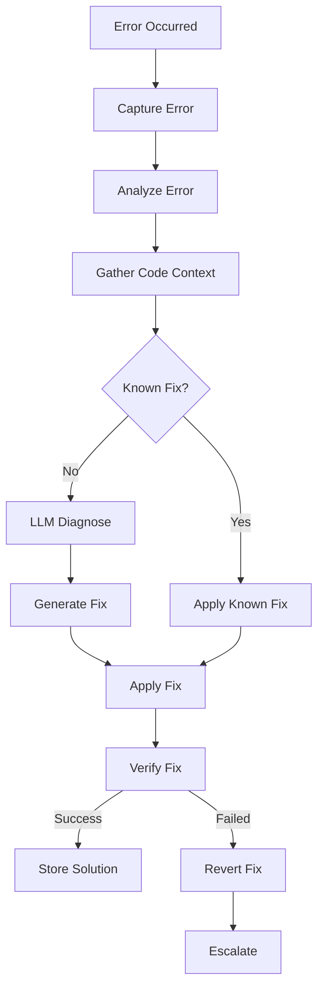

# Self-Debugging Deep Dive

> **Diagram:** [self-debugging.mermaid](self-debugging.mermaid)



## Overview

Self-Debugging is the agent's ability to identify, diagnose, and fix its own bugs without human intervention. It combines error analysis, code inspection, and automated repair to resolve issues autonomously.

## Architecture

```
┌─────────────────────────────────────────────────────────────────────┐
│                    SELF-DEBUGGING SYSTEM                            │
├─────────────────────────────────────────────────────────────────────┤
│                                                                     │
│  ┌──────────┐   ┌──────────┐   ┌──────────┐   ┌──────────┐        │
│  │  Error   │──▶│   Root   │──▶│   Fix    │──▶│ Verify   │        │
│  │  Capture │   │  Cause   │   │ Generate │   │  Fix     │        │
│  └──────────┘   └──────────┘   └──────────┘   └──────────┘        │
│       │              │              │               │                │
│       ▼              ▼              ▼               ▼                │
│  ┌──────────┐   ┌──────────┐   ┌──────────┐   ┌──────────┐        │
│  │ Traceback│   │ Code     │   │ Patch    │   │ Test     │        │
│  │ Analyzer │   │ Context  │   │ Generator│   │ Runner   │        │
│  └──────────┘   └──────────┘   └──────────┘   └──────────┘        │
│                                                                     │
│  ┌─────────────────────────────────────────────────────────────┐   │
│  │                    BUG DATABASE                              │   │
│  │  Known Bugs │ Solutions │ Patterns │ Learning History        │   │
│  └─────────────────────────────────────────────────────────────┘   │
└─────────────────────────────────────────────────────────────────────┘
```

## Core Implementation

### Error Capture System

```python
class ErrorCapture:
    """Captures and analyzes errors."""
    
    def __init__(self):
        self.captured_errors = []
    
    def capture(self, error: Exception, context: dict = None) -> dict:
        """Capture an error with full context."""
        
        import traceback
        
        error_info = {
            "id": str(uuid4()),
            "error_type": type(error).__name__,
            "error_message": str(error),
            "traceback": traceback.format_exc(),
            "context": context or {},
            "timestamp": datetime.now().isoformat(),
            "stack_frames": self.extract_stack_frames(error)
        }
        
        self.captured_errors.append(error_info)
        
        return error_info
    
    def extract_stack_frames(self, error: Exception) -> list:
        """Extract relevant stack frames."""
        
        import traceback
        
        frames = []
        tb = error.__traceback__
        
        while tb:
            frame = {
                "file": tb.tb_frame.f_code.co_filename,
                "function": tb.tb_frame.f_code.co_name,
                "line": tb.tb_lineno,
                "locals": self.safe_serialize_locals(tb.tb_frame.f_locals)
            }
            frames.append(frame)
            tb = tb.tb_next
        
        return frames
    
    def safe_serialize_locals(self, locals_dict: dict) -> dict:
        """Safely serialize local variables."""
        
        serialized = {}
        
        for key, value in locals_dict.items():
            if key.startswith('_'):
                continue
            
            try:
                # Try to get a string representation
                repr_str = repr(value)
                if len(repr_str) > 200:
                    repr_str = repr_str[:200] + "..."
                serialized[key] = repr_str
            except:
                serialized[key] = "<unserializable>"
        
        return serialized
    
    def analyze_error(self, error_info: dict) -> dict:
        """Analyze captured error."""
        
        analysis = {
            "error_category": self.categorize_error(error_info),
            "likely_cause": self.estimate_cause(error_info),
            "affected_files": self.extract_affected_files(error_info),
            "fix_difficulty": self.estimate_difficulty(error_info)
        }
        
        return analysis
    
    def categorize_error(self, error_info: dict) -> str:
        """Categorize the error type."""
        
        error_type = error_info["error_type"]
        
        categories = {
            "AttributeError": "attribute_access",
            "TypeError": "type_mismatch",
            "ValueError": "invalid_value",
            "KeyError": "missing_key",
            "IndexError": "index_out_of_range",
            "FileNotFoundError": "file_not_found",
            "ImportError": "import_error",
            "SyntaxError": "syntax_error",
            "NameError": "undefined_variable",
            "RuntimeError": "runtime_error",
            "ConnectionError": "network_error",
            "TimeoutError": "timeout",
            "PermissionError": "permission_error"
        }
        
        return categories.get(error_type, "unknown")
    
    def estimate_cause(self, error_info: dict) -> str:
        """Estimate likely cause based on error."""
        
        error_type = error_info["error_type"]
        error_msg = error_info["error_message"]
        
        causes = {
            "AttributeError": f"Object doesn't have attribute: {error_msg}",
            "TypeError": f"Wrong type used: {error_msg}",
            "ValueError": f"Invalid value provided: {error_msg}",
            "KeyError": f"Key not found: {error_msg}",
            "FileNotFoundError": f"File doesn't exist: {error_msg}",
            "ImportError": f"Module not found: {error_msg}",
            "NameError": f"Variable not defined: {error_msg}"
        }
        
        return causes.get(error_type, f"Unknown cause: {error_msg}")
    
    def extract_affected_files(self, error_info: dict) -> list:
        """Extract files affected by the error."""
        
        files = set()
        
        for frame in error_info.get("stack_frames", []):
            file_path = frame.get("file", "")
            if file_path and not file_path.startswith("<"):
                files.add(file_path)
        
        return list(files)
    
    def estimate_difficulty(self, error_info: dict) -> str:
        """Estimate fix difficulty."""
        
        error_type = error_info["error_type"]
        
        easy_fixes = ["NameError", "ImportError", "FileNotFoundError"]
        medium_fixes = ["TypeError", "ValueError", "KeyError", "IndexError"]
        hard_fixes = ["AttributeError", "RuntimeError", "LogicError"]
        
        if error_type in easy_fixes:
            return "easy"
        elif error_type in medium_fixes:
            return "medium"
        elif error_type in hard_fixes:
            return "hard"
        
        return "unknown"
```

### Code Context Gatherer

```python
class CodeContextGatherer:
    """Gathers code context around errors."""
    
    def __init__(self):
        self.context_lines = 10
    
    def gather_context(self, error_info: dict) -> dict:
        """Gather code context for the error."""
        
        context = {
            "error_location": self.get_error_location(error_info),
            "surrounding_code": self.get_surrounding_code(error_info),
            "related_code": self.get_related_code(error_info),
            "imports": self.get_relevant_imports(error_info)
        }
        
        return context
    
    def get_error_location(self, error_info: dict) -> dict:
        """Get the exact error location."""
        
        frames = error_info.get("stack_frames", [])
        if not frames:
            return {"file": "unknown", "line": 0, "function": "unknown"}
        
        # Get the first non-internal frame
        for frame in frames:
            if not frame["file"].startswith("<"):
                return {
                    "file": frame["file"],
                    "line": frame["line"],
                    "function": frame["function"]
                }
        
        return frames[0]
    
    def get_surrounding_code(self, error_info: dict) -> str:
        """Get code surrounding the error location."""
        
        location = self.get_error_location(error_info)
        file_path = location.get("file")
        line_number = location.get("line", 0)
        
        if not file_path or not os.path.exists(file_path):
            return ""
        
        try:
            with open(file_path, 'r') as f:
                lines = f.readlines()
            
            start = max(0, line_number - self.context_lines)
            end = min(len(lines), line_number + self.context_lines)
            
            # Add line numbers
            context_lines = []
            for i in range(start, end):
                prefix = ">>>" if i == line_number - 1 else "   "
                context_lines.append(f"{prefix} {i+1:4d}: {lines[i].rstrip()}")
            
            return "\n".join(context_lines)
        except Exception:
            return ""
    
    def get_related_code(self, error_info: dict) -> dict:
        """Get related code (callers, callees)."""
        
        frames = error_info.get("stack_frames", [])
        related = []
        
        for frame in frames[:3]:  # Top 3 frames
            if not frame["file"].startswith("<"):
                related.append({
                    "file": frame["file"],
                    "function": frame["function"],
                    "line": frame["line"]
                })
        
        return {"call_stack": related}
    
    def get_relevant_imports(self, error_info: dict) -> list:
        """Get relevant imports for the error location."""
        
        location = self.get_error_location(error_info)
        file_path = location.get("file")
        
        if not file_path or not os.path.exists(file_path):
            return []
        
        try:
            with open(file_path, 'r') as f:
                content = f.read()
            
            # Extract import statements
            imports = []
            for line in content.split('\n'):
                if line.strip().startswith(('import ', 'from ')):
                    imports.append(line.strip())
            
            return imports[:20]  # Limit to 20
        except Exception:
            return []
```

### Fix Generator

```python
class FixGenerator:
    """Generates fixes for errors."""
    
    def __init__(self, llm=None):
        self.llm = llm
        self.known_fixes = {}
        self.generation_history = []
    
    def generate_fix(self, error_info: dict, code_context: dict) -> dict:
        """Generate a fix for an error."""
        
        # Check known fixes first
        known_fix = self.check_known_fixes(error_info)
        if known_fix:
            return {"source": "known", "fix": known_fix}
        
        # Generate fix using LLM
        if self.llm:
            fix = self.generate_with_llm(error_info, code_context)
            return {"source": "generated", "fix": fix}
        
        # Fallback to heuristic fixes
        fix = self.generate_heuristic_fix(error_info, code_context)
        return {"source": "heuristic", "fix": fix}
    
    def check_known_fixes(self, error_info: dict) -> dict:
        """Check for known fixes."""
        
        error_type = error_info["error_type"]
        error_msg = error_info["error_message"]
        
        # Create signature
        signature = f"{error_type}:{error_msg[:100]}"
        
        return self.known_fixes.get(signature)
    
    def generate_with_llm(self, error_info: dict, code_context: dict) -> dict:
        """Generate fix using LLM."""
        
        prompt = f"""
        An error occurred during code execution. Please generate a fix.
        
        Error Type: {error_info['error_type']}
        Error Message: {error_info['error_message']}
        
        Code Context:
        {code_context.get('surrounding_code', 'No context available')}
        
        Error Location: {code_context.get('error_location', {}).get('file', 'unknown')}:{code_context.get('error_location', {}).get('line', 0)}
        
        Please provide:
        1. Root cause analysis
        2. The specific code change needed
        3. Confidence level (0-1)
        
        Return JSON with: root_cause, fix_description, old_code, new_code, confidence
        """
        
        try:
            response = self.llm.call(prompt)
            import json
            fix = json.loads(response)
            
            # Store for future reference
            signature = f"{error_info['error_type']}:{error_info['error_message'][:100]}"
            self.known_fixes[signature] = fix
            
            return fix
        except Exception as e:
            return self.generate_heuristic_fix(error_info, code_context)
    
    def generate_heuristic_fix(self, error_info: dict, code_context: dict) -> dict:
        """Generate fix using heuristics."""
        
        error_type = error_info["error_type"]
        error_msg = error_info["error_message"]
        
        fixes = {
            "NameError": {
                "root_cause": "Variable not defined",
                "fix_description": "Add variable definition",
                "confidence": 0.7
            },
            "ImportError": {
                "root_cause": "Module not installed",
                "fix_description": f"Install missing module: {error_msg}",
                "confidence": 0.8
            },
            "FileNotFoundError": {
                "root_cause": "File doesn't exist",
                "fix_description": "Check file path or create file",
                "confidence": 0.9
            },
            "TypeError": {
                "root_cause": "Wrong type used",
                "fix_description": "Add type conversion or fix type",
                "confidence": 0.6
            },
            "KeyError": {
                "root_cause": "Key doesn't exist in dictionary",
                "fix_description": "Use .get() with default or check key existence",
                "confidence": 0.7
            }
        }
        
        return fixes.get(error_type, {
            "root_cause": "Unknown",
            "fix_description": "Manual investigation required",
            "confidence": 0.3
        })
    
    def store_fix(self, error_info: dict, fix: dict, success: bool):
        """Store a fix for future reference."""
        
        signature = f"{error_info['error_type']}:{error_info['error_message'][:100]}"
        
        self.known_fixes[signature] = {
            **fix,
            "verified": success,
            "timestamp": datetime.now().isoformat()
        }
        
        self.generation_history.append({
            "error": error_info,
            "fix": fix,
            "success": success,
            "timestamp": datetime.now().isoformat()
        })
```

### Fix Applicator

```python
class FixApplicator:
    """Applies generated fixes to code."""
    
    def __init__(self):
        self.applied_fixes = []
    
    def apply_fix(self, fix: dict, code_context: dict) -> dict:
        """Apply a fix to code."""
        
        if "old_code" in fix and "new_code" in fix:
            return self.apply_code_change(fix, code_context)
        elif "file_path" in fix:
            return self.apply_file_change(fix)
        elif "command" in fix:
            return self.apply_command(fix)
        
        return {"success": False, "reason": "Unknown fix format"}
    
    def apply_code_change(self, fix: dict, code_context: dict) -> dict:
        """Apply a code change fix."""
        
        file_path = code_context.get("error_location", {}).get("file")
        old_code = fix.get("old_code", "")
        new_code = fix.get("new_code", "")
        
        if not file_path or not os.path.exists(file_path):
            return {"success": False, "reason": "File not found"}
        
        try:
            with open(file_path, 'r') as f:
                content = f.read()
            
            if old_code in content:
                new_content = content.replace(old_code, new_code, 1)
                
                # Create backup
                backup_path = f"{file_path}.bak"
                with open(backup_path, 'w') as f:
                    f.write(content)
                
                # Write new content
                with open(file_path, 'w') as f:
                    f.write(new_content)
                
                return {
                    "success": True,
                    "file": file_path,
                    "backup": backup_path,
                    "changes": {
                        "old": old_code[:100],
                        "new": new_code[:100]
                    }
                }
            else:
                return {"success": False, "reason": "Old code not found in file"}
                
        except Exception as e:
            return {"success": False, "reason": str(e)}
    
    def apply_file_change(self, fix: dict) -> dict:
        """Apply a file-level change."""
        
        file_path = fix.get("file_path")
        content = fix.get("content")
        operation = fix.get("operation", "write")
        
        try:
            if operation == "write":
                with open(file_path, 'w') as f:
                    f.write(content)
                return {"success": True, "file": file_path}
            elif operation == "append":
                with open(file_path, 'a') as f:
                    f.write(content)
                return {"success": True, "file": file_path}
            elif operation == "delete":
                if os.path.exists(file_path):
                    os.remove(file_path)
                return {"success": True, "file": file_path}
        except Exception as e:
            return {"success": False, "reason": str(e)}
    
    def apply_command(self, fix: dict) -> dict:
        """Apply a command fix."""
        
        import subprocess
        
        command = fix.get("command")
        
        try:
            result = subprocess.run(
                command,
                shell=True,
                capture_output=True,
                text=True,
                timeout=30
            )
            
            return {
                "success": result.returncode == 0,
                "stdout": result.stdout,
                "stderr": result.stderr
            }
        except Exception as e:
            return {"success": False, "reason": str(e)}
    
    def revert_fix(self, fix_result: dict) -> dict:
        """Revert an applied fix."""
        
        backup_path = fix_result.get("backup")
        
        if backup_path and os.path.exists(backup_path):
            file_path = fix_result.get("file")
            
            try:
                # Read backup
                with open(backup_path, 'r') as f:
                    content = f.read()
                
                # Restore
                with open(file_path, 'w') as f:
                    f.write(content)
                
                # Remove backup
                os.remove(backup_path)
                
                return {"success": True, "reverted": file_path}
            except Exception as e:
                return {"success": False, "reason": str(e)}
        
        return {"success": False, "reason": "No backup available"}
```

### Main Self-Debugging System

```python
class SelfDebuggingSystem:
    """Main self-debugging orchestrator."""
    
    def __init__(self, llm=None):
        self.capturer = ErrorCapture()
        self.context_gatherer = CodeContextGatherer()
        self.fix_generator = FixGenerator(llm)
        self.fix_applicator = FixApplicator()
        self.debug_history = []
    
    def debug_error(self, error: Exception, context: dict = None) -> dict:
        """Debug an error and attempt to fix it."""
        
        # Step 1: Capture error
        error_info = self.capturer.capture(error, context)
        
        # Step 2: Analyze error
        analysis = self.capturer.analyze_error(error_info)
        
        # Step 3: Gather code context
        code_context = self.context_gatherer.gather_context(error_info)
        
        # Step 4: Generate fix
        fix_result = self.fix_generator.generate_fix(error_info, code_context)
        
        # Step 5: Apply fix
        if fix_result["fix"].get("confidence", 0) > 0.5:
            apply_result = self.fix_applicator.apply_fix(fix_result["fix"], code_context)
        else:
            apply_result = {"success": False, "reason": "Low confidence fix"}
        
        # Step 6: Verify fix
        if apply_result["success"]:
            verification = self.verify_fix(apply_result, context)
        else:
            verification = {"success": False, "reason": "Fix not applied"}
        
        # Step 7: Record result
        self.debug_history.append({
            "error": error_info,
            "analysis": analysis,
            "fix": fix_result,
            "applied": apply_result,
            "verified": verification,
            "timestamp": datetime.now().isoformat()
        })
        
        # Step 8: Store successful fixes
        if verification["success"]:
            self.fix_generator.store_fix(error_info, fix_result["fix"], True)
        
        return {
            "debugged": True,
            "error_info": error_info,
            "analysis": analysis,
            "fix_applied": apply_result.get("success", False),
            "verified": verification.get("success", False),
            "fix": fix_result["fix"]
        }
    
    def verify_fix(self, apply_result: dict, context: dict = None) -> dict:
        """Verify that a fix worked."""
        
        # If there's a test runner, run tests
        if context and "test_runner" in context:
            try:
                test_result = context["test_runner"].run()
                return {"success": test_result.get("passed", False), "test_result": test_result}
            except Exception as e:
                return {"success": False, "reason": f"Test failed: {e}"}
        
        # If there's a verification function
        if context and "verifier" in context:
            try:
                return {"success": context["verifier"]()}
            except Exception as e:
                return {"success": False, "reason": f"Verification failed: {e}"}
        
        # Default: assume fix worked if it was applied
        return {"success": apply_result.get("success", False)}
    
    def get_debug_statistics(self) -> dict:
        """Get debugging statistics."""
        
        if not self.debug_history:
            return {"total_debugs": 0}
        
        successful = sum(1 for d in self.debug_history if d["verified"]["success"])
        
        return {
            "total_debugs": len(self.debug_history),
            "successful_fixes": successful,
            "success_rate": successful / len(self.debug_history),
            "by_error_type": self._stats_by_error_type()
        }
    
    def _stats_by_error_type(self) -> dict:
        """Get stats by error type."""
        
        stats = defaultdict(lambda: {"attempts": 0, "successes": 0})
        
        for d in self.debug_history:
            error_type = d["error"]["error_type"]
            stats[error_type]["attempts"] += 1
            if d["verified"]["success"]:
                stats[error_type]["successes"] += 1
        
        return dict(stats)
```

## Usage Examples

### Example 1: Debug a Runtime Error

```python
debugger = SelfDebuggingSystem(llm=my_llm)

try:
    # Some code that fails
    result = process_data(data)
except Exception as e:
    debug_result = debugger.debug_error(e, {
        "description": "Processing user data",
        "test_runner": my_test_runner
    })
    
    if debug_result["verified"]:
        print(f"Fix applied and verified: {debug_result['fix'].get('fix_description')}")
    else:
        print(f"Could not auto-fix: {debug_result['fix'].get('root_cause')}")
```

### Example 2: Batch Debugging

```python
debugger = SelfDebuggingSystem()

for test_case in failing_tests:
    try:
        test_case.run()
    except Exception as e:
        result = debugger.debug_error(e, test_case.context)
        print(f"Test: {test_case.name}, Fixed: {result['verified']}")

# View statistics
stats = debugger.get_debug_statistics()
print(f"Success rate: {stats['success_rate']:.1%}")
```

## Best Practices

1. **Always backup before fixing** — allow reverting changes
2. **Verify fixes** — don't assume a fix worked
3. **Learn from successes** — store working fixes for reuse
4. **Set confidence thresholds** — don't apply low-confidence fixes
5. **Track everything** — debug history enables learning
6. **Test after fixing** — ensure no regressions
7. **Escalate when stuck** — don't loop forever
8. **Review fix quality** — human oversight for complex fixes

## Integration

| Capability | Integration |
|---|---|
| **Self-Healing** | Debugging provides root cause for healing |
| **Self-Improving** | Debug patterns improve future debugging |
| **Self-Monitoring** | Monitoring detects when debugging is needed |
| **Self-Refactoring** | Refactoring prevents bugs |
| **Self-Remembering** | Known fixes persist across sessions |
