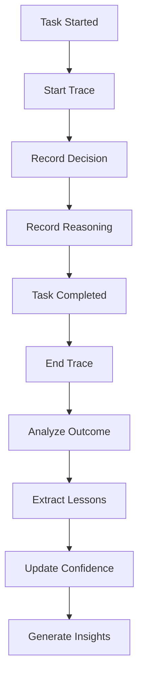

# Self-Observing Deep Dive

> **Diagram:** [self-observing.mermaid](self-observing.mermaid)



## Overview

Self-Observing is the agent's ability to monitor its own reasoning process, track its decisions, and reflect on its behavior — enabling meta-cognition and continuous self-improvement.

## Architecture

```
┌─────────────────────────────────────────────────────────────────────┐
│                     SELF-OBSERVING SYSTEM                           │
├─────────────────────────────────────────────────────────────────────┤
│                                                                     │
│  ┌──────────┐   ┌──────────┐   ┌──────────┐   ┌──────────┐        │
│  │Decision  │──▶│ Reasoning│──▶│ Outcome  │──▶│ Reflect  │        │
│  │ Tracer   │   │ Tracker  │   │ Analyzer │   │ on Process│       │
│  └──────────┘   └──────────┘   └──────────┘   └──────────┘        │
│       │              │              │               │                │
│       ▼              ▼              ▼               ▼                │
│  ┌──────────┐   ┌──────────┐   ┌──────────┐   ┌──────────┐        │
│  │  What    │   │  Why     │   │  Was it  │   │  How to  │        │
│  │ Happened │   │ Happened │   │  Right?  │   │ Improve  │        │
│  └──────────┘   └──────────┘   └──────────┘   └──────────┘        │
│                                                                     │
│  ┌─────────────────────────────────────────────────────────────┐   │
│  │                    OBSERVATION LOG                           │   │
│  │  Decision History │ Reasoning Chains │ Reflection Insights   │   │
│  └─────────────────────────────────────────────────────────────┘   │
└─────────────────────────────────────────────────────────────────────┘
```

## Core Implementation

### Decision Tracer

```python
class DecisionTracer:
    """Traces agent decisions."""
    
    def __init__(self):
        self.traces = []
        self.current_trace = None
    
    def start_trace(self, task: dict) -> str:
        """Start tracing a new decision."""
        
        trace_id = str(uuid4())
        
        self.current_trace = {
            "id": trace_id,
            "task": task,
            "decisions": [],
            "start_time": datetime.now().isoformat(),
            "end_time": None,
            "outcome": None
        }
        
        return trace_id
    
    def record_decision(self, decision: dict):
        """Record a decision in the current trace."""
        
        if self.current_trace:
            self.current_trace["decisions"].append({
                **decision,
                "timestamp": datetime.now().isoformat()
            })
    
    def end_trace(self, outcome: dict):
        """End the current trace."""
        
        if self.current_trace:
            self.current_trace["end_time"] = datetime.now().isoformat()
            self.current_trace["outcome"] = outcome
            
            self.traces.append(self.current_trace)
            self.current_trace = None
    
    def get_trace(self, trace_id: str) -> dict:
        """Get a specific trace."""
        
        for trace in self.traces:
            if trace["id"] == trace_id:
                return trace
        
        return None
    
    def get_recent_traces(self, limit: int = 10) -> list:
        """Get recent traces."""
        
        return self.traces[-limit:]
    
    def analyze_trace(self, trace: dict) -> dict:
        """Analyze a trace for insights."""
        
        decisions = trace.get("decisions", [])
        
        analysis = {
            "trace_id": trace["id"],
            "decision_count": len(decisions),
            "decision_types": self.count_decision_types(decisions),
            "time_taken": self.calculate_time(trace),
            "outcome": trace.get("outcome", {})
        }
        
        return analysis
    
    def count_decision_types(self, decisions: list) -> dict:
        """Count decisions by type."""
        
        counts = defaultdict(int)
        for decision in decisions:
            decision_type = decision.get("type", "unknown")
            counts[decision_type] += 1
        
        return dict(counts)
    
    def calculate_time(self, trace: dict) -> float:
        """Calculate time taken for trace."""
        
        start = datetime.fromisoformat(trace["start_time"])
        end = datetime.fromisoformat(trace["end_time"]) if trace.get("end_time") else datetime.now()
        
        return (end - start).total_seconds()
```

### Reasoning Tracker

```python
class ReasoningTracker:
    """Tracks reasoning chains."""
    
    def __init__(self):
        self.chains = []
        self.current_chain = None
    
    def start_chain(self, context: dict) -> str:
        """Start tracking a reasoning chain."""
        
        chain_id = str(uuid4())
        
        self.current_chain = {
            "id": chain_id,
            "context": context,
            "steps": [],
            "start_time": datetime.now().isoformat()
        }
        
        return chain_id
    
    def add_step(self, step: dict):
        """Add a reasoning step."""
        
        if self.current_chain:
            self.current_chain["steps"].append({
                **step,
                "timestamp": datetime.now().isoformat(),
                "step_number": len(self.current_chain["steps"]) + 1
            })
    
    def end_chain(self, conclusion: dict):
        """End the reasoning chain."""
        
        if self.current_chain:
            self.current_chain["end_time"] = datetime.now().isoformat()
            self.current_chain["conclusion"] = conclusion
            
            self.chains.append(self.current_chain)
            self.current_chain = None
    
    def get_chain(self, chain_id: str) -> dict:
        """Get a specific chain."""
        
        for chain in self.chains:
            if chain["id"] == chain_id:
                return chain
        
        return None
    
    def analyze_chain(self, chain: dict) -> dict:
        """Analyze a reasoning chain."""
        
        steps = chain.get("steps", [])
        
        analysis = {
            "chain_id": chain["id"],
            "step_count": len(steps),
            "step_types": self.count_step_types(steps),
            "conclusion": chain.get("conclusion", {}),
            "duration": self.calculate_duration(chain)
        }
        
        return analysis
    
    def count_step_types(self, steps: list) -> dict:
        """Count steps by type."""
        
        counts = defaultdict(int)
        for step in steps:
            step_type = step.get("type", "unknown")
            counts[step_type] += 1
        
        return dict(counts)
    
    def calculate_duration(self, chain: dict) -> float:
        """Calculate chain duration."""
        
        start = datetime.fromisoformat(chain["start_time"])
        end = datetime.fromisoformat(chain.get("end_time", chain["start_time"]))
        
        return (end - start).total_seconds()
```

### Outcome Analyzer

```python
class OutcomeAnalyzer:
    """Analyzes outcomes of decisions."""
    
    def __init__(self):
        self.analyses = []
    
    def analyze(self, decision: dict, outcome: dict) -> dict:
        """Analyze an outcome."""
        
        analysis = {
            "decision": decision,
            "outcome": outcome,
            "success": outcome.get("success", False),
            "expected_vs_actual": self.compare_expected_actual(decision, outcome),
            "lessons_learned": self.extract_lessons(decision, outcome),
            "timestamp": datetime.now().isoformat()
        }
        
        self.analyses.append(analysis)
        
        return analysis
    
    def compare_expected_actual(self, decision: dict, outcome: dict) -> dict:
        """Compare expected vs actual results."""
        
        expected = decision.get("expected_outcome")
        actual = outcome.get("actual_outcome")
        
        if expected is None or actual is None:
            return {"comparison": "insufficient_data"}
        
        return {
            "expected": expected,
            "actual": actual,
            "match": expected == actual,
            "difference": str(expected) != str(actual)
        }
    
    def extract_lessons(self, decision: dict, outcome: dict) -> list:
        """Extract lessons from the outcome."""
        
        lessons = []
        
        if not outcome.get("success"):
            # Extract failure lessons
            failure_reason = outcome.get("failure_reason", "unknown")
            
            lessons.append({
                "type": "failure_analysis",
                "lesson": f"Action failed due to: {failure_reason}",
                "suggestion": self.suggest_fix(failure_reason)
            })
        else:
            # Extract success lessons
            lessons.append({
                "type": "success_pattern",
                "lesson": f"Action succeeded: {decision.get('action', 'unknown')}",
                "reinforcement": "This approach works for similar tasks"
            })
        
        return lessons
    
    def suggest_fix(self, failure_reason: str) -> str:
        """Suggest a fix for a failure."""
        
        suggestions = {
            "timeout": "Consider increasing timeout or using async",
            "permission": "Check access rights and credentials",
            "not_found": "Verify resource exists and path is correct",
            "invalid_input": "Validate input before processing"
        }
        
        for keyword, suggestion in suggestions.items():
            if keyword in str(failure_reason).lower():
                return suggestion
        
        return "Investigate root cause"
    
    def get_statistics(self) -> dict:
        """Get analysis statistics."""
        
        if not self.analyses:
            return {"total": 0}
        
        successful = sum(1 for a in self.analyses if a["success"])
        
        return {
            "total": len(self.analyses),
            "successful": successful,
            "success_rate": successful / len(self.analyses),
            "recent_lessons": self.get_recent_lessons()
        }
    
    def get_recent_lessons(self, limit: int = 5) -> list:
        """Get recent lessons learned."""
        
        recent = self.analyses[-limit:]
        lessons = []
        
        for analysis in recent:
            lessons.extend(analysis.get("lessons_learned", []))
        
        return lessons
```

### Main Self-Observing System

```python
class SelfObservingSystem:
    """Main self-observing orchestrator."""
    
    def __init__(self):
        self.decision_tracer = DecisionTracer()
        self.reasoning_tracker = ReasoningTracker()
        self.outcome_analyzer = OutcomeAnalyzer()
        self.observation_log = []
    
    def observe_task(self, task: dict) -> dict:
        """Set up observation for a task."""
        
        trace_id = self.decision_tracer.start_trace(task)
        chain_id = self.reasoning_tracker.start_chain({"task": task})
        
        return {
            "trace_id": trace_id,
            "chain_id": chain_id
        }
    
    def record_decision(self, decision: dict):
        """Record a decision."""
        
        self.decision_tracer.record_decision(decision)
        self.reasoning_tracker.add_step({
            "type": "decision",
            "content": decision
        })
    
    def record_reasoning(self, reasoning: dict):
        """Record reasoning."""
        
        self.reasoning_tracker.add_step({
            "type": "reasoning",
            "content": reasoning
        })
    
    def complete_observation(self, outcome: dict) -> dict:
        """Complete observation for a task."""
        
        # End traces
        self.decision_tracer.end_trace(outcome)
        self.reasoning_tracker.end_chain({"outcome": outcome})
        
        # Analyze outcome
        if self.decision_tracer.traces:
            last_trace = self.decision_tracer.traces[-1]
            analysis = self.outcome_analyzer.analyze(
                last_trace.get("decisions", [{}])[-1] if last_trace.get("decisions") else {},
                outcome
            )
        else:
            analysis = {"success": outcome.get("success", False)}
        
        # Record observation
        observation = {
            "outcome": outcome,
            "analysis": analysis,
            "timestamp": datetime.now().isoformat()
        }
        
        self.observation_log.append(observation)
        
        return observation
    
    def get_insights(self) -> dict:
        """Get insights from observations."""
        
        stats = self.outcome_analyzer.get_statistics()
        
        return {
            "total_observations": len(self.observation_log),
            "success_rate": stats.get("success_rate", 0),
            "recent_lessons": stats.get("recent_lessons", []),
            "decision_patterns": self.analyze_decision_patterns()
        }
    
    def analyze_decision_patterns(self) -> dict:
        """Analyze patterns in decisions."""
        
        patterns = defaultdict(int)
        
        for trace in self.decision_tracer.get_recent_traces(50):
            for decision in trace.get("decisions", []):
                decision_type = decision.get("type", "unknown")
                patterns[decision_type] += 1
        
        return dict(patterns)
    
    def get_observation_report(self) -> dict:
        """Get observation report."""
        
        return {
            "total_observations": len(self.observation_log),
            "trace_count": len(self.decision_tracer.traces),
            "chain_count": len(self.reasoning_tracker.chains),
            "analysis_stats": self.outcome_analyzer.get_statistics(),
            "recent_observations": self.observation_log[-5:]
        }
```

## Usage Examples

### Example 1: Observe a Task

```python
observer = SelfObservingSystem()

# Set up observation
obs = observer.observe_task({"type": "code_generation", "prompt": "Write a parser"})

# Record decisions
observer.record_decision({
    "type": "tool_selection",
    "choice": "python_parser",
    "reason": "Task involves Python code"
})

# Record reasoning
observer.record_reasoning({
    "type": "approach",
    "thought": "Using AST-based parsing for reliability"
})

# Complete observation
result = observer.complete_observation({
    "success": True,
    "output": "def parse(code): ..."
})

# Get insights
insights = observer.get_insights()
print(f"Success rate: {insights['success_rate']:.1%}")
```

## Best Practices

1. **Trace everything** — comprehensive tracing enables better insights
2. **Analyze regularly** — don't just store, analyze
3. **Extract actionable lessons** — insights should drive improvement
4. **Share observations** — lessons should inform future decisions
5. **Balance detail vs performance** — don't let tracing slow down execution
6. **Store persistently** — observations should survive restarts
7. **Visualize patterns** — make insights accessible
8. **Act on insights** — observation without action is wasted

## Advanced Observation Patterns

### Meta-Cognition Engine

```python
class MetaCognitionEngine:
    """Enables agent to think about its own thinking."""
    
    def __init__(self):
        self.thinking_history = []
        self.confidence_tracker = {}
    
    def evaluate_thinking(self, reasoning_chain: dict) -> dict:
        """Evaluate quality of reasoning."""
        
        evaluation = {
            "clarity": self.assess_clarity(reasoning_chain),
            "completeness": self.assess_completeness(reasoning_chain),
            "consistency": self.assess_consistency(reasoning_chain),
            "efficiency": self.assess_efficiency(reasoning_chain)
        }
        
        # Calculate overall quality
        evaluation["overall"] = sum(evaluation.values()) / len(evaluation)
        
        self.thinking_history.append(evaluation)
        
        return evaluation
    
    def assess_clarity(self, chain: dict) -> float:
        """Assess clarity of reasoning."""
        
        steps = chain.get("steps", [])
        
        if not steps:
            return 0.0
        
        # Check if steps are well-defined
        defined_steps = sum(1 for s in steps if s.get("description"))
        
        return defined_steps / len(steps)
    
    def assess_completeness(self, chain: dict) -> float:
        """Assess completeness of reasoning."""
        
        steps = chain.get("steps", [])
        
        # Check if all necessary steps are present
        required = ["observation", "analysis", "decision", "action"]
        present = sum(1 for r in required if any(r in str(s).lower() for s in steps))
        
        return present / len(required)
    
    def assess_consistency(self, chain: dict) -> float:
        """Assess consistency of reasoning."""
        
        steps = chain.get("steps", [])
        
        if len(steps) < 2:
            return 1.0
        
        # Check for contradictions (simplified)
        contradictions = 0
        
        for i, step1 in enumerate(steps):
            for step2 in steps[i+1:]:
                if self.contradicts(step1, step2):
                    contradictions += 1
        
        return max(0, 1 - contradictions / len(steps))
    
    def assess_efficiency(self, chain: dict) -> float:
        """Assess efficiency of reasoning."""
        
        steps = chain.get("steps", [])
        
        if not steps:
            return 0.0
        
        # Check for redundancy
        unique_steps = len(set(str(s) for s in steps))
        
        return unique_steps / len(steps)
    
    def contradicts(self, step1: dict, step2: dict) -> bool:
        """Check if two steps contradict each other."""
        
        # Simplified contradiction detection
        str1 = str(step1).lower()
        str2 = str(step2).lower()
        
        contradictions = [
            ("yes", "no"),
            ("true", "false"),
            ("allow", "deny"),
            ("enable", "disable")
        ]
        
        for pos, neg in contradictions:
            if pos in str1 and neg in str2:
                return True
            if neg in str1 and pos in str2:
                return True
        
        return False
    
    def get_confidence(self, task_type: str) -> float:
        """Get confidence level for a task type."""
        
        if task_type in self.confidence_tracker:
            return self.confidence_tracker[task_type]
        
        return 0.5  # Default neutral confidence
    
    def update_confidence(self, task_type: str, success: bool):
        """Update confidence based on outcome."""
        
        current = self.get_confidence(task_type)
        
        if success:
            new_confidence = min(1.0, current + 0.1)
        else:
            new_confidence = max(0.0, current - 0.1)
        
        self.confidence_tracker[task_type] = new_confidence
```

### Decision Quality Analyzer

```python
class DecisionQualityAnalyzer:
    """Analyzes quality of decisions made."""
    
    def __init__(self):
        self.decisions = []
        self.quality_metrics = {}
    
    def analyze_decision(self, decision: dict, outcome: dict) -> dict:
        """Analyze a decision."""
        
        analysis = {
            "decision": decision,
            "outcome": outcome,
            "quality_score": self.calculate_quality(decision, outcome),
            "factors": self.identify_factors(decision, outcome),
            "improvement_suggestions": self.suggest_improvements(decision, outcome)
        }
        
        self.decisions.append(analysis)
        
        return analysis
    
    def calculate_quality(self, decision: dict, outcome: dict) -> float:
        """Calculate decision quality score."""
        
        score = 0.0
        
        # Did the decision lead to success?
        if outcome.get("success"):
            score += 0.4
        
        # Was the reasoning sound?
        if decision.get("reasoning_quality", 0) > 0.7:
            score += 0.2
        
        # Was it efficient?
        if outcome.get("efficiency", 0) > 0.7:
            score += 0.2
        
        # Was it well-documented?
        if decision.get("documented"):
            score += 0.2
        
        return score
    
    def identify_factors(self, decision: dict, outcome: dict) -> list:
        """Identify factors that influenced the outcome."""
        
        factors = []
        
        if outcome.get("success"):
            factors.append("Correct approach selected")
            if decision.get("context_used"):
                factors.append("Good context utilization")
        else:
            factors.append("Incorrect approach")
            if not decision.get("context_used"):
                factors.append("Insufficient context")
        
        return factors
    
    def suggest_improvements(self, decision: dict, outcome: dict) -> list:
        """Suggest improvements for future decisions."""
        
        suggestions = []
        
        if not outcome.get("success"):
            suggestions.append("Consider alternative approaches")
            if decision.get("confidence", 0) < 0.5:
                suggestions.append("Gather more information before deciding")
        
        if outcome.get("efficiency", 0) < 0.5:
            suggestions.append("Look for more efficient approaches")
        
        return suggestions
```

### Behavior Tracker

```python
class BehaviorTracker:
    """Tracks agent behavior patterns."""
    
    def __init__(self):
        self.behaviors = defaultdict(list)
        self.patterns = {}
    
    def track(self, behavior_type: str, details: dict):
        """Track a behavior."""
        
        self.behaviors[behavior_type].append({
            **details,
            "timestamp": datetime.now().isoformat()
        })
    
    def analyze_patterns(self, behavior_type: str) -> dict:
        """Analyze patterns in behavior."""
        
        records = self.behaviors.get(behavior_type, [])
        
        if len(records) < 5:
            return {"insufficient_data": True}
        
        analysis = {
            "total_occurrences": len(records),
            "frequency": self.calculate_frequency(records),
            "common_outcomes": self.find_common_outcomes(records),
            "trends": self.detect_trends(records)
        }
        
        self.patterns[behavior_type] = analysis
        
        return analysis
    
    def calculate_frequency(self, records: list) -> dict:
        """Calculate behavior frequency."""
        
        if not records:
            return {"per_hour": 0, "per_day": 0}
        
        # Calculate time span
        timestamps = [datetime.fromisoformat(r["timestamp"]) for r in records]
        span = max(timestamps) - min(timestamps)
        
        hours = max(span.total_seconds() / 3600, 1)
        days = max(span.days, 1)
        
        return {
            "per_hour": len(records) / hours,
            "per_day": len(records) / days
        }
    
    def find_common_outcomes(self, records: list) -> list:
        """Find common outcomes."""
        
        outcomes = defaultdict(int)
        
        for record in records:
            outcome = record.get("outcome", "unknown")
            outcomes[outcome] += 1
        
        return sorted(outcomes.items(), key=lambda x: x[1], reverse=True)[:5]
    
    def detect_trends(self, records: list) -> dict:
        """Detect trends in behavior."""
        
        if len(records) < 10:
            return {"trend": "insufficient_data"}
        
        # Simple trend detection
        recent = records[-5:]
        older = records[-10:-5]
        
        recent_rate = len(recent) / 5 if recent else 0
        older_rate = len(older) / 5 if older else 0
        
        if recent_rate > older_rate * 1.2:
            trend = "increasing"
        elif recent_rate < older_rate * 0.8:
            trend = "decreasing"
        else:
            trend = "stable"
        
        return {"trend": trend, "recent_rate": recent_rate, "older_rate": older_rate}
```

### Self-Reflection Engine

```python
class SelfReflectionEngine:
    """Enables agent to reflect on its performance."""
    
    def __init__(self):
        self.reflections = []
        self.insights = []
    
    def reflect(self, task: dict, outcome: dict, observations: dict) -> dict:
        """Reflect on task performance."""
        
        reflection = {
            "task": task,
            "outcome": outcome,
            "observations": observations,
            "strengths": self.identify_strengths(outcome),
            "weaknesses": self.identify_weaknesses(outcome),
            "lessons": self.extract_lessons(outcome),
            "improvements": self.suggest_improvements(outcome)
        }
        
        self.reflections.append(reflection)
        
        # Extract insights
        new_insights = self.extract_insights(reflection)
        self.insights.extend(new_insights)
        
        return reflection
    
    def identify_strengths(self, outcome: dict) -> list:
        """Identify what went well."""
        
        strengths = []
        
        if outcome.get("success"):
            strengths.append("Task completed successfully")
        if outcome.get("efficiency", 0) > 0.7:
            strengths.append("Efficient execution")
        if outcome.get("accuracy", 0) > 0.9:
            strengths.append("High accuracy")
        
        return strengths
    
    def identify_weaknesses(self, outcome: dict) -> list:
        """Identify what could improve."""
        
        weaknesses = []
        
        if not outcome.get("success"):
            weaknesses.append("Task failed")
        if outcome.get("efficiency", 0) < 0.5:
            weaknesses.append("Low efficiency")
        if outcome.get("attempts", 1) > 3:
            weaknesses.append("Required multiple attempts")
        
        return weaknesses
    
    def extract_lessons(self, outcome: dict) -> list:
        """Extract lessons from outcome."""
        
        lessons = []
        
        if outcome.get("success"):
            lessons.append({
                "type": "success_pattern",
                "lesson": "Current approach worked well"
            })
        else:
            lessons.append({
                "type": "failure_analysis",
                "lesson": f"Failed due to: {outcome.get('failure_reason', 'unknown')}"
            })
        
        return lessons
    
    def suggest_improvements(self, outcome: dict) -> list:
        """Suggest improvements."""
        
        improvements = []
        
        if not outcome.get("success"):
            improvements.append("Try alternative approach next time")
        if outcome.get("duration", 0) > 60:
            improvements.append("Look for optimization opportunities")
        
        return improvements
    
    def extract_insights(self, reflection: dict) -> list:
        """Extract insights from reflection."""
        
        insights = []
        
        # Extract from strengths
        for strength in reflection.get("strengths", []):
            insights.append({
                "type": "strength",
                "insight": strength,
                "timestamp": datetime.now().isoformat()
            })
        
        # Extract from lessons
        for lesson in reflection.get("lessons", []):
            insights.append({
                "type": "lesson",
                "insight": lesson.get("lesson", ""),
                "timestamp": datetime.now().isoformat()
            })
        
        return insights
    
    def get_reflection_stats(self) -> dict:
        """Get reflection statistics."""
        
        return {
            "total_reflections": len(self.reflections),
            "total_insights": len(self.insights),
            "recent_reflections": self.reflections[-5:]
        }
```

## Integration

| Capability | Integration |
|---|---|
| **Self-Improving** | Observations drive improvement |
| **Self-Debugging** | Traces help debug issues |
| **Self-Monitoring** | Monitoring provides observation data |
| **Self-Planning** | Insights inform better planning |
| **Self-Governing** | Observations verify policy compliance |
